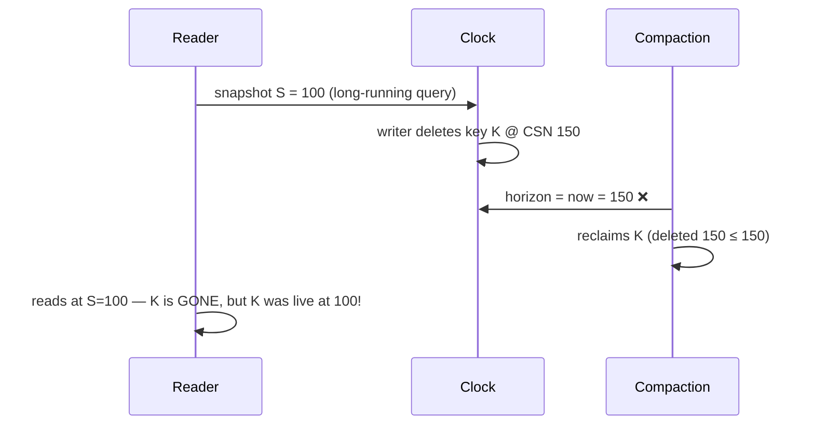
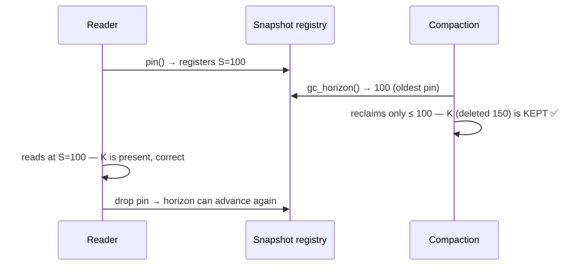

# The GC Watermark & Live-Snapshot Registry

```{=latex}
\epigraph{Perfection is achieved not when there is nothing more to add, but when there is nothing left to take away.}{--- Antoine de Saint-Exup\'ery}
```

Compaction reclaims space by dropping row versions no one can see any more. Get the
"no one can see" test wrong and you get the worst kind of bug: a silent wrong answer
for a reader on an old snapshot. This chapter is how ChakraDB gets it right — the
correctness guarantee behind the concurrency wedge.

## The hazard

Compaction, when it merges parts, physically reclaims rows whose deletion CSN is at
or before a **horizon**. The rule is:

> The horizon must be **≤ the oldest CSN any live snapshot may still observe.**
> Reclaim anything newer, and a reader holding an older snapshot loses a row it
> should still see.

The danger case, if the horizon were just "now":



At `S=100`, key `K` (deleted at 150) *should* be visible. A horizon of "now" would
have reclaimed it.

## The fix: a live-snapshot registry

ChakraDB tracks the oldest live reader and holds the horizon back to it. The CSN
generator keeps a small registry — a map from CSN to a count of live *pins*:

- A read that must outlive a clock advance — a query or a transaction — **pins** its
  snapshot: it registers its CSN and gets an RAII guard.
- **`gc_horizon()`** = the smallest pinned CSN, or the current clock if none are
  pinned.
- Compaction reclaims only up to `gc_horizon()`.

```text
pin():                       gc_horizon():               on guard drop:
  lock registry                lock registry               lock registry
  csn = current()              h = min(registry keys)      registry[csn] -= 1
  registry[csn] += 1              or current() if empty     if 0: remove csn
  return guard(csn)            return h                    unlock
```



## The subtle part: no window

The correctness hinges on one detail: **reading the current CSN and registering the
pin happen under the same lock that `gc_horizon` uses.** Otherwise a compaction could
compute a horizon *above* a pin that is about to register at a lower CSN — and the
race is back.

Because both operations are linearized by the one registry lock, a compaction that
runs *after* a pin registers sees that pin (so its horizon ≤ the pin), and a
compaction that runs *before* the pin registers used a horizon ≤ the pin's snapshot
anyway (the clock only advances). Either way the horizon never exceeds a live
snapshot. The proof is small precisely because the critical section is small.

## What pins, and what doesn't

Only reads that could **outlive a clock advance** need to pin:

- The **SQL interpreter** pins for the duration of a `SELECT`/`UPDATE`/`DELETE`.
- The **DataFusion bridge** pins for the whole query.
- A **transaction** pins from `BEGIN` until commit/rollback.
- A **`GraphView`** pins while it builds its CSR.

A transient read at `current` needs no pin — nothing it can see is reclaimable,
because the horizon can never exceed `current`. So the hot path stays lock-free; the
registry is touched once per long read, not per row.

## Why compaction is safe to be lazy

Compaction is **caller-driven** — there is no background thread. Combined with the
registry, that means space is reclaimed only when you ask, and only up to the oldest
live reader. `Storage::compact_all()` uses `gc_horizon()` automatically; the
low-level `Database::compact_all(horizon)` takes an explicit horizon for callers who
know a safe one.

## Regression-tested

The guarantee is pinned down by a test: a reader pins a snapshot, a writer deletes a
key at a later CSN, compaction runs — and the pinned reader **still sees the row**;
after the pin drops, the row becomes reclaimable. The test also checks the horizon
tracks the oldest of several concurrent pins (`tests/gc_watermark.rs`). It would
fail against the naive "horizon = now," so it genuinely guards the fix.
