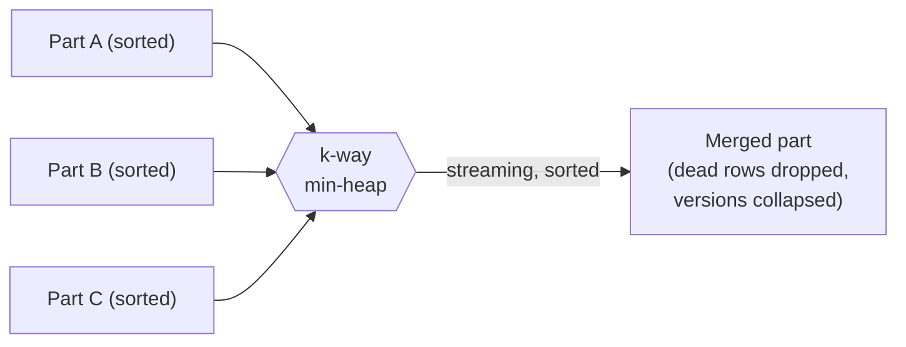

# The Merge / Compaction Algorithm

Writes create parts; parts accumulate; scans slow down. Compaction is the debt
payment: it merges parts into fewer, larger, sorted parts, physically drops rows no
live reader can see, and collapses redundant version stamps. It is **caller-driven**
— there is no background thread — so it runs when asked, and only up to a safe
[GC horizon](gc-watermark.md).

## The k-way merge

Because every input part is sorted by key, merging them into one sorted part is a
classic k-way merge over a heap of cursors:

> **ALGORITHM 8 — Merge parts**
> ```text
> Input:  parts P₁..P_k (each sorted by key); reclamation horizon H
> Output: one merged, sorted part
> 1  heap ← { (P_i.key(0), i, 0) for each non-empty P_i }   ▷ min-heap on key
> 2  out ← empty builder
> 3  while heap not empty:
> 4      (k, i, o) ← heap.pop_min()                          ▷ smallest current key
> 5      keep ← RowIsLive(P_i, o, H)                          ▷ see ALGORITHM 9
> 6      if keep: out.append(P_i.row(o))                      ▷ carry the surviving row
> 7      if o+1 < P_i.len: heap.push((P_i.key(o+1), i, o+1))  ▷ advance that cursor
> 8  return out.seal()                                        ▷ sorted Arrow part
> ```

The output is produced in sorted key order in a single streaming pass — `O(N log k)`
for `N` total rows and `k` inputs — with no intermediate sort. Newer parts take
precedence when keys tie, so an updated row's newest version wins.



## Reclamation: which rows survive

The horizon `H` is the oldest CSN any live snapshot may observe (the [GC
watermark](gc-watermark.md)). A row can be physically dropped only when no snapshot
`≥ H` could still see it:

> **ALGORITHM 9 — Row liveness under a horizon**
> ```text
> Input:  a row at ordinal o in part P; horizon H
> Output: true if the row must be kept
> 1  if the row is not tombstoned: return true             ▷ a live version — keep
> 2  d ← its deletion CSN
> 3  if d ≤ H: return false                                 ▷ deleted before/at the
> 4  return true                                            ▷   horizon → reclaimable
> ```

Line 3 is the crux: a row deleted at `d ≤ H` is invisible to *every* live snapshot
(all are `≥ H > `… `≥ d`), so it is safe to drop. A row deleted *after* `H` is still
visible to a reader on an old snapshot and **must be kept**. Getting this bound
wrong is the silent-wrong-answer hazard the [GC watermark](gc-watermark.md) chapter
is devoted to.

After merging, the surviving versions' stamps are **collapsed**: if all rows of the
merged part now share one creation CSN, the part stores a single `Uniform(csn)`
instead of a per-row array — restoring the cheap [full-part fast
path](visibility.md) for future scans.

## Selection and incrementality

Two more practicalities keep compaction from being wasteful:

- **Selection.** Not every part is merged every time. A policy chooses a set of
  candidates (for example, similar-sized adjacent parts), so compaction does
  bounded work per invocation rather than rewriting the whole table.
- **Incremental persistence.** When the merged result is checkpointed, unchanged
  parts are skipped and a part that only *gained tombstones* since the last
  checkpoint has just those deletion-vector entries appended — not a full rewrite.
  This fixed an `O(n²)` that a naive "rewrite everything each checkpoint" would
  incur.

## The backpressure contract

Compaction trades write amplification for scan speed. If it cannot keep up, the
engine does **not** silently let scans degrade — it applies explicit ingest
**backpressure** (a throttle, then a stall) keyed on the part count, surfaced in
[`Storage::stats()`](../guide/observability.md). This is the "cost of fast writes
is paid in compaction, and made visible" commitment from the
[cost model](../introduction/cost-model.md).

> **Proposition 6 (Merge preserves the visible database).** For any snapshot `S ≥
> H`, the set of rows visible to `S` is identical before and after a merge with
> horizon `H`.
>
> *Proof sketch.* A merge changes physical layout, not logical content, except that
> it drops rows with `deleted ≤ H` (ALG 9). Such a row is invisible to any `S ≥ H`
> because `S ≥ H ≥ deleted` fails `S < deleted` ([ALGORITHM 3](visibility.md)). Every
> row visible to `S` has `deleted > H`, is therefore kept, and its `(created,
> deleted)` stamps are preserved (collapse only rewrites the storage form, not the
> values). Hence `S`'s visible set is unchanged. The requirement `S ≥ H` is exactly
> what the GC watermark guarantees for every live reader. ∎
