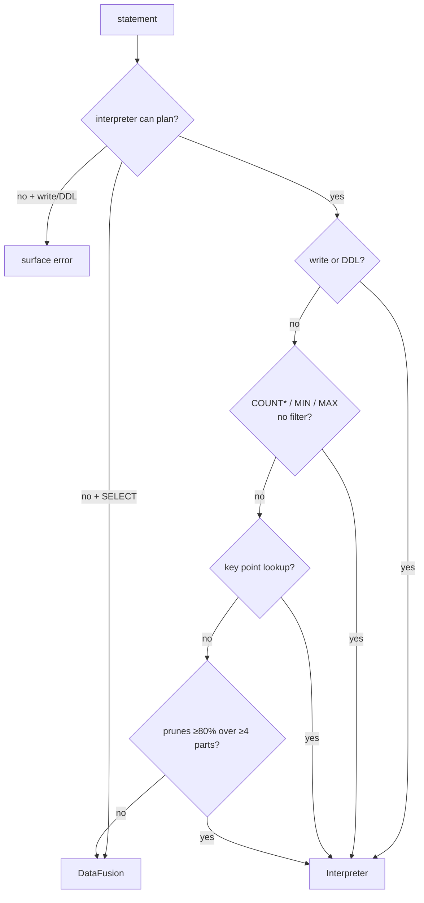

# Query Routing (Cost Model)

```{=latex}
\epigraph{Different roads sometimes lead to the same castle.}{--- George R. R. Martin}
```

The HTAP router decides, for each statement, whether to run it on the hand-written
**interpreter** or on **DataFusion**. The decision is cheap — it inspects the
*planned* statement, not the data — and it is the concrete cost model that lets one
engine serve both transactional and analytical shapes well.

## The two-stage decision

> **ALGORITHM 12 — Route a statement**
> ```text
> Input:  SQL statement text
> Output: the engine to execute it on
> 1  plan ← interpreter.plan(statement)
> 2  if plan failed:                                   ▷ join / subquery / window
> 3      if statement is a SELECT: return DataFusion    ▷ it can plan these
> 4      else: raise the error                          ▷ a write/DDL error is real
> 5  if statement is a write or DDL: return Interpreter ▷ owns WAL + snapshot clock
> 6  if plan is bare COUNT(*) with no filter:  return Interpreter  ▷ metadata, no scan
> 7  if plan is bare MIN(c)/MAX(c):            return Interpreter  ▷ zonemaps, no scan
> 8  if plan is a key point lookup:            return Interpreter  ▷ index funnel
> 9  if plan is a selective range that prunes ≥ 80% of rows across ≥ 4 parts:
> 10     return Interpreter                             ▷ pruned scan beats vectorized
> 11 return DataFusion                                  ▷ scans, joins, aggregation
> ```

The first stage (lines 1–4) is a capability check: joins, subqueries, and windows
the interpreter cannot plan, so a `SELECT` using them falls through to DataFusion,
while a *write* that fails to plan (e.g. a constraint violation) is a real error and
is surfaced — never silently retried on the read-only engine.

The second stage (lines 5–11) is the cost model: the shapes the interpreter *wins*
are captured explicitly, and everything else takes the vectorized path.



## Why each branch

- **Writes / DDL (line 5).** Only the interpreter mutates state and appends to the
  WAL; it owns the [snapshot clock](visibility.md).
- **Bare `COUNT(*)` (line 6).** Answered from part row-counts — no scan at all.
- **Bare `MIN`/`MAX` (line 7).** Answered from the per-part zonemaps — no scan.
- **Point lookup (line 8).** The [index funnel](key-index.md) is `O(log n)`; a
  vectorized scan operator would be far slower for a single row.
- **Selective range (lines 9–10).** [Zonemap pruning](pruning.md) makes the
  interpreter touch only a few parts; below ~20% selectivity the pruned interpreter
  scan beats a full vectorized scan. The threshold is a cost estimate, not a scan —
  it counts, from the zonemaps alone, how many rows survive pruning.
- **Everything else (line 11).** Large scans, `GROUP BY`, joins, windows, and
  subqueries want DataFusion's vectorized, spill-capable operators.

## The estimate is metadata-only

Line 9's "prunes ≥ 80%" is computed without reading a row: for each part, the
`excludes` test ([ALGORITHM 11](pruning.md)) plus the part's row count says how many
rows survive. Summing over parts gives the surviving fraction. So the routing
decision itself is `O(number of parts)`, not `O(rows)`.

> **Proposition 8 (Routing is answer-preserving).** For any statement, the
> interpreter and DataFusion produce the same result; routing changes only cost.
>
> *Proof sketch.* Both engines read the same MVCC snapshot and the same immutable
> parts. The interpreter's fast paths are exact — `COUNT(*)` from true row counts,
> `MIN`/`MAX` from exact zonemaps, point lookup from the sorted key, pruned scan from
> a conservative `excludes` that never drops a match (ALG 11). DataFusion evaluates
> the same relational semantics over the same Arrow data. Hence the two agree on
> every routed statement; the HTAP-equivalence property tests assert exactly this
> across randomized queries. ∎

## The pin

Whichever engine runs, the statement first **pins** its snapshot for the duration
(so compaction cannot reclaim a version it will read — the [GC
watermark](gc-watermark.md)). Transient reads at the current clock need no pin;
long reads (a full scan, a DataFusion query, a transaction) hold one.
