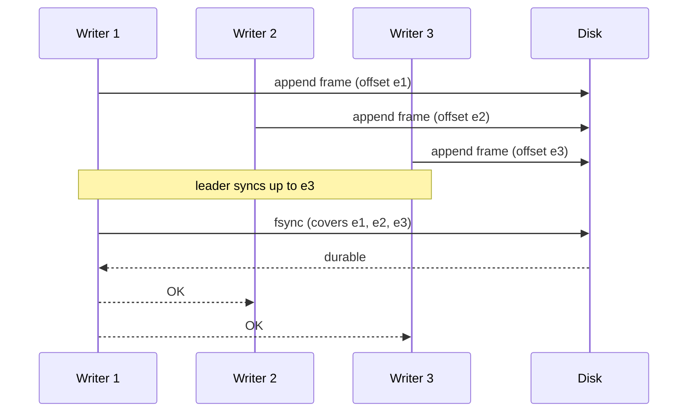

# Write-Ahead Logging & Group Commit

```{=latex}
\epigraph{The faintest ink is more powerful than the strongest memory.}{--- Proverb}
```

Durability is the promise that an acknowledged write survives a crash. ChakraDB
keeps it with a write-ahead log: every mutation is framed, checksummed, and made
durable *before* the write is acknowledged. Group commit amortizes the `fsync` so
throughput scales with concurrency.

## Record framing

Each WAL record is wrapped in a self-describing frame so a torn write is
detectable:

```text
 ┌──────────┬──────────┬──────────────────────────┐
 │ len (u32)│ crc (u32)│ payload (len bytes)       │
 └──────────┴──────────┴──────────────────────────┘
```

The payload is one of: `Insert{table, csn, row}`, `Delete{table, csn, key}`,
`Seal{table, csn, part_id}`, `Checkpoint{csn}`, or `Txn{ops}` (a whole committed
transaction as one record). The length lets recovery find the next frame; the CRC
lets it reject a frame torn by a crash mid-append.

## The append

> **ALGORITHM 5 — WAL append and acknowledge**
> ```text
> Input:  record R; durability mode M ∈ {Sync, Group, Async}
> Output: acknowledgement (the write is durable per M)
> 1  frame ← [len(R)] ++ [crc32(R)] ++ encode(R)
> 2  acquire the append lock                          ▷ assigns byte offsets in order
> 3  append frame to the log at the current end
> 4  release the append lock
> 5  case M of
> 6    Sync:  fsync()                                 ▷ durable before returning
> 7    Group: wait for the group fsync (ALGORITHM 6)  ▷ shared with concurrent writers
> 8    Async: return now                              ▷ a crash may lose the last frames
> 9  return OK
> ```

The append lock is held only for the byte-copy that assigns offsets; the `fsync`
(the expensive part) happens outside it, so writers do not serialize on the disk.

## Group commit

When many threads commit at once, forcing one `fsync` per write wastes the disk's
throughput — a single `fsync` makes *everything appended so far* durable. Group
commit exploits that:

> **ALGORITHM 6 — Group commit**
> ```text
> Input:  a stream of concurrent committers, each having appended its frame
> Output: one fsync makes a whole batch durable
> 1  each committer records the log end e_i after its append, then waits
> 2  one committer becomes the LEADER:
> 3      target ← current log end                     ▷ covers every frame ≤ target
> 4      fsync()                                       ▷ a single disk sync
> 5      publish durable-through = target
> 6  every waiter with e_i ≤ target wakes and returns OK
> ```

Because an `fsync` covers all bytes written before it, `k` concurrent commits need
one sync instead of `k`. The measured effect is that syncs-per-append drops sharply
as concurrency rises — group commit is why durable throughput scales with writers
rather than collapsing to disk-sync latency.



## The three modes

| Mode | Line | Guarantee | When to use |
|---|---|---|---|
| `Sync` | 6 | every write `fsync`'d before ack | strictest; low write rate |
| `Group` | 7 | concurrent writers share one `fsync` | default; high concurrency |
| `Async` | 8 | acked before `fsync` | fastest; a crash may lose the last unflushed writes |

## The crash-atomicity of a transaction

A committed transaction is written as **one** `Txn` record — a single frame. Since
a frame is all-or-nothing under the CRC, recovery applies the whole transaction or
none of it.

> **Proposition 4 (Commit atomicity).** A crash during the commit of a transaction
> leaves the database in a state with either all of the transaction's writes or
> none.
>
> *Proof sketch.* The transaction's writes are one framed record. If the crash
> occurs before the frame's bytes (and their covering `fsync`) are durable, recovery
> sees no valid frame there (the CRC fails on the torn tail) and discards it —
> *none*. If the frame and its `fsync` completed, recovery replays the whole frame
> — *all*. There is no third outcome because the frame is the unit of durability.
> This is verified empirically by truncating the log at **every** byte and asserting
> the recovered row count is only ever the pre-transaction value or the
> post-transaction value (`torn_commit_record_is_all_or_nothing`). ∎

Recovery — how the log is replayed to reconstruct the acknowledged state — is
[the next chapter](recovery.md).
