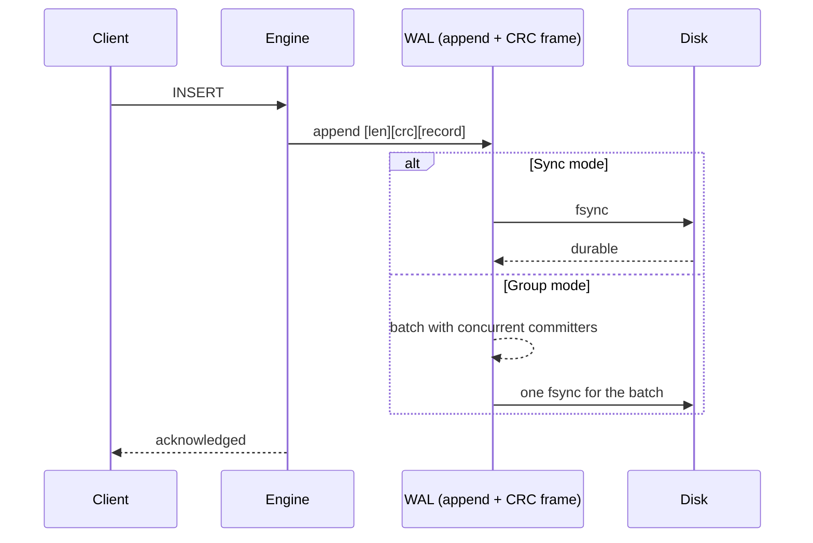
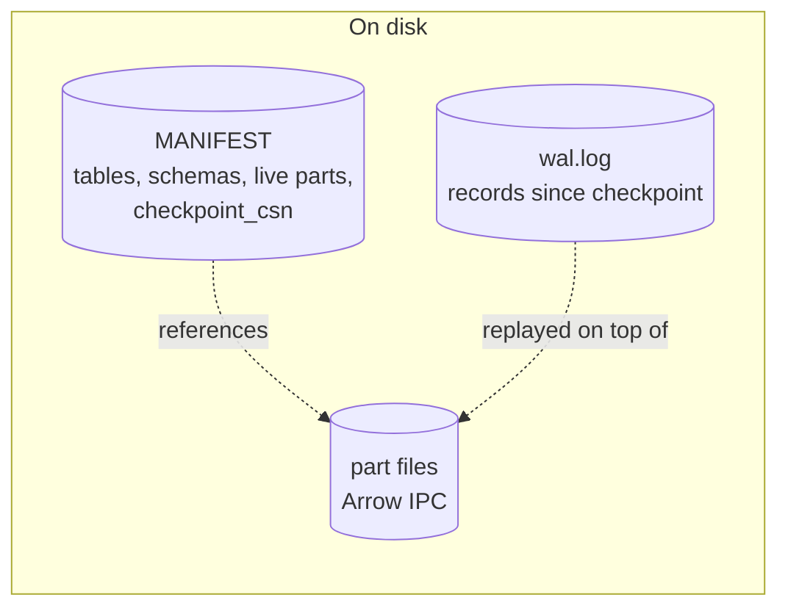
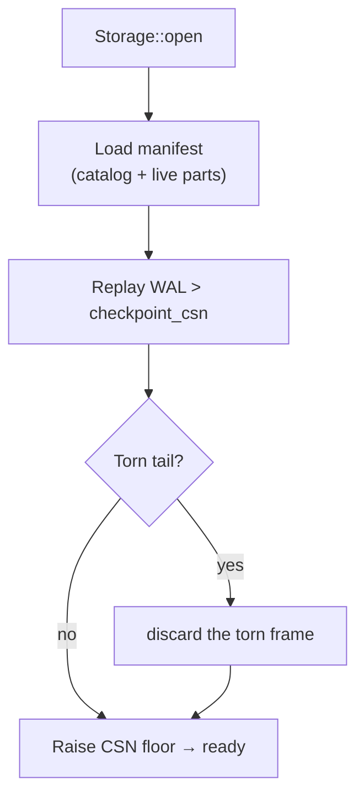

# Durability: WAL, Group Commit & Recovery

A durable ChakraDB (`Storage`) guarantees that an acknowledged write survives a
crash. The mechanism is a classic **write-ahead log** with **group commit**, a
**manifest** for the catalog and part set, and a **recovery** pass that replays the
log. This chapter is the shape; the [WAL algorithm](../algorithms/wal.md) and
[recovery](../algorithms/recovery.md) chapters have the byte-level detail.

## Write-ahead logging

Every mutation is appended to the WAL **before** it is acknowledged. A record is
framed with a length and a CRC, so a crash mid-append leaves a *torn* final frame
that recovery detects by checksum and discards — the log's valid prefix is always
recoverable.

## Three durability modes

The trade between latency and the guarantee is a knob:

| Mode | Guarantee | Cost |
|---|---|---|
| `Sync` | every write `fsync`'d before ack | strongest, one fsync/write |
| `Group` | concurrent writers share one `fsync` | strong, amortized |
| `Async` | acked before `fsync` | fastest; a crash may lose the last unflushed writes |

**Group commit** is the default sweet spot: when many threads commit at once, their
records are appended and made durable with a *single* `fsync`, so throughput scales
with concurrency instead of paying a sync per write.

## The manifest and checkpointing

The WAL grows without bound if never trimmed. A **checkpoint** makes the in-memory
state durable in parts, records the live part set and each table's schema in the
**manifest**, and advances a `checkpoint_csn` — after which the log *before* that
point is reclaimable. Checkpointing is incremental: unchanged parts are skipped,
and parts that only gained tombstones get just those appended. See
[Checkpointing](checkpointing.md).

## Recovery

On open, recovery reconstructs the exact acknowledged state:

1. Read the **manifest** — the catalog (tables + schemas) and the live part set as
   of the last checkpoint. Part *indexes* are loaded resident; part *data* is
   faulted lazily on first touch (fast reopen).
2. Replay the **WAL** past `checkpoint_csn`, applying each record to the in-memory
   tables. A torn final frame is discarded.
3. Raise the CSN clock above the highest replayed stamp, so no version number is
   ever reissued.

## How well it's tested

Durability is the property you cannot get wrong, so it is tested adversarially:

- **10,000 randomized crash trials** verify that every acknowledged write survives,
  in all three durability modes (`crash_consistency`).
- **Durable SQL** adds tens of thousands more crash trials — millions of
  acknowledged writes verified across integer, text, and keyless schemas
  (`durable_sql_crash`).
- A committed multi-statement transaction is one WAL record, so truncating the log
  at *every byte* leaves the transaction either fully applied or fully absent —
  never partial (`torn_commit_record_is_all_or_nothing`).

## The single I/O seam

Everything reaches disk through one `trait Io` (see [The I/O
Abstraction](io.md)) — a real POSIX backend for production and an in-memory,
fault-injecting backend (`MemIo`) that makes those thousands of crash trials
possible without touching a real disk. The durability logic is identical over
both.
