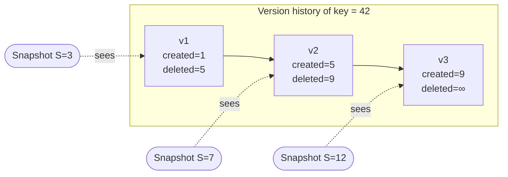

# MVCC & Snapshot Isolation

Multi-Version Concurrency Control is the reason readers never block writers. This
chapter is the *model*; the [visibility algorithm](../algorithms/visibility.md) and
the [GC watermark](../algorithms/gc-watermark.md) get the full treatment in Part
III.

## The commit sequence number (CSN)

There is one piece of global state every writer touches: a monotonic 64-bit
counter, the **commit sequence number**. Allocating a CSN is a single atomic
increment. A **snapshot** is just a CSN — a number naming an instant.

Every row version carries two stamps:

- `created` — the CSN at which this version came to exist.
- `deleted` — the CSN at which it was superseded or removed (or `NEVER_DELETED`).

## The visibility predicate

A version is visible to a snapshot `S` if and only if it was created at or before
`S` and not yet deleted as of `S`:

```
visible(S, created, deleted)  ⟺  created ≤ S < deleted
```

That is the whole rule. It is a pure function of three integers — no locks, no
undo log, no read view to construct.



At `S=3`, only `v1` satisfies `created ≤ 3 < deleted` (1 ≤ 3 < 5). At `S=7`, only
`v2` (5 ≤ 7 < 9). Exactly one version of a live key is visible to any snapshot —
which is what makes an `UPDATE` a create-plus-delete rather than a mutation.

## Why cold data is free

The predicate has two fast-path corollaries that make ChakraDB's scans cheap:

> **A part created entirely at or before `S` and with no deletions after `S` is
> "fully visible" — every one of its rows passes, so the scan skips the per-row
> check entirely.**

Concretely, a part stores a uniform `created` stamp and the minimum `deleted` CSN
across its rows. If `created_max ≤ S` and `S < min_deleted`, the whole part is
visible with a single comparison. A cold, unmodified part — the vast majority of a
large table — pays **zero** per-row version cost on a scan. Only recently-modified
parts and the L0 buffer pay the per-row predicate. This is the "cost of concurrency
is paid only by data that was recently modified" principle, from Neumann et al.'s
MVCC design, made concrete.

## Snapshot isolation, across tables

The CSN clock is global to a database, so a snapshot is consistent **across every
table at once.** An application reading two tables at snapshot `S` observes both as
of the same instant — no torn cross-table view. This is what lets the graph layer
build a consistent adjacency from an edges table while a nodes table is also being
written.

## Readers do not block writers — and the reverse

- A **reader** takes a snapshot number and scans the parts visible to it. It grabs
  the part list under a brief read lock, then scans **lock-free**; the parts are
  immutable, so nothing a writer does can change what the reader is reading.
- A **writer** advances the clock and appends a new version. It never waits on a
  reader.

The one serialization point is *per table*: two writers to the *same* table take a
short write lock for the L0 insert. Different tables write concurrently. (This is
the deliberate trade in the [cost model](../introduction/cost-model.md).)

## Garbage collection needs a watermark

Because old versions stay until compaction reclaims them, compaction must not drop
a version some live snapshot can still see. ChakraDB tracks a **live-snapshot
registry**: a long-running reader (a query or a transaction) *pins* its snapshot,
and compaction's reclamation horizon is held back to the oldest pinned snapshot. A
reader on an old snapshot keeps its view even as newer writes are compacted away.
The full mechanism — and why it is correct under concurrency — is in
[The GC Watermark](../algorithms/gc-watermark.md).

## Durability of the clock

The CSN is monotonic and never reset. On recovery, the counter is raised above the
highest CSN any replayed record used, so a recovered database never reissues a
stamp — two rows can never collide on a version number. The counter is 64-bit:
~1.8×10¹⁹ total mutations over a database's entire lifetime.
