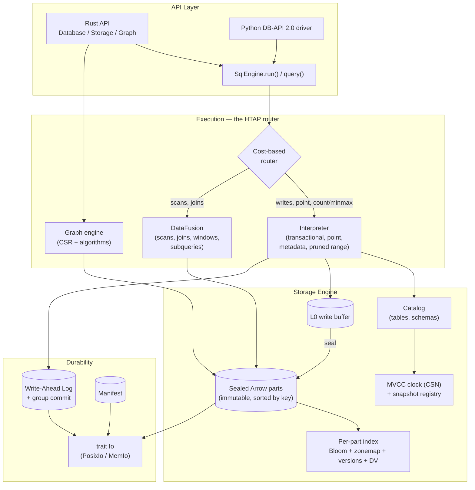

# System Overview

ChakraDB is a stack of narrow layers with one guiding split: **buy execution,
build storage.** The vectorized analytical engine is Apache DataFusion; the
storage engine, MVCC, durability, transactional interpreter, and graph layer are
ChakraDB's own. The layers meet at deliberately thin interfaces.

## The layers, top to bottom

**API.** Three entry points: the Rust `Database`/`Storage`/`Graph` types, a
standards-based Python DB-API 2.0 (PEP 249) driver, and the SQL front end
(`SqlEngine`).

**Execution — the HTAP router.** Every SQL statement is routed to whichever engine
fits its shape. Cheap transactional shapes — writes, key point-lookups, metadata
`COUNT(*)`/`MIN`/`MAX`, and selective range scans — run on a hand-written
**interpreter** that owns the write path. Analytical shapes — large scans, joins,
windows, subqueries — run on **DataFusion**. The **graph engine** is a third
consumer, building CSR working sets from the same parts. See
[The HTAP Router](query-router.md).

**Storage Engine.** A three-tier log-structured store: an in-memory **L0** buffer
absorbs writes at memory speed; when it fills it is sealed, sorted by key, into an
immutable columnar **Arrow part**; parts accumulate and are periodically merged by
compaction. Every part carries a small resident **index** — a Bloom filter, per
-column min/max zonemaps, version stamps, and a deletion vector. See
[The Storage Engine](storage-engine.md).

**Durability.** A write-ahead log with group commit makes writes durable before
they are acknowledged; a manifest records the catalog and the set of live parts;
recovery replays the WAL past the last checkpoint. Everything reaches disk through
a single `trait Io`, which has a real POSIX implementation and an in-memory fault
-injecting one for tests. See [Durability](durability.md).

## The two invariants that make it fast

Two design invariants recur throughout the architecture, and they are worth
holding in mind before the details:

> **1. The sorted key column *is* the index.** Because a sealed part is written
> sorted by its key, a row's ordinal position *is* its offset. There is no
> separate key→location map to store or maintain — the index cost is ~1.25 bytes
> per row and flat with table size. This is the [primary-key index](pk-index.md).

> **2. Cold data pays zero concurrency cost.** MVCC visibility is a pure function
> of a snapshot number and a part's version stamps. A part that predates every
> live snapshot is "fully visible" and is scanned with no per-row version check at
> all. A billion-row table with a thousand recent mutations pays version costs on
> a thousand rows, not a billion. This is [MVCC](mvcc.md).

## The data flow of a write and a read

A **write** appends to the WAL (durable), updates the L0 buffer and the MVCC clock,
and acknowledges — all without touching any reader. A **read** takes a snapshot
number, then either funnels through the index to a single row (point lookup) or
scans the parts visible to that snapshot (analytical / graph), holding no lock
that a writer could contend on. The following chapters trace both paths in detail.
