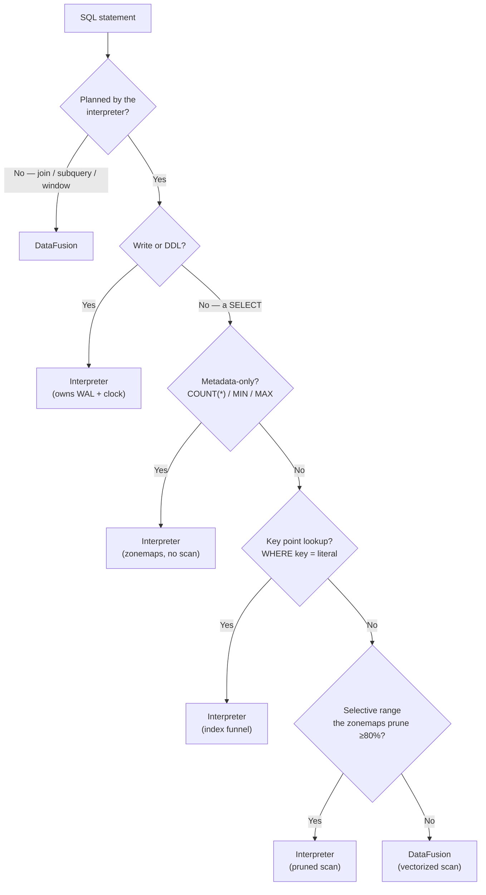

# The Query Layer: The HTAP Router

ChakraDB runs **two** execution engines and routes each statement to whichever
fits. This is the concrete shape of "buy execution, build storage": DataFusion is
bought for vectorized analytics; a compact interpreter is built for the
transactional and point-query path it wins.

## Why two engines

Different query shapes have opposite ideal engines:

- A **key point-lookup** (`WHERE id = 42`) wants an index funnel — a Bloom probe and
  a binary search — not a vectorized scan operator. The interpreter wins by orders
  of magnitude.
- A **`COUNT(*)`** or **bare `MIN`/`MAX`** wants to be answered from metadata (row
  counts, zonemaps) with *no scan at all*. The interpreter does exactly that.
- A **large `GROUP BY` / join / window** wants vectorized, spill-capable operators.
  DataFusion wins.
- A **write** (`INSERT`/`UPDATE`/`DELETE`/`COPY`) must own the WAL and the snapshot
  clock. Only the interpreter writes.

Routing to a single engine would lose one side of this. So ChakraDB has a
**cost-based router** that inspects the planned statement.

## The routing decision

The first stage asks whether the interpreter can even plan the statement; joins,
subqueries, and window functions it cannot, so they go straight to DataFusion. For
the rest, a second cost stage checks the cheap-shape shortcuts — metadata answers,
point lookups, and highly selective ranges that [zonemap pruning](pruning.md) makes
cheaper on the interpreter than a full vectorized scan — and everything else takes
the vectorized path.

## The interpreter half

A hand-written, allocation-conscious evaluator over the sorted parts. It:

- resolves columns to indices at plan time (no per-row name lookup),
- evaluates predicates and projections columnar, over the Arrow batches in place,
- answers `COUNT(*)`/`MIN`/`MAX` from part metadata,
- funnels point lookups through bounds → Bloom → binary search,
- prunes parts on selective ranges,
- and is the **only** path that mutates state and writes the WAL.

It is also the **zero-heavy-dependency fallback**: build without the `datafusion`
feature and the engine still runs single-table SQL on the interpreter alone.

## The DataFusion half

DataFusion receives the raw SQL and executes it over an Arrow view of the current
MVCC snapshot — **zero-copy**, since sealed parts already *are* Arrow record
batches, handed over by reference. It brings the large SQL surface (joins,
subqueries, windows, a rich function library) and vectorized, spill-capable
operators. ChakraDB pins the snapshot for the query's duration, so DataFusion sees
a consistent read while writers keep committing.

> **A subtlety worth stating.** Because the interpreter owns writes and DDL, a
> statement that fails to *plan* on the interpreter — say, a constraint violation —
> is a real error and is surfaced, not silently retried on DataFusion. Only a
> *SELECT* the interpreter cannot plan falls through to the vectorized engine.

## Transactions run on the interpreter

Inside a `BEGIN … COMMIT`, statements run on the interpreter against a private
overlay (read-your-writes; nothing hits the WAL until commit). Joins and subqueries
belong *outside* a transaction — the transactional path is single-table by design.
See [Transactions](transactions.md).

## Why this is the right split

Building a world-class vectorized engine is a multi-year effort on the axis
ChakraDB *deliberately does not compete on* (raw scan speed). Buying DataFusion
spends those years on storage, MVCC, durability, and graph instead — while the
interpreter captures the transactional shapes DataFusion is simply the wrong tool
for. The [DuckDB comparison](../comparisons/duckdb.md) shows where each lands.
