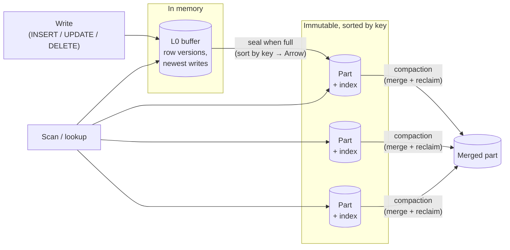
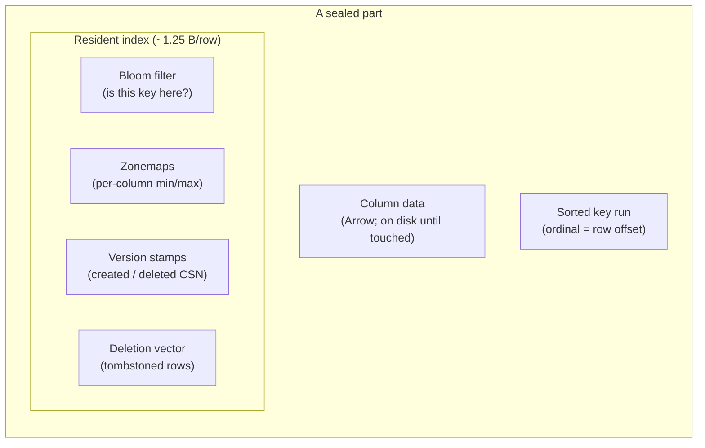
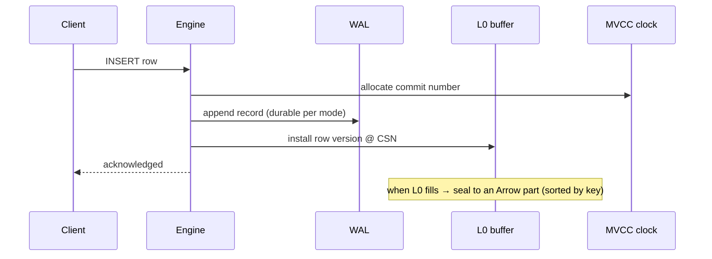

# The Storage Engine

```{=latex}
\epigraph{Show me your flowcharts and conceal your tables, and I shall continue to be mystified. Show me your tables, and I won't usually need your flowcharts; they'll be obvious.}{--- Fred Brooks}
```

ChakraDB's storage is **log-structured** and **Arrow-native**. Writes land in
memory and are sealed into immutable columnar parts; reads see a merged view
across the tiers. This chapter is the shape of the store; the algorithms that run
over it — visibility, merge, pruning — get their own chapters in Part III.

## Three tiers



1. **L0 — the write buffer.** New row versions land here at memory speed. L0 is a
   small in-memory structure keyed for point lookup and range scan. It holds the
   newest, not-yet-sealed writes.

2. **Sealed parts — the columnar body.** When L0 fills (a configurable threshold),
   it is **sealed**: its rows are sorted by the table's key and written as an
   immutable **Apache Arrow** record batch. On the durable path a part persists as
   an Arrow **IPC** stream — an open format any Arrow reader can open. A part never
   changes after sealing; updates and deletes are expressed as *new* versions and
   *deletion-vector* marks, not in-place edits.

3. **Compaction — keeping scans fast.** Parts accumulate as writes flow. A
   background-free, caller-driven **compaction** merges parts, drops rows no live
   snapshot can see, and collapses version stamps — trading write amplification for
   scan speed. See [Compaction](compaction.md).

> **The absorption point.** Fast writes create unmerged deltas that slow scans;
> ChakraDB pays that debt in **compaction**, not in the read path, and applies
> explicit **backpressure** if compaction cannot keep up — never silent scan
> degradation.

## What a part carries: the resident index

The reason ChakraDB can keep row *data* on disk but stay fast is that each part
keeps a small **index resident in memory** — about **1.25 bytes per row**, flat
with table size:



- **Bloom filter** — answers "could key *k* be in this part?" with no disk touch,
  so a point lookup skips parts that certainly lack the key.
- **Zonemaps** — per-column `(min, max)`. A `WHERE` range or a graph adjacency scan
  skips any part whose range cannot overlap. This is [zonemap pruning](pruning.md).
- **Version stamps** — the `created`/`deleted` CSN per row (or one uniform stamp
  when the whole part shares one), the input to [MVCC visibility](mvcc.md).
- **Deletion vector** — which ordinals are tombstoned, so a scan skips deleted rows
  without rewriting the part.
- **The sorted key run** *is* the index: because the part is sorted by key, the
  ordinal position is the row offset, and a lookup is a Bloom probe plus a binary
  search — no separate key→location map exists. See
  [The Primary-Key Index](pk-index.md).

## Arbitrary schemas, any-type keys

A table has any number of columns of any supported type. Its **primary key** is a
single column of any type (integer, text, float, boolean, date, decimal), or — if
no key is declared — a hidden auto-increment `_rowid` (a *keyless* table). One idea
keeps the engine simple: **every table has exactly one key column**; "keyless" is
just a table whose key is hidden.

## Why not a general buffer pool?

Parts are immutable and whole-part granular, so ChakraDB deliberately has **no LRU,
no page-replacement cache**. The policy is "fault a part's data in on first touch,
keep it until the part is dropped." That is the honest amount of machinery for
immutable parts — and it is why the *resident index*, not disk, is the scaling
ceiling (see [Limits](../operations/limits.md)).

## The write path in one picture



Notice what the write path does *not* do: it never takes a lock a reader holds.
Readers run against a snapshot number and see a consistent view; writers advance
the clock and append. That decoupling is the concurrency wedge, and the next
chapter — MVCC — is how it stays correct.
