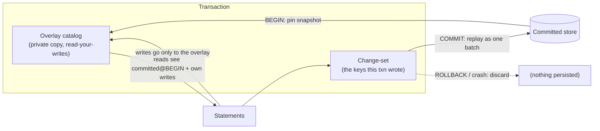
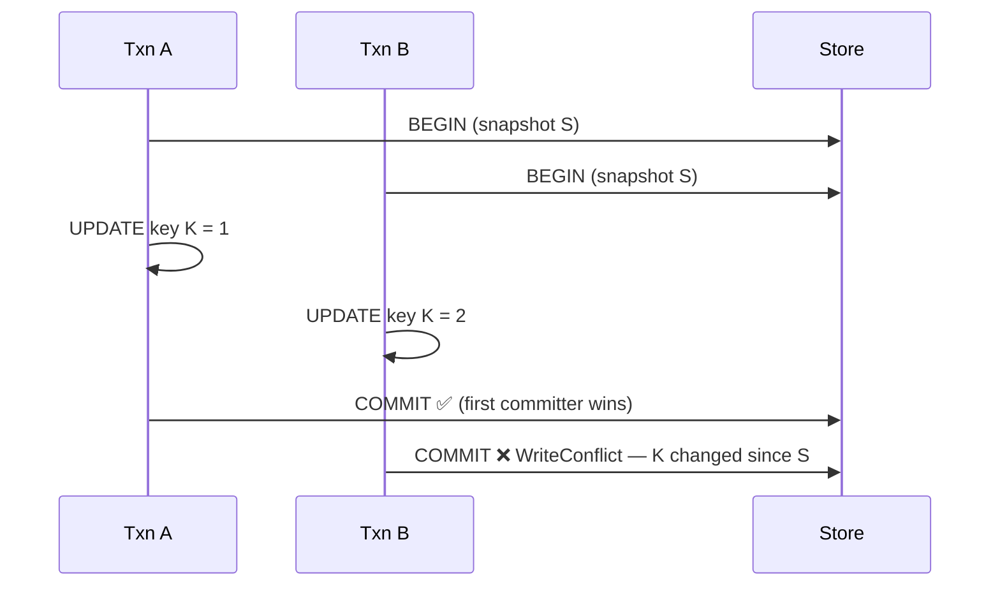

# Transactions

`BEGIN … COMMIT` gives ChakraDB ACID multi-statement transactions with **snapshot
isolation** and **first-committer-wins** conflict detection. The design is a
private **overlay** that is invisible until commit, so a crash or `ROLLBACK` simply
discards it.

## The overlay model

A transaction is a private catalog initialized from a committed snapshot, plus a
change-set to replay on commit:



- **Reads** inside the transaction see the committed state as of `BEGIN` plus the
  transaction's own writes (read-your-writes), and *nothing* uncommitted from other
  connections.
- **Writes** go only into the overlay and the change-set — never the real store or
  the WAL — so rolling back is free and a crash loses nothing.
- **COMMIT** replays the change-set to the real store, which logs it as **one**
  crash-atomic WAL record.

## Snapshot isolation

The transaction pins its `BEGIN` snapshot (which also holds the [GC
watermark](../algorithms/gc-watermark.md) back, so the versions it may read are not
compacted away). Every statement in the transaction reads that one consistent
instant, extended by its own writes. Other connections' commits are invisible.

## First-committer-wins

At `COMMIT`, ChakraDB checks whether any key the transaction wrote was changed by
another committed transaction since `BEGIN` — i.e. whether the key's current
committed value differs from what the transaction saw at `BEGIN`. If so, the commit
fails with a **write conflict** and the transaction is aborted; retry it.



Synthetic-rowid inserts never conflict — each is a brand-new row with a fresh key.

## Crash-atomic commit

Because the whole change-set is handed to the durable backend as one batch, it is
logged as a single `WalRecord::Txn`. A WAL record is framed with a length and CRC,
so recovery applies it **all or nothing**: a crash mid-commit leaves a torn frame
that is discarded, and the transaction never partially appears. This is verified by
truncating the log at every byte and asserting the row count is only ever
"baseline" or "baseline + the whole transaction."

## Scope

Statements in a transaction run on the **single-table interpreter** (the overlay is
materialized from the committed snapshot on first touch). Joins and subqueries
belong *outside* a transaction — use them on the autocommit path where DataFusion
is available. DDL (`CREATE TABLE`) inside a transaction is applied immediately and
is not rolled back in v1.

## Example

```sql
BEGIN;
  UPDATE accounts SET balance = balance - 100 WHERE id = 1;
  UPDATE accounts SET balance = balance + 100 WHERE id = 2;
COMMIT;   -- both, atomically, or neither
```

Outside an explicit transaction, every statement autocommits.
