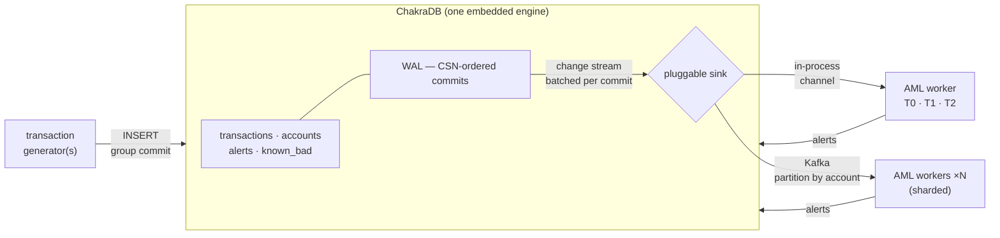

# Case Study: A Real-Time Anti-Money-Laundering System

```{=latex}
\epigraph{Follow the money.}{--- Deep Throat, \textit{All the President's Men}}
```

This is the chapter where every part of ChakraDB is used at once, on a workload
that genuinely needs all of it: **anti-money-laundering (AML)**. Money laundering is
a *graph* problem wearing a *transactional* disguise — a stream of individually
innocuous transfers whose *shape*, taken together, is the crime. Detecting it in
real time means ingesting transactions transactionally, scoring them analytically,
and traversing the entity graph they form — over one consistent view, as the data
arrives. That is exactly the HTAP-plus-graph workload ChakraDB is built for.

We build a working detection engine: the schema, the ingestion path, a detector for
each of the major laundering typologies (mapped onto a ChakraDB primitive), the
scoring pipeline that combines them, and the case-management output — all in one
embedded process, over live data.

## The problem

Laundering has three classic stages, and each leaves a different footprint in the
data:

- **Placement** — dirty cash enters the system (many small deposits). Footprint:
  *structuring / smurfing* — many small credits, kept under reporting thresholds,
  fanning **into** one account.
- **Layering** — the money is moved through a maze of transfers to obscure its
  origin. Footprint: *round-tripping and chains* — directed **cycles** and long
  paths through many accounts, often rapidly.
- **Integration** — the laundered money returns to the criminal as apparently
  legitimate funds. Footprint: *mule networks* — dense clusters of accounts that
  concentrate flow toward a few beneficiaries.

```mermaid
flowchart LR
    subgraph P["Placement (structuring)"]
      D1(( )) --> M[Mule A]
      D2(( )) --> M
      D3(( )) --> M
      D4(( )) --> M
    end
    subgraph L["Layering (round-trip)"]
      M --> B[Acct B] --> C[Acct C] --> M
    end
    subgraph I["Integration"]
      C --> Z[Beneficiary]
    end
    classDef s fill:#f4c430; class M,Z s;
```

No single transfer is suspicious. The *fan-in* at the mule, the *cycle* B→C→A→B, and
the *concentration* toward the beneficiary are — and each is a graph query.

## Why one engine

The traditional AML stack fragments this: an OLTP core banking system for the
transactions, a nightly batch to a warehouse for the rules, and a separate graph
database for network analysis — reconciled by ETL. The consequences are exactly the
ones that matter for AML: the graph is **hours stale**, so layering is caught after
the money is gone; the systems disagree on *which* transactions are in scope; and
running the network analysis contends with ingestion.

ChakraDB collapses the stack. Transactions, rule analytics, and graph traversal all
read the **same MVCC snapshot** of the **same live data**, in one process, with
writers never blocked by the scorer. The detector below runs *as transactions
arrive*.

## The schema

Two logical layers: the transactional records, and the entity/flow graph derived
from them.

```sql
-- Customers and their risk attributes.
CREATE TABLE customers (
  id          INT PRIMARY KEY,
  name        VARCHAR(128) NOT NULL,
  country     VARCHAR(2),
  risk_rating VARCHAR(8) DEFAULT 'low',     -- low | medium | high
  is_pep      BOOLEAN DEFAULT false,        -- politically-exposed person
  onboarded   DATE
);

-- Accounts, each owned by a customer.
CREATE TABLE accounts (
  id          INT PRIMARY KEY,
  customer_id INT NOT NULL,
  opened      DATE,
  status      VARCHAR(8) DEFAULT 'active'
);

-- The transaction ledger — exact money, never rounded.
CREATE TABLE txns (
  id       INT PRIMARY KEY,
  src_acct INT NOT NULL,
  dst_acct INT NOT NULL,
  amount   DECIMAL(14,2) NOT NULL CHECK (amount > 0),
  ts       TIMESTAMP NOT NULL,
  channel  VARCHAR(12),                     -- wire | ach | card | crypto
  CHECK (src_acct <> dst_acct)
);

-- A watchlist of accounts already known to be bad (SARs filed, sanctions, ...).
CREATE TABLE known_bad (
  acct     INT PRIMARY KEY,
  reason   VARCHAR(32),
  added    DATE
);
```

The **flow graph** is derived: a node is an account, and a directed edge
`src → dst` means "money moved from src to dst," weighted by amount. ChakraDB's
`Graph` handle maintains it as an edges table keyed `(src, dst)` so adjacency is
clustered ([The Graph Model](../graph/modeling.md)).

## Ingestion

Each incoming transaction is one ACID transaction: the ledger row and the flow edge
commit together, so the graph is never half-updated relative to the ledger.

```rust
use chakradb::{SqlEngine, Graph};

fn ingest(sql: &SqlEngine, flow: &Graph, t: &Txn) -> anyhow::Result<()> {
    sql.run(&format!(
        "BEGIN;
         INSERT INTO txns VALUES ({}, {}, {}, {:.2}, '{}', '{}');
         COMMIT;",
        t.id, t.src_acct, t.dst_acct, t.amount, t.ts, t.channel
    ))?;
    // The flow edge, weighted by amount (idempotent upsert on (src,dst)).
    flow.add_edge(t.src_acct, t.dst_acct, t.amount)?;
    Ok(())
}
```

`DECIMAL(14,2)` keeps amounts exact; the `CHECK`s reject nonsense before it reaches
the log. Ingestion never pauses for the detector — the wedge.

## The detection engine

Each laundering typology maps onto a ChakraDB primitive. We take **one snapshot** —
a SQL view of the current state and a `GraphView` (CSR) built from the same instant
([Live Graph Analytics](../graph/live-analytics.md)) — so every detector sees a
consistent graph.

```rust
let view = flow.view()?;   // consistent CSR snapshot; ingestion continues
```

### 1. Structuring / smurfing — graph fan-in + SQL velocity

Many small credits fanning **into** one account, kept under a reporting threshold,
in a short window. Fan-in is `in_degree`; the threshold and velocity are SQL.

```rust
// Candidate mules: high fan-in of small, sub-threshold credits in 24h.
fn structuring_suspects(sql: &SqlEngine, view: &GraphView, acct: NodeId) -> bool {
    let fan_in = view.in_degree(acct);                 // graph: many senders
    let small_credits: i64 = sql.query(&format!(
        "SELECT COUNT(*) FROM txns
         WHERE dst_acct = {acct} AND amount < 10000.00
           AND ts > NOW_MINUS_24H"))?[0][0].parse().unwrap_or(0);
    fan_in >= 8 && small_credits >= 8                  // tune per institution
}
```

### 2. Round-tripping / layering — laundering cycles (SCC)

Funds that can return to their origin through a chain of transfers form a **directed
cycle** — a strongly-connected component of size ≥ 2. `laundering_cycles` finds them
directly ([Graph Algorithms](../graph/algorithms.md)).

```rust
// Every set of accounts among which money can circulate.
let cycles: Vec<Vec<NodeId>> = view.laundering_cycles();
for ring in &cycles {
    alert(Alert::layering(ring, "funds can round-trip among these accounts"));
}
```

A single `laundering_cycles()` call replaces the recursive path-search that a
relational-only system cannot express (SQL has no recursion in ChakraDB's surface —
which is *why* the algorithm lives in the engine).

### 3. Mule networks — connected components + centrality

A laundering operation is a **dense cluster** that concentrates flow toward a few
beneficiaries. Weakly-connected components isolate the clusters; PageRank finds the
beneficiaries within one.

```rust
let comps = view.connected_components();               // isolate clusters
let ranks = view.pagerank(30, 0.85);                   // flow concentration
// A component with an unusually high-PageRank sink is a candidate mule network.
```

### 4. Risk propagation from known-bad — personalized PageRank

The most powerful signal: **proximity to accounts already known to be bad**. Seed
personalized PageRank with the watchlist, and every account gets a risk score that
is its exposure to the seeds — decaying with graph distance.

```rust
let seeds: Vec<NodeId> = sql.query("SELECT acct FROM known_bad")?
    .iter().map(|r| r[0].parse().unwrap()).collect();
let risk = view.personalized_pagerank(&seeds, 40, 0.85);
// risk[&acct] is high for accounts transacting near the watchlist — even
// several hops away, which flat rules miss entirely.
```

### 5. Rapid movement & fan-out — SQL + graph out-degree

Layering also shows as money that arrives and leaves almost immediately, and as
*fan-out* (one account distributing to many). Velocity is a temporal SQL query;
fan-out is `out_degree`.

```rust
let fan_out = view.out_degree(acct);                   // distribution
let dwell_ms: i64 = sql.query(&format!(
    "SELECT MIN(out.ts - inn.ts) FROM txns inn, txns out
     WHERE inn.dst_acct = {acct} AND out.src_acct = {acct}"))?[0][0].parse()?;
let rapid = dwell_ms < 60_000;                          // in-and-out under a minute
```

## The scoring pipeline

The detectors combine into a single risk score per account, computed over one
snapshot, and above a threshold they open a case:

```rust
fn score_accounts(sql: &SqlEngine, flow: &Graph) -> anyhow::Result<Vec<Case>> {
    let view = flow.view()?;                            // one consistent instant
    let seeds = known_bad_accounts(sql)?;
    let risk  = view.personalized_pagerank(&seeds, 40, 0.85);
    let cycles = view.laundering_cycles();
    let in_cycle: HashSet<NodeId> = cycles.iter().flatten().copied().collect();

    let mut cases = Vec::new();
    for &acct in view_accounts(&view) {
        let mut score = 0.0;
        let mut reasons = Vec::new();

        // (1) proximity to known-bad (the dominant term)
        if let Some(&r) = risk.get(&acct) {
            score += 100.0 * r;
            if r > SEED_PROXIMITY { reasons.push("near a watchlisted account"); }
        }
        // (2) in a laundering cycle
        if in_cycle.contains(&acct) {
            score += 40.0; reasons.push("member of a round-trip cycle");
        }
        // (3) structuring fan-in
        if structuring_suspects(sql, &view, acct) {
            score += 30.0; reasons.push("structuring: high small-credit fan-in");
        }
        // (4) fan-out distribution
        if view.out_degree(acct) >= 20 {
            score += 15.0; reasons.push("fan-out distribution");
        }

        if score >= CASE_THRESHOLD {
            cases.push(Case { acct, score, reasons, snapshot: view.node_count() });
        }
    }
    cases.sort_by(|a, b| b.score.partial_cmp(&a.score).unwrap());
    Ok(cases)
}
```

Because all four signals read the **same** `view` and the **same** SQL snapshot,
the score is internally consistent — no detector is looking at a different instant
of the graph, which in a fragmented stack is a constant source of false alerts.

## Case management and SAR output

A case above threshold is written back as a queryable table — so investigators
triage with plain SQL, joined to the customer records, over the same live data:

```sql
-- The investigator's queue: highest-risk cases with the human context.
SELECT c.name, c.country, c.is_pep, a.score, a.reasons
FROM   alerts a
JOIN   accounts   acct ON acct.id = a.acct
JOIN   customers  c    ON c.id = acct.customer_id
WHERE  a.score >= 80
ORDER  BY a.score DESC;
```

Confirmed cases feed back into `known_bad`, which **re-seeds** the personalized
PageRank on the next pass — the system learns: each confirmed mule sharpens the risk
propagation for the accounts around it.

## Operating it live

```mermaid
sequenceDiagram
    participant TX as Transaction stream
    participant DB as ChakraDB
    participant SC as Scorer (every N seconds)
    participant INV as Investigator
    loop continuously
      TX->>DB: ingest (txn + flow edge, one commit)
    end
    loop on a cadence
      SC->>DB: view() — consistent snapshot; ingestion never pauses
      SC->>SC: PPR + cycles + fan-in/out + velocity
      SC->>DB: write alerts table
    end
    INV->>DB: SQL over alerts JOIN customers (same live data)
```

- The **inline** checks (fan-in, velocity, watchlist membership) run per transaction
  using live adjacency (`in_degree`, `out_neighbors`) — cheap, no snapshot copy.
- The **network** analysis (cycles, PageRank, personalized PageRank) runs on a
  cadence over a `view()`; each pass is a fresh consistent snapshot while ingestion
  continues at full rate.
- Watch `Storage::stats()` for checkpoint lag and backpressure under peak load
  ([Observability](../guide/observability.md)); back up the store on a schedule
  ([Backup & Restore](../guide/backup.md)).

## Scaling to millions per hour — the event-driven pipeline

The batch scorer above is correct but polls. A production AML system is
*event-driven*: the instant a transaction commits, detection should react — and
it must do so without ever slowing the ingest that feeds it. This is where
ChakraDB's design pays off, and it is worth building out in full because it is
the workload that sets ChakraDB apart.

### The trigger: a committed-change stream

ChakraDB deliberately has **no in-SQL triggers**. Running user code (especially
Python under the GIL) inside the writer's critical section would throttle the one
thing that has to stay fast. Instead it exposes the model an event-driven system
actually wants: a **stream of committed row changes** (change-data-capture).

A `CdcBackend` decorates the engine's backend and publishes a `Change`
`{op, csn, old, new}` after each INSERT/UPDATE/DELETE commits — after the write
is applied and, on the durable backend, after it is WAL-logged. An INSERT (the
ingest hot path) pays only a channel send; the old-row image for UPDATE/DELETE is
read outside any engine lock. Nothing touches the writer's hot locks.

In Rust, a subscription is a pull-based stream:

```rust
let cdc = Cdc::new();
let engine = SqlEngine::with_backend(CdcBackend::wrap(db, cdc.clone()));
let stream = cdc.subscribe(Some("transactions"));   // one table, or None for all

// on the worker thread:
while let Some(batch) = stream.recv() {              // one commit's changes
    for change in &batch {
        if change.op == ChangeOp::Insert {
            react(change.new.as_ref().unwrap());     // fire detectors
        }
    }
}
```

In Python it is a callback — the entire engine, including the graph algorithms,
in a few lines:

```python
def react(old, new):
    if new:
        worker.on_transaction(new)          # dict: {"src":…, "dst":…, "amount":…}

conn.on_change("transactions", react)       # fires after every committed write
```

Delivery is at-least-once and in commit order; a rolled-back transaction never
appears. A `ChangeSink` trait leaves room for a Kafka transport (below) without
changing a line of detector code.

### The three-tier detection model

The trap every "fraud on a graph" system falls into is recomputing global graph
algorithms per event. At millions of transactions per hour you cannot run
PageRank on every insert. The pipeline splits detection into three tiers by *how
much of the graph each needs* and *how fresh it must be*:

| Tier | Runs | Scope | Cost | Catches |
|---|---|---|---|---|
| **T0 — per-event** | on every committed txn, at ingest rate | O(1)–O(degree) | counter bump, set lookup | fan-in threshold crossed, transacts-with-known-bad, fan-out |
| **T1 — micro-batch** | every few seconds, on the touched subgraph | k-hop neighbourhood of new edges | bounded | short laundering cycles (bounded length + Δt), local dense mule clusters |
| **T2 — periodic** | every few minutes, over a `view()` snapshot | whole graph | seconds, **off the write path** | global `personalized_pagerank`, full `strongly_connected_components`, communities |

T0 keeps up with the firehose because it never touches more than one node's
neighbourhood. T2 is expensive but rare, and runs on an **MVCC snapshot** — so it
never blocks ingest. That single fact is the difference between ChakraDB and a
bolt-on stack.

The worker's T0 and T2 in pseudocode:

> **ALGORITHM — T0 (per committed transaction)**
> ```text
> Input: change (src, dst, amount)
> 1  graph.add_edge(src, dst, amount)                 ▷ mirror into payment graph
> 2  in_sources[dst].add(src);  fan_in ← |in_sources[dst]|
> 3  if 9000 ≤ amount < 10000: near_threshold[dst] += 1
> 4  out_targets[src].add(dst); fan_out ← |out_targets[src]|
> 5  if fan_in ≥ Θ_in  and  near_threshold[dst] ≥ Θ_near:  alert(dst, STRUCTURING)
> 6  if fan_out ≥ Θ_out:                                    alert(src, FAN_OUT)
> 7  if src ∈ known_bad:                                    alert(dst, KNOWN_BAD)
> ```

> **ALGORITHM — T2 (every N events, over one snapshot)**
> ```text
> 1  view ← graph.view()                               ▷ consistent MVCC snapshot
> 2  for ring in view.laundering_cycles():             ▷ non-trivial SCCs
> 3      for m in ring: alert(m, LAYERING_CYCLE)
> 4  risk ← view.personalized_pagerank(known_bad)       ▷ risk propagation
> 5  for acct in top_k(risk): alert(acct, HIGH_RISK_EXPOSURE)
> ```

### The architecture



- **Ingest** rides ChakraDB's group commit; the writer is never the bottleneck.
- **The change stream** emits one batch per commit, CSN-stamped — ordered,
  replayable, resumable by cursor.
- **Transport is pluggable**: the in-process channel (default, µs latency,
  single node) or Kafka (partition key = `hash(account)`) so *N* workers consume
  in parallel and survive restarts — near-linear horizontal scale-out.
- **T2 runs on a `view()`** — a consistent snapshot — so heavy analytics never
  block the writer. A Neo4j + Postgres + Flink stack must ETL OLTP → graph → OLAP
  and can never give you one transactionally-consistent view; ChakraDB does it in
  one process, no copy.

### Capacity: it is not close

The shipped in-process pipeline (`examples/aml_pipeline.rs`) runs a generator
thread and the reacting worker concurrently over one engine. On a single machine
it sustains, end to end — ingest *plus* per-event detection *plus* periodic
global graph passes:

```text
Ingest: 60,037 transactions in 1.39s
        = 43,196 txn/s  ≈  155 million txn/hour
Worker: reacted to 60,037 committed transactions via the change stream
All typologies detected live — pipeline verified.
```

The standalone generator (`examples/aml_gen.rs`) writes at ~190 million
txn/hour. Against a target of "millions per hour," the engine has roughly two
orders of magnitude of headroom — because readers never block writers, so the
detection load and the ingest load do not contend. This is the axis the project
competes on, made concrete.

### Horizontal scale-out

Beyond a single node, the Kafka sink partitions the change stream by
`hash(account)`. Each worker owns a shard of the payment graph and its
incremental T0 state; the known-bad seed set is replicated to every shard, and
cross-shard rings are escalated to a coordinator. The CSN cursor per partition
makes each worker resume exactly where it left off after a restart — no missed or
double-counted transaction, which is a hard compliance requirement.

### The two implementations

The complete pipeline ships in both languages:

- **`examples/aml_pipeline.rs`** — the scalable reference: a generator thread and
  a tiered worker over one `SqlEngine`, reacting through the Rust `ChangeStream`.
- **`examples/aml_stream.py`** — the ergonomic mirror: the same tiers driven by
  `conn.on_change`. (While a T2 pass holds the GIL, ingest pauses briefly — which
  is precisely why the scalable worker is the Rust one.)
- **`examples/aml_gen.rs`** — the standalone producer CLI (`--db`, `--count`,
  `--seed`), the feed for the Kafka-partitioned topology.

## What ChakraDB made possible

| Laundering typology | ChakraDB primitive |
|---|---|
| Structuring / smurfing | `in_degree` (fan-in) + SQL velocity |
| Round-tripping / layering | `laundering_cycles` (SCC) |
| Mule networks | `connected_components` + `pagerank` |
| Proximity to known-bad | `personalized_pagerank(seeds)` |
| Rapid movement | temporal SQL |
| Fan-out distribution | `out_degree` |

Every one of these ran over the **same live snapshot**, in **one embedded process**,
while transactions kept arriving — the combination the fragmented AML stack cannot
offer. The graph algorithms the system needed (reverse adjacency for fan-in, SCC for
cycles, personalized PageRank for risk propagation) are built into ChakraDB's core
(`src/graph.rs`), so the application is a few hundred lines of scoring logic, not a
three-system integration project. **Follow the money — in real time, over one
consistent view of it.**

## The reference implementation

This case study ships as two runnable programs — the same system in each
language, generating their own synthetic data (legitimate traffic with laundering
rings deliberately injected) and *asserting* that every planted typology is
caught:

```bash
cargo run --release --example aml_realtime --no-default-features   # Rust
python examples/aml_app.py                                          # Python
```

Both build a ~230-account payment network, run the five detectors over one
`view()`, and emit a ranked SAR list. The output speaks for itself — signal
cleanly separated from a sea of legitimate activity, with zero false positives:

```text
── Detector 1 — Structuring (fan-in of near-threshold deposits) ──
  account  500: 12 distinct sources, 12 just-under-threshold deposits, $114,669 received

── Detector 2 — Layering (round-trip cycles / SCCs) ──
  ring #1: [700, 701, 702, 703]  — funds return to origin

── Detector 3 — Mule fan-out (distribution hubs) ──
  account  800: pays out to 20 distinct counterparties

── Detector 4 — Risk propagation (personalized PageRank from known-bad) ──
  seed(s) [800] → risk reached 66 downstream accounts.

── SAR candidates — fused risk ranking ──
   acct   score  reasons
    800    6.00  known-bad, mule-fan-out
    703    3.00  laundering-cycle
    700    3.00  laundering-cycle
    702    3.00  laundering-cycle
    701    3.00  laundering-cycle
    500    2.50  structuring-collector
```

The Rust program is the canonical reference; the Python program is the same
logic through `conn.graph(...)`, showing that the *entire* engine — SQL, exact
money, and the graph algorithms — is available to a client in a few hundred
lines. **Follow the money — in real time, over one consistent view of it.**
