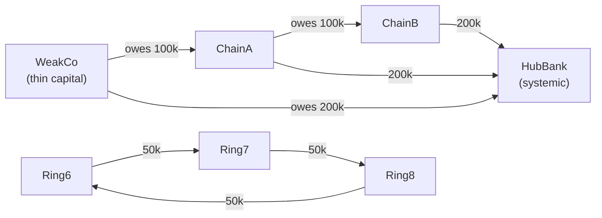

# Case Study: Real-Time Counterparty Credit & Market Risk

```{=latex}
\epigraph{The revolutionary idea that defines the boundary between modern times and the past is the mastery of risk.}{--- Peter L. Bernstein, \emph{Against the Gods}}
```

Banks still compute much of their risk **overnight**, in batch: the book is
frozen, market data is snapshotted, and a grid churns until morning. By the time
the numbers land, the market has moved. The prize everyone chases is **intraday,
real-time risk** — exposure, limits, VaR, and systemic contagion recomputed as
prices tick and trades book. That is precisely the shape of workload ChakraDB is
built for, and this chapter builds it end to end.

It is the risk analogue of the [AML case study](aml.md): a live portfolio and a
streaming market-data feed drive a **materialized worker** that reacts to every
price tick through the change stream, over one consistent dataset, never blocking
ingest. The runnable code is `examples/ccr_pipeline.rs` (Rust) and
`examples/ccr_stream.py` (Python).

## Two risk domains, one engine

| Domain | Question | Cadence |
|---|---|---|
| **Market risk** | How much could the book lose from price moves? (MtM, VaR) | per tick + periodic |
| **Counterparty credit risk (CCR)** | If a counterparty defaults, what do we lose — and who else falls? | per trade + periodic |

Both are functions of the *same* live data — the trades, the prices, and the web
of who owes whom. Stitching them across an OLTP store, a market-data bus, a graph
database, and an overnight risk grid is the status quo; doing them together, in
one embedded engine, on one consistent snapshot, is the ChakraDB thesis.

## The exposure network is a graph

CCR is intrinsically a **network** problem, and this is where the built-in graph
engine becomes the risk engine. Model the interbank system as a directed, weighted
graph: a node is a legal entity; an edge `i → j` of weight `w` means *`i` owes `j`
the amount `w`*. On that one structure:

| Risk question | Built-in primitive |
|---|---|
| Who is systemically important (too-connected-to-fail)? | `pagerank` on the liability network |
| If X defaults, who is dragged under, and by how much? | **`eisenberg_noe`** (clearing vector / default cascade) |
| Hidden circular exposures = netting opportunities | `laundering_cycles` (SCCs) |
| Netting sets / collateral pools | `connected_components` |
| Concentration / Cover-2 | top-k weighted degree |



## The schema

Trades and market data are ordinary tables; the exposure network is a graph over
the same database.

```sql
CREATE TABLE counterparties (id INTEGER PRIMARY KEY, name VARCHAR(32),
    rating VARCHAR(4), external_assets DECIMAL(18,2));
CREATE TABLE trades (trade_id INTEGER PRIMARY KEY, counterparty INTEGER,
    instrument INTEGER, notional DECIMAL(18,2), trade_price DECIMAL(12,4));
CREATE TABLE market_data (tick_id INTEGER PRIMARY KEY, instrument INTEGER,
    price DECIMAL(12,4), ts TIMESTAMP);              -- the streaming feed
CREATE TABLE limits (counterparty INTEGER PRIMARY KEY, limit_amount DECIMAL(18,2));
CREATE TABLE interbank (id INTEGER PRIMARY KEY, debtor INTEGER, creditor INTEGER,
    amount DECIMAL(18,2));                            -- edges of the exposure graph
CREATE TABLE risk_alerts (id INTEGER PRIMARY KEY, entity INTEGER, kind VARCHAR(40));
```

Money is exact `DECIMAL`, never binary float — a hard requirement when the number
is a P&L or an exposure ([Exact Decimal Arithmetic](../engine/data-types.md)).

## Real-time exposure: the per-tick calculation

**Current exposure** to a counterparty is the netted, non-negative
mark-to-market of the trades facing it: `CE_c = max(Σ_{t∈c} MtM_t, 0)`. For a
linear instrument `MtM_t = notional_t · (price − trade_price_t)`. The naïve
approach reprices the whole book on every tick; the scalable approach reprices
**only the trades on the instrument that ticked**, and folds the delta into a
running per-counterparty exposure — O(trades-on-that-instrument), not O(book).

> **ALGORITHM — T0: on each committed price tick `(instrument I, price p)`**
> ```text
> 1  Δ ← p − last_price[I]
> 2  pnl_window.push( Δ · Σ_{t on I} notional_t )        ▷ portfolio P&L for VaR
> 3  for each trade t on I:
> 4      mtm′ ← notional_t · (p − trade_price_t)
> 5      exposure[t.cp] += mtm′ − mtm[t];  mtm[t] ← mtm′  ▷ incremental netting
> 6  for each affected counterparty c:
> 7      if max(exposure[c], 0) > limit[c]:  alert(c, LIMIT_BREACH)
> 8  last_price[I] ← p
> ```

This runs on every committed tick, at ingest speed — the change stream delivers
the tick the instant it commits.

## Portfolio & systemic risk: the periodic pass

The heavy analytics run on a cadence over a consistent `Graph::view()` snapshot,
off the write path.

**Value-at-Risk.** A 99% one-tick VaR by historical simulation: the worst 1% loss
in the rolling P&L window. A breach of the VaR limit raises a portfolio alert.

**Systemic importance.** `pagerank` over the liability network. Because edges run
debtor → creditor, PageRank mass accumulates at the entities everyone owes — the
hubs whose failure would ripple furthest.

**Default contagion — the Eisenberg–Noe clearing vector.** The centerpiece. Given
external assets `e_i` (each entity's outside cash) and the liability edges, the
clearing payment vector `p` solves

```{=latex}
\[
  p_i = \min\!\Big( \bar p_i,\; e_i + \sum_j \Pi_{ji}\, p_j \Big),
  \qquad \bar p_i = \sum_j L_{ij},\quad \Pi_{ji} = L_{ji}/\bar p_j .
\]
```

Each node pays the smaller of what it owes and what it actually has once upstream
payments arrive. ChakraDB solves it by the monotone Picard iteration from
`p = p̄` downward — which converges to the greatest clearing vector — and reports
each entity's payment, surviving equity, and, crucially, the set of **defaulters**:
exactly who a cascade sinks. Feed it a stressed `external_assets` (one entity's
cash set to zero) and it simulates the shock's contagion.

> **ALGORITHM — T2: periodic systemic pass over one snapshot**
> ```text
> 1  view ← exposures.view()
> 2  if VaR₉₉(pnl_window) > var_limit:  alert(PORTFOLIO, VAR_BREACH)
> 3  hub ← argmax view.pagerank();       alert(hub, SYSTEMICALLY_IMPORTANT)
> 4  for d in view.eisenberg_noe(external_assets).defaulted:
> 5      alert(d, DEFAULT_CASCADE)
> 6  for ring in view.laundering_cycles():
> 7      for m in ring: alert(m, CIRCULAR_EXPOSURE)
> ```

## The worker is a materialized worker

The whole risk engine is one [materialized worker](../engine/overview.md) —
a named, incrementally-maintained derivation of the data. In Rust it implements
`MaterializedWorker` and is registered on the change stream:

```rust
let ccr = cdc.materialize(Some("market_data"), RiskWorker::new(engine, exposures, trades, assets));
// ... the feed streams; the worker maintains exposure and fires alerts ...
ccr.query(|w| w.cp_exposure.clone());   // real-time exposure, any time
ccr.stop();                             // client owns the lifecycle
```

In Python it is a class plus `conn.on_change` — the same design, the full engine
(SQL, exact money, the graph algorithms, `eisenberg_noe`) in a few hundred lines:

```python
def react(old, new):
    worker.on_change(old, new)          # dict: {"instrument":…, "price":…}
conn.on_change("market_data", react)
```

## Capacity

The shipped pipeline (`examples/ccr_pipeline.rs`) runs the feed and the reacting
risk worker concurrently over one engine:

```text
Ingest: 40,000 market-data ticks in 0.84s
        = 47,790 ticks/s  ≈  172 million/hour
All injected risks detected live — CCR pipeline verified.
```

Real-time exposure, single-name limits, VaR, systemic-importance, default-cascade
contagion, and circular-exposure detection — all live, over one consistent
dataset, while the feed keeps ticking. The periodic Eisenberg–Noe and PageRank
passes run on an MVCC snapshot, so they never stall ingest. That non-blocking
split is the difference between real-time risk and an overnight batch.

## What ChakraDB made possible

| Risk measure | ChakraDB primitive |
|---|---|
| Real-time current exposure & netting | incremental per-tick repricing (T0) |
| Single-name limit monitoring | live exposure vs `limits` |
| Portfolio VaR / Expected Shortfall | historical simulation over the P&L window |
| Systemic importance | `pagerank` on the exposure network |
| Default-cascade contagion | **`eisenberg_noe`** clearing vector |
| Circular exposures / netting | `laundering_cycles` (SCC) |
| Netting sets | `connected_components` |

The injected risks — a concentrated single-name breach, a portfolio VaR breach, a
systemic hub, a thinly-capitalised default cascade, and a ring of circular
exposures — are every one detected **live**, in one embedded process, while the
market-data feed streams at 170 million ticks/hour. **Risk, in real time, over one
consistent view of the book.**
