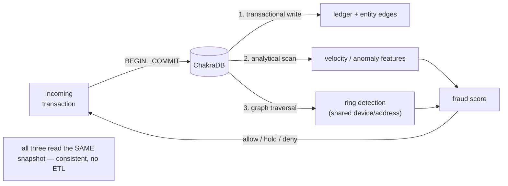

# Case Study: Real-Time Fraud Detection (HTAP + Graph)

```{=latex}
\epigraph{Trust, but verify.}{--- Russian proverb}
```

This case study exercises everything at once: transactional ingest, analytical
scoring, and graph traversal — over **one consistent snapshot**, in one embedded
process. It is the workload ChakraDB is built for.

## The problem

A payments service must, for each incoming transaction, decide *in-line* whether it
looks fraudulent. Fraud signals are both **statistical** (this card's spend rate
just spiked) and **relational** (this device has touched five accounts that share a
shipping address with a known mule). Traditionally that means two or three systems:
an OLTP store for the writes, a warehouse for the stats, and a graph database for
the relationships — kept in sync by ETL, always a little stale.

ChakraDB collapses them.



## The schema

```sql
-- The transactional ledger (exact money — no rounding).
CREATE TABLE txns (
  id        INT PRIMARY KEY,
  card_id   INT NOT NULL,
  device_id INT NOT NULL,
  amount    DECIMAL(12,2) NOT NULL CHECK (amount >= 0),
  ts        TIMESTAMP NOT NULL,
  status    VARCHAR(8) DEFAULT 'pending'
);

-- The entity graph: cards, devices, addresses linked by shared use.
-- (Managed by the Graph handle; edges keyed (src,dst) src-major.)
```

Nodes are entities (cards, devices, addresses, accounts); an edge means "these two
entities were seen together." A fraud *ring* is a dense cluster in this graph.

## Ingest: the transactional write

Each transaction is one ACID transaction — the ledger row and the entity edges
commit together, so no reader ever sees half of it:

```sql
BEGIN;
  INSERT INTO txns VALUES (9001, 55, 88, 249.99, '2026-07-22 14:03:01', 'pending');
  -- link card 55 <-> device 88 in the entity graph (via the Graph handle)
COMMIT;                       -- first-committer-wins; crash-atomic
```

`DECIMAL(12,2)` keeps money exact; `CHECK`/`NOT NULL` reject bad rows before they
touch the log.

## Scoring: analytical + graph, one snapshot

The scorer takes a single snapshot and reads all three signals from it — no
cross-system consistency to reason about:

```rust
let snap_engine = &engine;                 // SQL over the current snapshot
let graph_view  = fraud_graph.view()?;     // CSR over the SAME instant

// (A) Statistical: this card's velocity in the last minute.
let velocity: i64 = snap_engine
    .query("SELECT COUNT(*) FROM txns \
            WHERE card_id = 55 AND ts > '2026-07-22 14:02:01'")?
    [0][0].parse()?;

// (G) Relational: how tightly is this device tied into a cluster?
let ring_size = graph_view
    .connected_components_of(device_node)   // its component
    .len();
let local_density = graph_view.triangle_count_around(device_node);

let score = weight_v * velocity as f64
          + weight_r * (ring_size as f64) * (1.0 + local_density as f64);
```

The analytical `COUNT(*)` runs on the interpreter with zonemap pruning; the graph
traversal runs over the CSR view. **Both see the transaction that was just
committed** — because they read the same MVCC snapshot as the ledger.

## Why the other architectures struggle here

- **Warehouse + ETL:** the graph and stats lag the ledger by minutes — useless for
  in-line scoring.
- **Separate graph DB:** the scorer must join across two systems and reconcile two
  consistency models; the graph mutation contends with the traversal.
- **Single-writer OLAP (DuckDB):** cannot ingest concurrently with the scan; the
  write stream would have to pause for every analytical read.

ChakraDB serves all three from one snapshot, in one process, with writers never
blocked by the scorer.

## Operating it

- Run the **scorer** in-line (per transaction) using live adjacency
  (`out_neighbors`, `out_degree`) for cheap signals, and a periodic `view()` +
  `pagerank`/`connected_components` pass for the expensive ring analysis (see
  [Live Graph Analytics](../graph/snapshot.md)).
- Watch `Storage::stats()` for checkpoint lag and backpressure under peak ingest
  (see [Observability](../getting-started/getting-started.md)).
- Back up the store with `backup_to` on a cadence (see
  [Backup & Restore](../getting-started/getting-started.md)).

## The takeaway

Fraud detection is the archetypal **HTAP + graph** workload: fast writes, live
statistics, and relationship traversal, all needing to agree on the *same instant*.
ChakraDB's contribution is that the agreement is free — it is one snapshot clock —
so the application is a few queries and a graph view, not a three-system
integration project.
