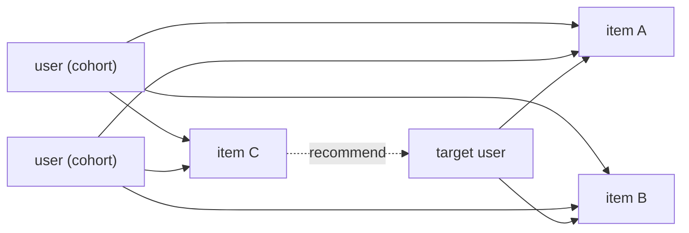

# Case Study: Real-Time Recommendations

```{=latex}
\epigraph{People who liked this also liked \ldots}{--- every store, everywhere}
```

The first two case studies catch *bad* behaviour. This one is the opposite: it
helps, and it shows ChakraDB's reach beyond fraud and risk. A stream of user
interactions — views, clicks, purchases — drives a **live recommendation
engine**: as engagement arrives, "what should this user see next?" is answered in
real time, over one consistent graph, never blocking the ingest that feeds it.

The workload usually needs a separate feature store, a nightly model-training
job, and a serving tier reconciled by pipelines. Here it is one embedded process
reacting to the interaction stream. The runnable code is
`examples/reco_pipeline.rs` (Rust) and `examples/reco_stream.py` (Python).

## Recommendation is link prediction on a bipartite graph

Model engagement as a bipartite graph: users on one side, items on the other, an
edge for each interaction. "What should user *u* see?" becomes *link prediction*
— which edges are likely to form next — and ChakraDB has the primitives built in:

| Question | Built-in primitive |
|---|---|
| What should this user see next? | `recommend(user, k)` — random-walk-with-restart |
| You might also like … | `adamic_adar(a, b)` — rarity-weighted item similarity |
| What's trending? | `out_degree` / `pagerank` |
| Users like this one | `jaccard_similarity`, `common_neighbors` |

Edges are added **both ways** (`u → i` and `i → u`) so a random walk can bounce
user → item → user → item, which is exactly collaborative filtering: the walk
reaches items engaged by users similar to you.



The target user engaged A and B; a cohort engaged A, B **and C**; the walk from
the target reaches C through the cohort — so C is recommended.

## The schema

```sql
CREATE TABLE interactions (id INTEGER PRIMARY KEY, user_id INTEGER,
    item_id INTEGER, kind VARCHAR(8), ts TIMESTAMP);   -- the engagement stream
CREATE TABLE recommendations (id INTEGER PRIMARY KEY, user_id INTEGER, item_id INTEGER);
```

The engagement **graph** is derived from the stream; item nodes live above the
user-id range so the two never collide.

## The recommender is a materialized worker

The engine is one [materialized worker](../reactive/change-streams.md) over the
interaction stream. Each interaction folds into the graph (T0); recommendations
refresh periodically over a snapshot (T2).

> **ALGORITHM — T0: on each committed interaction `(user u, item i)`**
> ```text
> 1  graph.add_edge(u, item_node(i));  graph.add_edge(item_node(i), u)   ▷ both ways
> ```

> **ALGORITHM — T2: refresh recommendations over one snapshot**
> ```text
> 1  view ← graph.view()
> 2  recs    ← view.recommend(u, k)            ▷ items reached via similar users, unseen
> 3  trending← items sorted by view.out_degree ▷ most distinct users
> 4  similar ← view.adamic_adar(anchor, ·)     ▷ "you might also like"
> ```

`recommend` runs personalized PageRank seeded at the user, drops the user's
already-engaged items and any zero-signal candidate, and returns the top-`k`
remainder — collaborative filtering expressed as a graph walk, in one call.

## In code

Rust — register the recommender on the interaction stream:

```rust
let engagement = Graph::open(db.clone(), "engagement")?;
let reco = cdc.register("recommender", Some("interactions"),
                        Recommender::new(engine.clone(), engagement));
// … the feed streams; recommendations refresh incrementally …
reco.query(|w| w.last_recommendations.clone());
```

Python — the same worker as a class plus `conn.on_change`:

```python
view = graph.view()
recs   = view.recommend(target_user, 10)      # [(item_node, score), …]
trend  = sorted(items, key=view.out_degree, reverse=True)
also   = view.adamic_adar(item_a, item_b)
```

## Capacity

```text
Ingest: 50,000 interactions in 1.1s
        = 45,899 interactions/s  ≈  165 million/hour
Recommendations verified — the cohort's item surfaced live.
```

Recommendations stay fresh as engagement streams, because the heavy walk runs on
an MVCC snapshot off the write path. A cohort's co-engaged item is surfaced to
the target user; the trending item ranks first by engagement; Adamic–Adar ranks
the bundle items as most similar — every check passing on the live stream.

## The pattern, three times over

This is the third system built on the same machinery — the change stream, a
materialized worker, and the graph library — as
[AML](aml.md) and [Counterparty Risk](ccr.md). Catch laundering, measure
systemic risk, or personalize a feed: the engine is the same, the workload reacts
to live data in one process, and the reader never blocks the writer. That is what
makes ChakraDB more than a query engine — it is a substrate for real-time systems.
