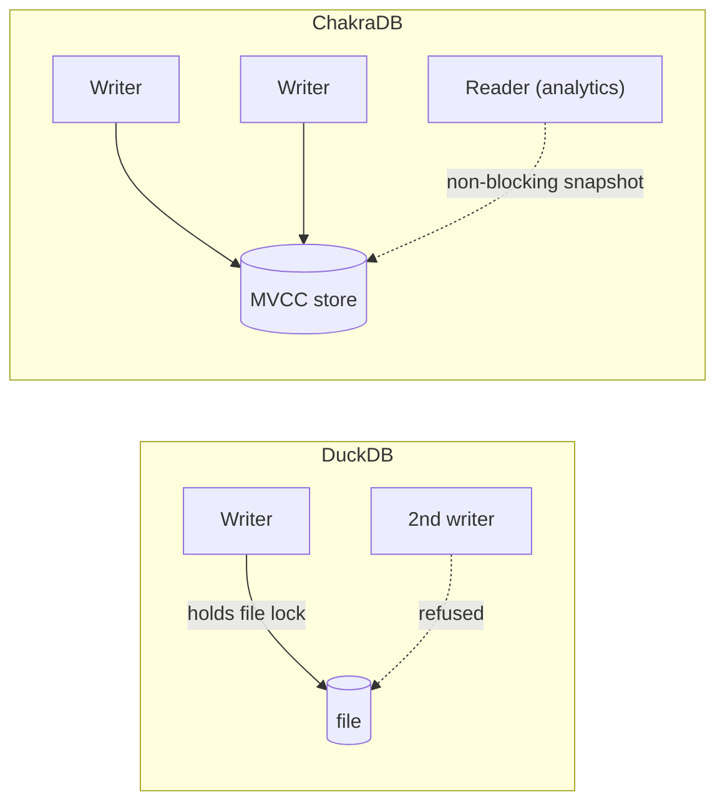

# ChakraDB vs. DuckDB

```{=latex}
\epigraph{If you know the enemy and know yourself, you need not fear the result of a hundred battles.}{--- Sun Tzu}
```

DuckDB is the reference point — the best-in-class embedded analytical engine. This
chapter is honest about where DuckDB wins, where ChakraDB wins, and the one axis
where the comparison is *structural* rather than a matter of tuning.

## The structural difference: concurrent writers

DuckDB holds a **single-writer file lock**. A second process opening the same
database for writing is refused at the OS level (`IO Error: Could not set lock`).
That is not a tuning parameter — it is the concurrency model.

ChakraDB permits **continuous concurrent writers with non-blocking snapshot
reads**. This is the wedge: ChakraDB serves a workload DuckDB *structurally
cannot* — a live write stream with analytics running over it at the same time.



**Measured:** under 4 threads issuing durable, WAL-logged writes, ChakraDB's
analytical query p50 degrades just **1.49×** (2.2 → 3.3 ms) while ~8,900 writes
commit *during* the measurement, readers never block, and every query sees a stable
snapshot (`wedge-bench`). DuckDB cannot run this benchmark — the second writer is
refused.

## Cold-scan analytics: DuckDB's home turf

On a static dataset scanned cold, DuckDB is excellent and mature. ChakraDB does not
try to out-scan it; the goal is to be *competitive* while adding concurrency. On a
105-column ClickBench-shaped table, identical results to DuckDB, p50 ms:

| Query | 10M — ChakraDB | 10M — DuckDB | Winner |
|---|---:|---:|---|
| `COUNT(*)` | 0.0 | 0.0 | tie |
| filtered count (`<>`) | 4.8 | 1.0 | DuckDB |
| sum/avg | 5.3 | 3.0 | DuckDB |
| `COUNT(DISTINCT UserID)` | **40.6** | 60.0 | **ChakraDB 1.5×** |
| `COUNT(DISTINCT SearchPhrase)` | **12.0** | 36.0 | **ChakraDB 3×** |
| min/max | 0.1 | 0.0 | tie (both instant) |
| group-by adv engine | 4.9 | 2.0 | DuckDB |
| top users (group+sort) | **59.7** | 71.0 | **ChakraDB** |
| top phrases / by time | 55.7 / 52.1 | 24.0 / 15.0 | DuckDB |
| pk range ~20 rows | 1.1 | 1.0 | tie (both prune) |

**Reading it:**
- **ChakraDB wins the big `COUNT(DISTINCT)`s at scale** (up to 3×) and top-users —
  and those margins *widen* as rows grow.
- **DuckDB wins simple `GROUP BY` and top-K** — its vectorized hash-agg and top-K
  operators are more optimized, and zonemaps don't help those shapes.
- **Selective range scans are a tie** — both prune (DuckDB via rowgroup stats,
  ChakraDB via zonemaps); a needle range stays ~1 ms as the table grows 100×.

The full harness (both engines, identical CSV) is `src/bin/clickbench.rs` +
`scripts/clickbench_duckdb.sh`; the numbers and method are in
Benchmark Methodology.

## Feature and model comparison

| | DuckDB | ChakraDB |
|---|---|---|
| Model | embedded OLAP | embedded **HTAP + graph** |
| Concurrent writers | ❌ single-writer lock | ✅ MVCC, non-blocking reads |
| Transactions | ✅ | ✅ (BEGIN/COMMIT/ROLLBACK, first-committer-wins) |
| Analytical engine | native vectorized | DataFusion (vectorized) |
| Graph | ❌ | ✅ built-in (adjacency + algorithms) |
| On-disk format | native (open via extensions) | Arrow IPC parts (open) |
| Exact `DECIMAL` | ✅ | ✅ (i128 / Arrow Decimal128) |
| Backup/restore | file copy | `backup_to` / `restore` (consistent) |
| Maturity | very high | young, but crash-tested |

## When to pick which

- **Pick DuckDB** for the fastest cold-scan analytics over data you loaded earlier,
  on a laptop-class machine, with a single writer.
- **Pick ChakraDB** when writes and analytics happen *at the same time* on live
  data, when you also need **graph** traversals over that data, or when concurrent
  ingest must never pause for a reader.

They are not the same product. DuckDB optimizes the *static-analytics* axis;
ChakraDB optimizes the *live, concurrent, multi-model* axis.
