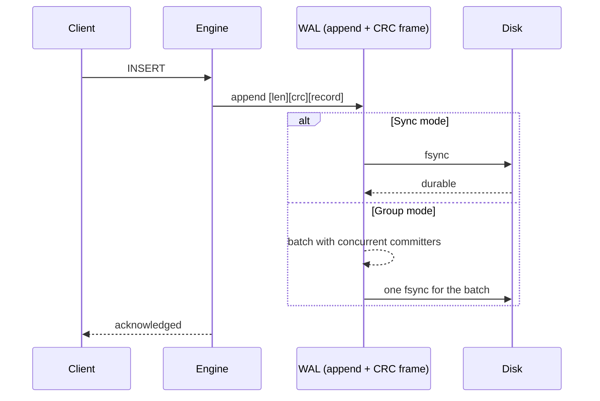
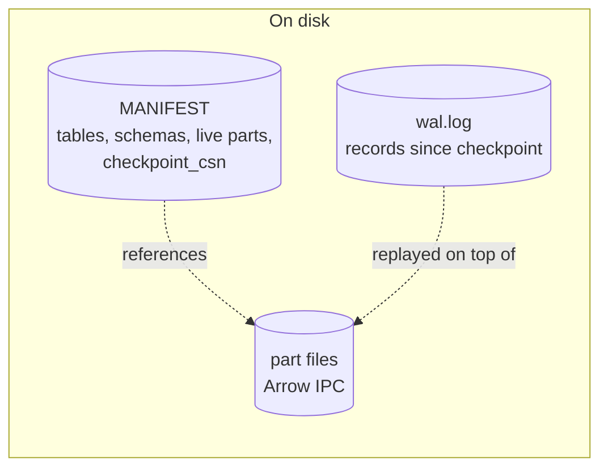
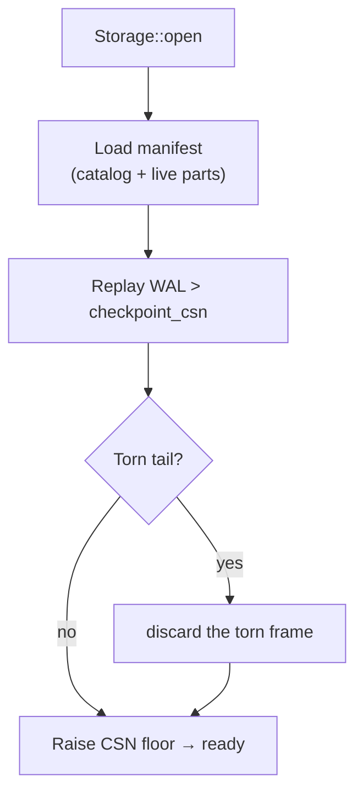
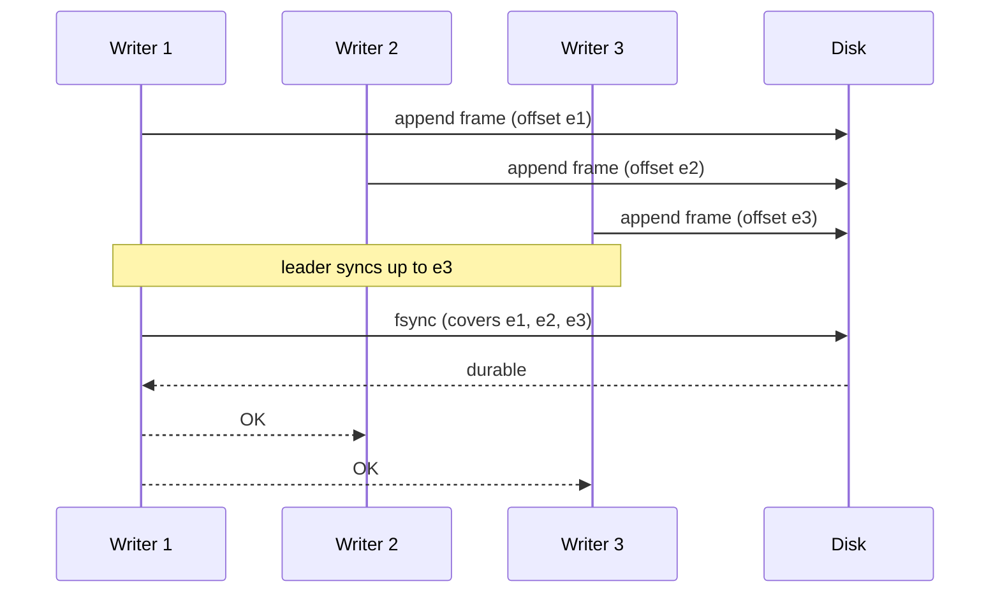

# Durability: WAL, Group Commit & Recovery

```{=latex}
\epigraph{The palest ink is better than the best memory.}{--- Chinese proverb}
```

A durable ChakraDB (`Storage`) guarantees that an acknowledged write survives a
crash. The mechanism is a classic **write-ahead log** with **group commit**, a
**manifest** for the catalog and part set, and a **recovery** pass that replays the
log. This chapter covers all three — the design, then the WAL and recovery
algorithms with their byte-level detail — in the sections below.

## Write-ahead logging

Every mutation is appended to the WAL **before** it is acknowledged. A record is
framed with a length and a CRC, so a crash mid-append leaves a *torn* final frame
that recovery detects by checksum and discards — the log's valid prefix is always
recoverable.



## Three durability modes

The trade between latency and the guarantee is a knob:

| Mode | Guarantee | Cost |
|---|---|---|
| `Sync` | every write `fsync`'d before ack | strongest, one fsync/write |
| `Group` | concurrent writers share one `fsync` | strong, amortized |
| `Async` | acked before `fsync` | fastest; a crash may lose the last unflushed writes |

**Group commit** is the default sweet spot: when many threads commit at once, their
records are appended and made durable with a *single* `fsync`, so throughput scales
with concurrency instead of paying a sync per write.

## The manifest and checkpointing

The WAL grows without bound if never trimmed. A **checkpoint** makes the in-memory
state durable in parts, records the live part set and each table's schema in the
**manifest**, and advances a `checkpoint_csn` — after which the log *before* that
point is reclaimable. Checkpointing is incremental: unchanged parts are skipped,
and parts that only gained tombstones get just those appended. See
Checkpointing.



## Recovery

On open, recovery reconstructs the exact acknowledged state:

1. Read the **manifest** — the catalog (tables + schemas) and the live part set as
   of the last checkpoint. Part *indexes* are loaded resident; part *data* is
   faulted lazily on first touch (fast reopen).
2. Replay the **WAL** past `checkpoint_csn`, applying each record to the in-memory
   tables. A torn final frame is discarded.
3. Raise the CSN clock above the highest replayed stamp, so no version number is
   ever reissued.



## How well it's tested

Durability is the property you cannot get wrong, so it is tested adversarially:

- **10,000 randomized crash trials** verify that every acknowledged write survives,
  in all three durability modes (`crash_consistency`).
- **Durable SQL** adds tens of thousands more crash trials — millions of
  acknowledged writes verified across integer, text, and keyless schemas
  (`durable_sql_crash`).
- A committed multi-statement transaction is one WAL record, so truncating the log
  at *every byte* leaves the transaction either fully applied or fully absent —
  never partial (`torn_commit_record_is_all_or_nothing`).

## The single I/O seam

Everything reaches disk through one `trait Io` (see [The I/O
Abstraction](storage.md)) — a real POSIX backend for production and an in-memory,
fault-injecting backend (`MemIo`) that makes those thousands of crash trials
possible without touching a real disk. The durability logic is identical over
both.

## Write-Ahead Logging & Group Commit


Durability is the promise that an acknowledged write survives a crash. ChakraDB
keeps it with a write-ahead log: every mutation is framed, checksummed, and made
durable *before* the write is acknowledged. Group commit amortizes the `fsync` so
throughput scales with concurrency.

## Record framing

Each WAL record is wrapped in a self-describing frame so a torn write is
detectable:

```text
 ┌──────────┬──────────┬──────────────────────────┐
 │ len (u32)│ crc (u32)│ payload (len bytes)       │
 └──────────┴──────────┴──────────────────────────┘
```

The payload is one of: `Insert{table, csn, row}`, `Delete{table, csn, key}`,
`Seal{table, csn, part_id}`, `Checkpoint{csn}`, or `Txn{ops}` (a whole committed
transaction as one record). The length lets recovery find the next frame; the CRC
lets it reject a frame torn by a crash mid-append.

## The append

> **ALGORITHM 5 — WAL append and acknowledge**
> ```text
> Input:  record R; durability mode M ∈ {Sync, Group, Async}
> Output: acknowledgement (the write is durable per M)
> 1  frame ← [len(R)] ++ [crc32(R)] ++ encode(R)
> 2  acquire the append lock                          ▷ assigns byte offsets in order
> 3  append frame to the log at the current end
> 4  release the append lock
> 5  case M of
> 6    Sync:  fsync()                                 ▷ durable before returning
> 7    Group: wait for the group fsync (ALGORITHM 6)  ▷ shared with concurrent writers
> 8    Async: return now                              ▷ a crash may lose the last frames
> 9  return OK
> ```

The append lock is held only for the byte-copy that assigns offsets; the `fsync`
(the expensive part) happens outside it, so writers do not serialize on the disk.

## Group commit

When many threads commit at once, forcing one `fsync` per write wastes the disk's
throughput — a single `fsync` makes *everything appended so far* durable. Group
commit exploits that:

> **ALGORITHM 6 — Group commit**
> ```text
> Input:  a stream of concurrent committers, each having appended its frame
> Output: one fsync makes a whole batch durable
> 1  each committer records the log end e_i after its append, then waits
> 2  one committer becomes the LEADER:
> 3      target ← current log end                     ▷ covers every frame ≤ target
> 4      fsync()                                       ▷ a single disk sync
> 5      publish durable-through = target
> 6  every waiter with e_i ≤ target wakes and returns OK
> ```

Because an `fsync` covers all bytes written before it, `k` concurrent commits need
one sync instead of `k`. The measured effect is that syncs-per-append drops sharply
as concurrency rises — group commit is why durable throughput scales with writers
rather than collapsing to disk-sync latency.



## The three modes

| Mode | Line | Guarantee | When to use |
|---|---|---|---|
| `Sync` | 6 | every write `fsync`'d before ack | strictest; low write rate |
| `Group` | 7 | concurrent writers share one `fsync` | default; high concurrency |
| `Async` | 8 | acked before `fsync` | fastest; a crash may lose the last unflushed writes |

## The crash-atomicity of a transaction

A committed transaction is written as **one** `Txn` record — a single frame. Since
a frame is all-or-nothing under the CRC, recovery applies the whole transaction or
none of it.

> **Proposition 4 (Commit atomicity).** A crash during the commit of a transaction
> leaves the database in a state with either all of the transaction's writes or
> none.
>
> *Proof sketch.* The transaction's writes are one framed record. If the crash
> occurs before the frame's bytes (and their covering `fsync`) are durable, recovery
> sees no valid frame there (the CRC fails on the torn tail) and discards it —
> *none*. If the frame and its `fsync` completed, recovery replays the whole frame
> — *all*. There is no third outcome because the frame is the unit of durability.
> This is verified empirically by truncating the log at **every** byte and asserting
> the recovered row count is only ever the pre-transaction value or the
> post-transaction value (`torn_commit_record_is_all_or_nothing`). ∎

Recovery — how the log is replayed to reconstruct the acknowledged state — is the
next section.

## Crash Recovery


Recovery reconstructs the exact acknowledged state after a crash: the catalog from
the manifest, the data from the parts, and everything since the last checkpoint by
replaying the WAL — discarding any torn tail.

## The procedure

> **ALGORITHM 7 — Recovery**
> ```text
> Input:  a database directory (manifest, part files, wal.log)
> Output: an open database at the last acknowledged state
> 1  M ← read manifest                                 ▷ catalog + live parts + checkpoint_csn
> 2  for each table T in M:
> 3      rebuild T's schema; register its live parts    ▷ indexes resident, data lazy
> 4  max ← M.checkpoint_csn
> 5  for each frame F in wal.log, in order:
> 6      if not crc_ok(F): break                        ▷ torn tail — stop cleanly (ALG 7a)
> 7      if F.csn ≤ M.checkpoint_csn: continue           ▷ already durable in parts
> 8      apply F to the in-memory tables                 ▷ Insert/Delete/Txn; skip unknown tables
> 9      max ← builtin_max(max, F.csn)
> 10 set the CSN clock floor to max + 1                  ▷ never reissue a stamp
> 11 return the open database
> ```

Three things make this correct and fast.

**Only the tail is replayed.** A checkpoint has already written everything at or
below `checkpoint_csn` into parts (recorded in the manifest), so recovery skips
those frames (line 7) and replays only what came after — usually a small tail.

**Parts load lazily.** Line 3 registers each part's *index* (Bloom, bounds, version
stamps, deletion vector) resident, but leaves its *column data* on disk until first
touched. Reopening a large database is therefore near-instant — flat in the number
of parts, not their bytes.

**Unknown tables are skipped.** If a frame references a table not in the manifest
(it was dropped, or a `TRUNCATE` gave it a fresh id), line 8 ignores it. This is
what makes `DROP TABLE` and `TRUNCATE` durable without a special log record — see
[the SQL surface](../getting-started/getting-started.md).

## The torn tail

A crash mid-append leaves a partial final frame. Recovery detects it by checksum
and stops — the log's valid prefix is always recoverable:

> **ALGORITHM 7a — Torn-tail detection (line 6, expanded)**
> ```text
> Input:  the byte at the current read position in the log
> Output: the next valid frame, or STOP
> 1  if fewer than 8 bytes remain: STOP                 ▷ no room for len+crc
> 2  len ← read u32;  crc ← read u32
> 3  if fewer than len bytes remain: STOP               ▷ payload truncated
> 4  payload ← read len bytes
> 5  if crc32(payload) ≠ crc: STOP                       ▷ torn or corrupt frame
> 6  return decode(payload)
> ```

Everything after the first bad frame is discarded — those writes were never
acknowledged (their covering `fsync` had not completed), so dropping them is
correct.

```mermaid
flowchart LR
    subgraph log["wal.log after a crash"]
      F1["frame 1 ✓"] --> F2["frame 2 ✓"] --> F3["frame 3 ✓"] --> T["torn frame ✗"]
    end
    F1 & F2 & F3 -->|replayed| DB[("recovered state")]
    T -.->|discarded (crc fails)| X["(dropped)"]
    style T fill:#f5d6d6
```

## Why it recovers the exact acknowledged state

> **Proposition 5 (Recovery completeness).** After recovery, the database contains
> every acknowledged write and no unacknowledged one.
>
> *Proof sketch.* An *acknowledged* write is, by the durability mode
> (ALGORITHM 5), one whose frame and covering `fsync` completed — so its
> frame is intact and precedes the torn tail, and it is replayed (or already in a
> part below the checkpoint). An *unacknowledged* write either never reached the log
> or sits in the torn tail; the CRC rejects the latter, so it is dropped. Hence the
> recovered set is exactly the acknowledged set. This is stress-tested by tens of
> thousands of randomized crash trials across all durability modes and schemas
> (`crash_consistency`, `durable_sql_crash`). ∎

## Clock safety

Line 10 raises the CSN clock above the highest replayed stamp. Without it, a
recovered database could hand out a CSN a replayed row already used, and two rows
would collide on a version number — corrupting [visibility](mvcc.md). The
floor makes recovered CSNs safe: the next allocation is strictly greater than
anything on disk.
