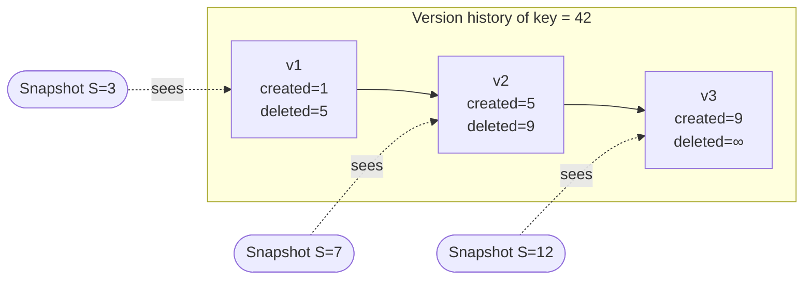
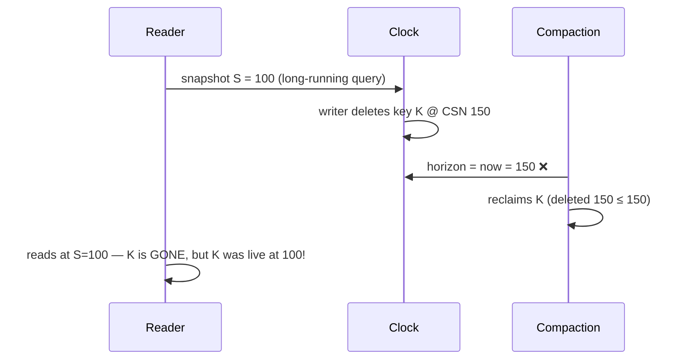
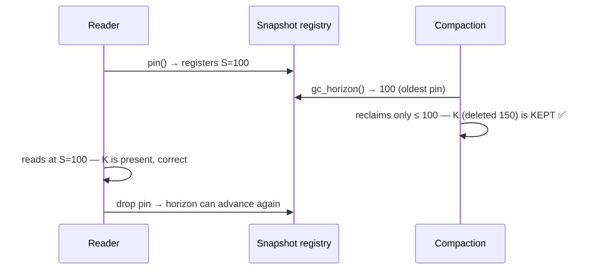
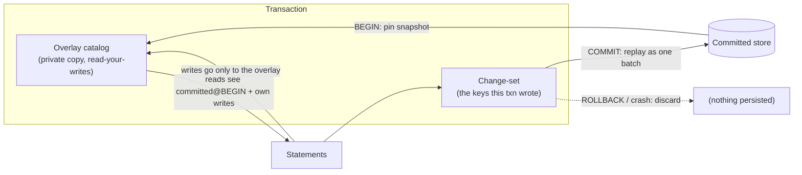
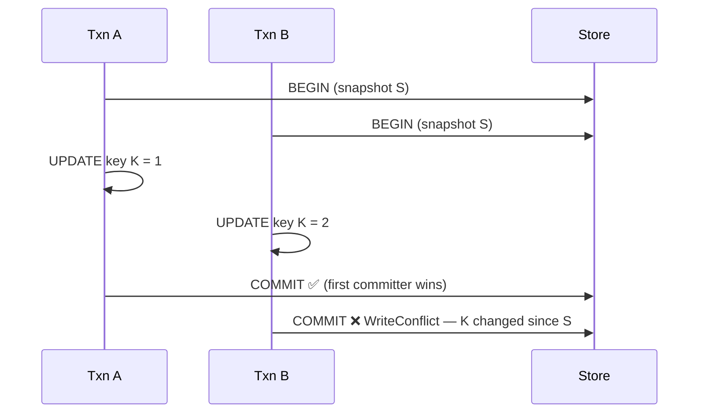

# MVCC & Snapshot Isolation

```{=latex}
\epigraph{Time is what keeps everything from happening at once.}{--- Ray Cummings}
```

Multi-Version Concurrency Control is the reason readers never block writers. This
chapter is the *model*; the visibility algorithm and
the GC watermark get the full treatment in Part
III.

## The commit sequence number (CSN)

There is one piece of global state every writer touches: a monotonic 64-bit
counter, the **commit sequence number**. Allocating a CSN is a single atomic
increment. A **snapshot** is just a CSN — a number naming an instant.

Every row version carries two stamps:

- `created` — the CSN at which this version came to exist.
- `deleted` — the CSN at which it was superseded or removed (or `NEVER_DELETED`).

## The visibility predicate

A version is visible to a snapshot `S` if and only if it was created at or before
`S` and not yet deleted as of `S`:

```
visible(S, created, deleted)  ⟺  created ≤ S < deleted
```

That is the whole rule. It is a pure function of three integers — no locks, no
undo log, no read view to construct.



At `S=3`, only `v1` satisfies `created ≤ 3 < deleted` (1 ≤ 3 < 5). At `S=7`, only
`v2` (5 ≤ 7 < 9). Exactly one version of a live key is visible to any snapshot —
which is what makes an `UPDATE` a create-plus-delete rather than a mutation.

## Why cold data is free

The predicate has two fast-path corollaries that make ChakraDB's scans cheap:

> **A part created entirely at or before `S` and with no deletions after `S` is
> "fully visible" — every one of its rows passes, so the scan skips the per-row
> check entirely.**

Concretely, a part stores a uniform `created` stamp and the minimum `deleted` CSN
across its rows. If `created_max ≤ S` and `S < min_deleted`, the whole part is
visible with a single comparison. A cold, unmodified part — the vast majority of a
large table — pays **zero** per-row version cost on a scan. Only recently-modified
parts and the L0 buffer pay the per-row predicate. This is the "cost of concurrency
is paid only by data that was recently modified" principle, from Neumann et al.'s
MVCC design, made concrete.

## Snapshot isolation, across tables

The CSN clock is global to a database, so a snapshot is consistent **across every
table at once.** An application reading two tables at snapshot `S` observes both as
of the same instant — no torn cross-table view. This is what lets the graph layer
build a consistent adjacency from an edges table while a nodes table is also being
written.

## Readers do not block writers — and the reverse

- A **reader** takes a snapshot number and scans the parts visible to it. It grabs
  the part list under a brief read lock, then scans **lock-free**; the parts are
  immutable, so nothing a writer does can change what the reader is reading.
- A **writer** advances the clock and appends a new version. It never waits on a
  reader.

The one serialization point is *per table*: two writers to the *same* table take a
short write lock for the L0 insert. Different tables write concurrently. (This is
the deliberate trade in the [cost model](../introduction/introduction.md).)

## Garbage collection needs a watermark

Because old versions stay until compaction reclaims them, compaction must not drop
a version some live snapshot can still see. ChakraDB tracks a **live-snapshot
registry**: a long-running reader (a query or a transaction) *pins* its snapshot,
and compaction's reclamation horizon is held back to the oldest pinned snapshot. A
reader on an old snapshot keeps its view even as newer writes are compacted away.
The full mechanism — and why it is correct under concurrency — is in
The GC Watermark.

## Durability of the clock

The CSN is monotonic and never reset. On recovery, the counter is raised above the
highest CSN any replayed record used, so a recovered database never reissues a
stamp — two rows can never collide on a version number. The counter is 64-bit:
~1.8×10¹⁹ total mutations over a database's entire lifetime.

## MVCC Visibility


Visibility is the pure function at the heart of snapshot isolation. It decides,
for a snapshot `S` and a row version stamped `(created, deleted)`, whether that
version is the one `S` should see. Everything about ChakraDB's non-blocking reads
follows from how cheap this function is.

## The predicate

> **ALGORITHM 3 — Version visibility**
> ```text
> Input:  snapshot S (a CSN); version stamps created, deleted
> Output: true if the version is visible to S
> 1  return created ≤ S  and  S < deleted            ▷ deleted = ∞ if never deleted
> ```

That is the whole rule: a version is visible iff it was created at or before `S`
and not yet deleted as of `S`. It is three integer comparisons — no lock, no undo
log, no read-view to materialize.

An `UPDATE` is modeled as *delete-old + create-new*: the old version's `deleted` is
set to the new CSN, and the new version's `created` is that same CSN.

> **Proposition 2 (Exactly one live version).** For any live key and any snapshot
> `S`, exactly one version satisfies `created ≤ S < deleted`.
>
> *Proof sketch.* The versions of a key form a chain: `v₁(c₁, d₁), v₂(c₂, d₂), …`
> with `d_i = c_{i+1}` (each delete coincides with the next create), the last
> version having `deleted = ∞`. The intervals `[c_i, d_i)` therefore **partition**
> the CSN line from `c₁` to `∞`. Any `S ≥ c₁` lands in exactly one interval; any
> `S < c₁` lands in none (the key did not exist yet). ∎

```mermaid
flowchart LR
    subgraph chain["Version chain of one key — intervals partition the CSN line"]
      direction LR
      A["[1, 5)"] --> B["[5, 9)"] --> C["[9, ∞)"]
    end
    S3(["S=3 → [1,5)"]):::a --> A
    S7(["S=7 → [5,9)"]):::b --> B
    S12(["S=12 → [9,∞)"]):::c --> C
    classDef a fill:#bde0fe; classDef b fill:#a2d2ff; classDef c fill:#8ecae6;
```

## Why cold data is free

The predicate has a batched fast path that is the reason a large scan is cheap.
Instead of testing every row, a scan tests the *whole part* first:

> **ALGORITHM 4 — Full-part visibility fast path**
> ```text
> Input:  snapshot S; part P with uniform created stamp c_max
>         and minimum deletion m_del over its rows
> Output: how to scan P under S
> 1  if c_max ≤ S and S < m_del:                     ▷ every row created ≤ S,
> 2      scan ALL rows of P — no per-row check        ▷ none deleted ≤ S
> 3  elif S < c_min:                                  ▷ part entirely in the future
> 4      skip P                                        ▷ nothing visible
> 5  else:
> 6      for each row r in P:                          ▷ the slow path
> 7          if ALGORITHM 3 holds and r not tombstoned: emit r
> ```

Line 1 is the corollary that matters: a part whose newest creation is `≤ S` and
whose earliest deletion is `> S` is **fully visible** — every row passes, so the
scan emits the batch with a single comparison and *zero* per-row work.

> **Proposition 3 (Cold-scan cost).** A scan at `S` pays the per-row visibility
> check only on parts modified in the window the snapshot straddles; cold,
> unmodified parts pay `O(1)` per part.
>
> *Proof sketch.* A cold part has a uniform `created ≤ S` (it was written long ago)
> and no deletions after `S`, so it takes the fast path (ALG 4, line 1) — one
> comparison for the entire part. Only parts with a `created` or a `deleted` inside
> `(S_min, S_max]` fall to the slow path. Hence a billion-row table with a thousand
> recent mutations checks a thousand rows, not a billion — the "cost of concurrency
> is paid only by recently-modified data" principle, from Neumann et al. ∎

## Where the stamps live

Per-part, ChakraDB stores the version stamps compactly: a part whose rows all share
one CSN stores a single `Uniform(csn)` rather than a stamp per row (the common case
for a bulk-sealed part), and a **deletion vector** records which ordinals are
tombstoned and at which CSN. So the fast path's `c_max` and `m_del` are `O(1)` to
read, and the slow path consults the deletion vector rather than rewriting the part.

## The consequence for concurrency

Because visibility is a pure function of a snapshot number and immutable per-row
stamps, a reader needs **no lock**: it fixes `S`, grabs the (immutable) part list,
and scans. A concurrent writer advances the clock and appends new versions with
higher CSNs — invisible to `S`. This is the mechanism behind "readers never block
writers," and it is why the same snapshot feeds analytics, transactions, and the
[graph CSR](../graph/snapshot.md) consistently.

## The GC Watermark & Live-Snapshot Registry


Compaction reclaims space by dropping row versions no one can see any more. Get the
"no one can see" test wrong and you get the worst kind of bug: a silent wrong answer
for a reader on an old snapshot. This chapter is how ChakraDB gets it right — the
correctness guarantee behind the concurrency wedge.

## The hazard

Compaction, when it merges parts, physically reclaims rows whose deletion CSN is at
or before a **horizon**. The rule is:

> The horizon must be **≤ the oldest CSN any live snapshot may still observe.**
> Reclaim anything newer, and a reader holding an older snapshot loses a row it
> should still see.

The danger case, if the horizon were just "now":



At `S=100`, key `K` (deleted at 150) *should* be visible. A horizon of "now" would
have reclaimed it.

## The fix: a live-snapshot registry

ChakraDB tracks the oldest live reader and holds the horizon back to it. The CSN
generator keeps a small registry — a map from CSN to a count of live *pins*:

- A read that must outlive a clock advance — a query or a transaction — **pins** its
  snapshot: it registers its CSN and gets an RAII guard.
- **`gc_horizon()`** = the smallest pinned CSN, or the current clock if none are
  pinned.
- Compaction reclaims only up to `gc_horizon()`.

```text
pin():                       gc_horizon():               on guard drop:
  lock registry                lock registry               lock registry
  csn = current()              h = min(registry keys)      registry[csn] -= 1
  registry[csn] += 1              or current() if empty     if 0: remove csn
  return guard(csn)            return h                    unlock
```



## The subtle part: no window

The correctness hinges on one detail: **reading the current CSN and registering the
pin happen under the same lock that `gc_horizon` uses.** Otherwise a compaction could
compute a horizon *above* a pin that is about to register at a lower CSN — and the
race is back.

Because both operations are linearized by the one registry lock, a compaction that
runs *after* a pin registers sees that pin (so its horizon ≤ the pin), and a
compaction that runs *before* the pin registers used a horizon ≤ the pin's snapshot
anyway (the clock only advances). Either way the horizon never exceeds a live
snapshot. The proof is small precisely because the critical section is small.

## What pins, and what doesn't

Only reads that could **outlive a clock advance** need to pin:

- The **SQL interpreter** pins for the duration of a `SELECT`/`UPDATE`/`DELETE`.
- The **DataFusion bridge** pins for the whole query.
- A **transaction** pins from `BEGIN` until commit/rollback.
- A **`GraphView`** pins while it builds its CSR.

A transient read at `current` needs no pin — nothing it can see is reclaimable,
because the horizon can never exceed `current`. So the hot path stays lock-free; the
registry is touched once per long read, not per row.

## Why compaction is safe to be lazy

Compaction is **caller-driven** — there is no background thread. Combined with the
registry, that means space is reclaimed only when you ask, and only up to the oldest
live reader. `Storage::compact_all()` uses `gc_horizon()` automatically; the
low-level `Database::compact_all(horizon)` takes an explicit horizon for callers who
know a safe one.

## Regression-tested

The guarantee is pinned down by a test: a reader pins a snapshot, a writer deletes a
key at a later CSN, compaction runs — and the pinned reader **still sees the row**;
after the pin drops, the row becomes reclaimable. The test also checks the horizon
tracks the oldest of several concurrent pins (`tests/gc_watermark.rs`). It would
fail against the naive "horizon = now," so it genuinely guards the fix.

## Transactions


`BEGIN … COMMIT` gives ChakraDB ACID multi-statement transactions with **snapshot
isolation** and **first-committer-wins** conflict detection. The design is a
private **overlay** that is invisible until commit, so a crash or `ROLLBACK` simply
discards it.

## The overlay model

A transaction is a private catalog initialized from a committed snapshot, plus a
change-set to replay on commit:



- **Reads** inside the transaction see the committed state as of `BEGIN` plus the
  transaction's own writes (read-your-writes), and *nothing* uncommitted from other
  connections.
- **Writes** go only into the overlay and the change-set — never the real store or
  the WAL — so rolling back is free and a crash loses nothing.
- **COMMIT** replays the change-set to the real store, which logs it as **one**
  crash-atomic WAL record.

## Snapshot isolation

The transaction pins its `BEGIN` snapshot (which also holds the GC
watermark back, so the versions it may read are not
compacted away). Every statement in the transaction reads that one consistent
instant, extended by its own writes. Other connections' commits are invisible.

## First-committer-wins

At `COMMIT`, ChakraDB checks whether any key the transaction wrote was changed by
another committed transaction since `BEGIN` — i.e. whether the key's current
committed value differs from what the transaction saw at `BEGIN`. If so, the commit
fails with a **write conflict** and the transaction is aborted; retry it.



Synthetic-rowid inserts never conflict — each is a brand-new row with a fresh key.

## Crash-atomic commit

Because the whole change-set is handed to the durable backend as one batch, it is
logged as a single `WalRecord::Txn`. A WAL record is framed with a length and CRC,
so recovery applies it **all or nothing**: a crash mid-commit leaves a torn frame
that is discarded, and the transaction never partially appears. This is verified by
truncating the log at every byte and asserting the row count is only ever
"baseline" or "baseline + the whole transaction."

## Scope

Statements in a transaction run on the **single-table interpreter** (the overlay is
materialized from the committed snapshot on first touch). Joins and subqueries
belong *outside* a transaction — use them on the autocommit path where DataFusion
is available. DDL (`CREATE TABLE`) inside a transaction is applied immediately and
is not rolled back in v1.

## Example

```sql
BEGIN;
  UPDATE accounts SET balance = balance - 100 WHERE id = 1;
  UPDATE accounts SET balance = balance + 100 WHERE id = 2;
COMMIT;   -- both, atomically, or neither
```

Outside an explicit transaction, every statement autocommits.
