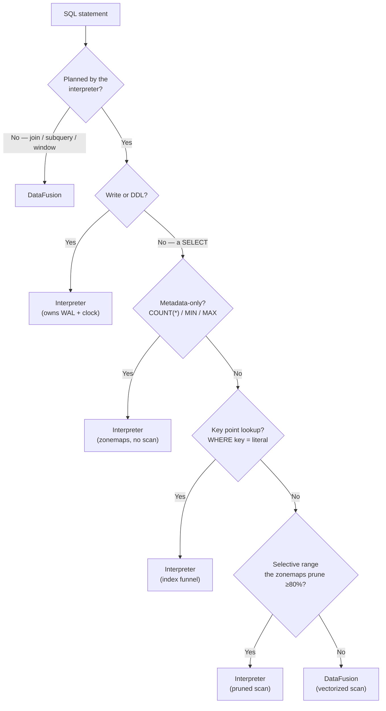
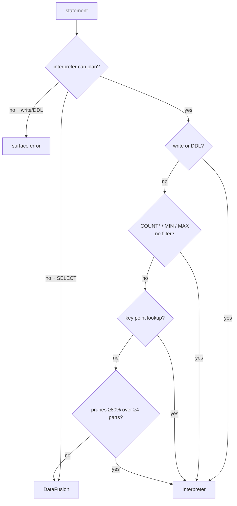

# The Query Layer: The HTAP Router

```{=latex}
\epigraph{If the only tool you have is a hammer, it is tempting to treat everything as if it were a nail.}{--- Abraham Maslow}
```

ChakraDB runs **two** execution engines and routes each statement to whichever
fits. This is the concrete shape of "buy execution, build storage": DataFusion is
bought for vectorized analytics; a compact interpreter is built for the
transactional and point-query path it wins.

## Why two engines

Different query shapes have opposite ideal engines:

- A **key point-lookup** (`WHERE id = 42`) wants an index funnel — a Bloom probe and
  a binary search — not a vectorized scan operator. The interpreter wins by orders
  of magnitude.
- A **`COUNT(*)`** or **bare `MIN`/`MAX`** wants to be answered from metadata (row
  counts, zonemaps) with *no scan at all*. The interpreter does exactly that.
- A **large `GROUP BY` / join / window** wants vectorized, spill-capable operators.
  DataFusion wins.
- A **write** (`INSERT`/`UPDATE`/`DELETE`/`COPY`) must own the WAL and the snapshot
  clock. Only the interpreter writes.

Routing to a single engine would lose one side of this. So ChakraDB has a
**cost-based router** that inspects the planned statement.

## The routing decision



The first stage asks whether the interpreter can even plan the statement; joins,
subqueries, and window functions it cannot, so they go straight to DataFusion. For
the rest, a second cost stage checks the cheap-shape shortcuts — metadata answers,
point lookups, and highly selective ranges that [zonemap pruning](storage.md) makes
cheaper on the interpreter than a full vectorized scan — and everything else takes
the vectorized path.

## The interpreter half

A hand-written, allocation-conscious evaluator over the sorted parts. It:

- resolves columns to indices at plan time (no per-row name lookup),
- evaluates predicates and projections columnar, over the Arrow batches in place,
- answers `COUNT(*)`/`MIN`/`MAX` from part metadata,
- funnels point lookups through bounds → Bloom → binary search,
- prunes parts on selective ranges,
- and is the **only** path that mutates state and writes the WAL.

It is also the **zero-heavy-dependency fallback**: build without the `datafusion`
feature and the engine still runs single-table SQL on the interpreter alone.

## The DataFusion half

DataFusion receives the raw SQL and executes it over an Arrow view of the current
MVCC snapshot — **zero-copy**, since sealed parts already *are* Arrow record
batches, handed over by reference. It brings the large SQL surface (joins,
subqueries, windows, a rich function library) and vectorized, spill-capable
operators. ChakraDB pins the snapshot for the query's duration, so DataFusion sees
a consistent read while writers keep committing.

> **A subtlety worth stating.** Because the interpreter owns writes and DDL, a
> statement that fails to *plan* on the interpreter — say, a constraint violation —
> is a real error and is surfaced, not silently retried on DataFusion. Only a
> *SELECT* the interpreter cannot plan falls through to the vectorized engine.

## Transactions run on the interpreter

Inside a `BEGIN … COMMIT`, statements run on the interpreter against a private
overlay (read-your-writes; nothing hits the WAL until commit). Joins and subqueries
belong *outside* a transaction — the transactional path is single-table by design.
See [Transactions](mvcc.md).

## Why this is the right split

Building a world-class vectorized engine is a multi-year effort on the axis
ChakraDB *deliberately does not compete on* (raw scan speed). Buying DataFusion
spends those years on storage, MVCC, durability, and graph instead — while the
interpreter captures the transactional shapes DataFusion is simply the wrong tool
for. The [DuckDB comparison](../comparisons/comparisons.md) shows where each lands.

## Query Routing (Cost Model)


The HTAP router decides, for each statement, whether to run it on the hand-written
**interpreter** or on **DataFusion**. The decision is cheap — it inspects the
*planned* statement, not the data — and it is the concrete cost model that lets one
engine serve both transactional and analytical shapes well.

## The two-stage decision

> **ALGORITHM 12 — Route a statement**
> ```text
> Input:  SQL statement text
> Output: the engine to execute it on
> 1  plan ← interpreter.plan(statement)
> 2  if plan failed:                                   ▷ join / subquery / window
> 3      if statement is a SELECT: return DataFusion    ▷ it can plan these
> 4      else: raise the error                          ▷ a write/DDL error is real
> 5  if statement is a write or DDL: return Interpreter ▷ owns WAL + snapshot clock
> 6  if plan is bare COUNT(*) with no filter:  return Interpreter  ▷ metadata, no scan
> 7  if plan is bare MIN(c)/MAX(c):            return Interpreter  ▷ zonemaps, no scan
> 8  if plan is a key point lookup:            return Interpreter  ▷ index funnel
> 9  if plan is a selective range that prunes ≥ 80% of rows across ≥ 4 parts:
> 10     return Interpreter                             ▷ pruned scan beats vectorized
> 11 return DataFusion                                  ▷ scans, joins, aggregation
> ```

The first stage (lines 1–4) is a capability check: joins, subqueries, and windows
the interpreter cannot plan, so a `SELECT` using them falls through to DataFusion,
while a *write* that fails to plan (e.g. a constraint violation) is a real error and
is surfaced — never silently retried on the read-only engine.

The second stage (lines 5–11) is the cost model: the shapes the interpreter *wins*
are captured explicitly, and everything else takes the vectorized path.



## Why each branch

- **Writes / DDL (line 5).** Only the interpreter mutates state and appends to the
  WAL; it owns the [snapshot clock](mvcc.md).
- **Bare `COUNT(*)` (line 6).** Answered from part row-counts — no scan at all.
- **Bare `MIN`/`MAX` (line 7).** Answered from the per-part zonemaps — no scan.
- **Point lookup (line 8).** The [index funnel](storage.md) is `O(log n)`; a
  vectorized scan operator would be far slower for a single row.
- **Selective range (lines 9–10).** [Zonemap pruning](storage.md) makes the
  interpreter touch only a few parts; below ~20% selectivity the pruned interpreter
  scan beats a full vectorized scan. The threshold is a cost estimate, not a scan —
  it counts, from the zonemaps alone, how many rows survive pruning.
- **Everything else (line 11).** Large scans, `GROUP BY`, joins, windows, and
  subqueries want DataFusion's vectorized, spill-capable operators.

## The estimate is metadata-only

Line 9's "prunes ≥ 80%" is computed without reading a row: for each part, the
`excludes` test ([ALGORITHM 11](storage.md)) plus the part's row count says how many
rows survive. Summing over parts gives the surviving fraction. So the routing
decision itself is `O(number of parts)`, not `O(rows)`.

> **Proposition 8 (Routing is answer-preserving).** For any statement, the
> interpreter and DataFusion produce the same result; routing changes only cost.
>
> *Proof sketch.* Both engines read the same MVCC snapshot and the same immutable
> parts. The interpreter's fast paths are exact — `COUNT(*)` from true row counts,
> `MIN`/`MAX` from exact zonemaps, point lookup from the sorted key, pruned scan from
> a conservative `excludes` that never drops a match (ALG 11). DataFusion evaluates
> the same relational semantics over the same Arrow data. Hence the two agree on
> every routed statement; the HTAP-equivalence property tests assert exactly this
> across randomized queries. ∎

## The pin

Whichever engine runs, the statement first **pins** its snapshot for the duration
(so compaction cannot reclaim a version it will read — the [GC
watermark](mvcc.md)). Transient reads at the current clock need no pin;
long reads (a full scan, a DataFusion query, a transaction) hold one.
