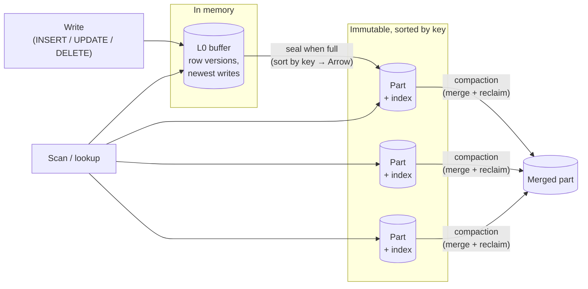
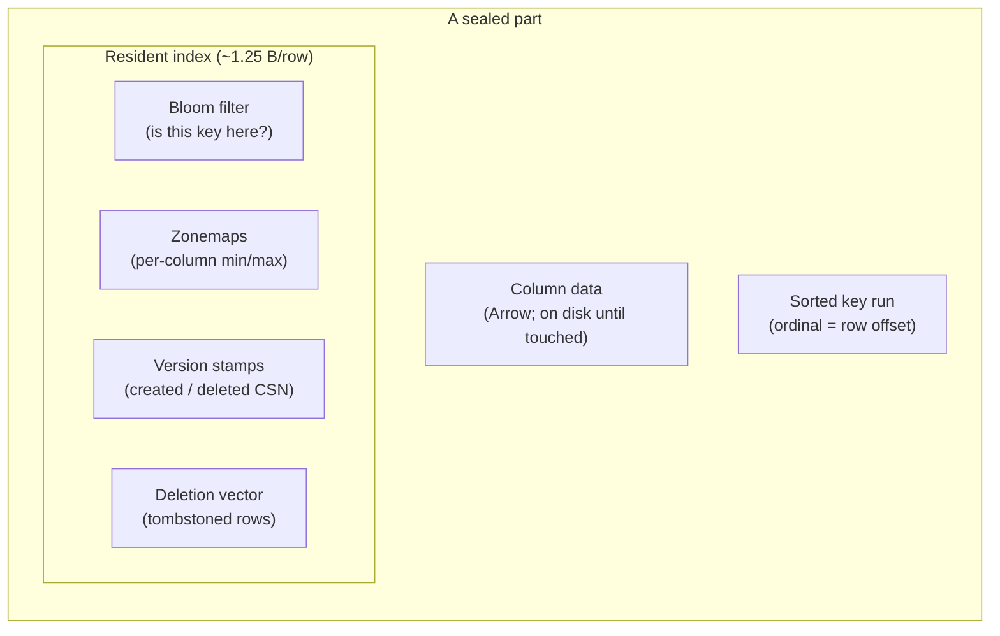
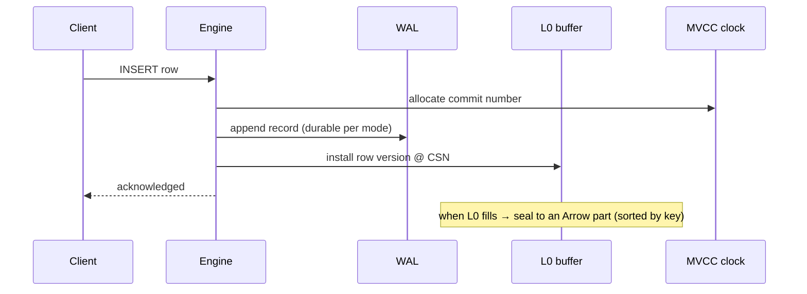
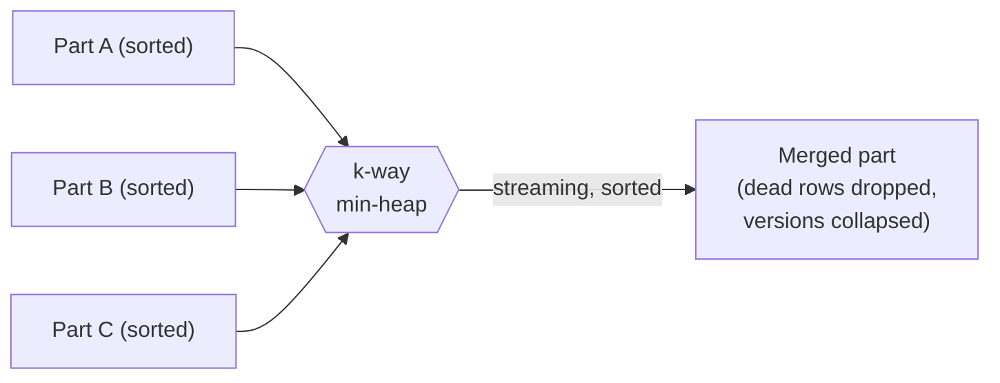

# The Storage Engine

```{=latex}
\epigraph{Show me your flowcharts and conceal your tables, and I shall continue to be mystified. Show me your tables, and I won't usually need your flowcharts; they'll be obvious.}{--- Fred Brooks}
```

ChakraDB's storage is **log-structured** and **Arrow-native**. Writes land in
memory and are sealed into immutable columnar parts; reads see a merged view
across the tiers. This chapter is the shape of the store; the algorithms that run
over it — visibility, merge, pruning — get their own chapters in Part III.

## Three tiers



1. **L0 — the write buffer.** New row versions land here at memory speed. L0 is a
   small in-memory structure keyed for point lookup and range scan. It holds the
   newest, not-yet-sealed writes.

2. **Sealed parts — the columnar body.** When L0 fills (a configurable threshold),
   it is **sealed**: its rows are sorted by the table's key and written as an
   immutable **Apache Arrow** record batch. On the durable path a part persists as
   an Arrow **IPC** stream — an open format any Arrow reader can open. A part never
   changes after sealing; updates and deletes are expressed as *new* versions and
   *deletion-vector* marks, not in-place edits.

3. **Compaction — keeping scans fast.** Parts accumulate as writes flow. A
   background-free, caller-driven **compaction** merges parts, drops rows no live
   snapshot can see, and collapses version stamps — trading write amplification for
   scan speed. See [Compaction](storage.md).

> **The absorption point.** Fast writes create unmerged deltas that slow scans;
> ChakraDB pays that debt in **compaction**, not in the read path, and applies
> explicit **backpressure** if compaction cannot keep up — never silent scan
> degradation.

## What a part carries: the resident index

The reason ChakraDB can keep row *data* on disk but stay fast is that each part
keeps a small **index resident in memory** — about **1.25 bytes per row**, flat
with table size:



- **Bloom filter** — answers "could key *k* be in this part?" with no disk touch,
  so a point lookup skips parts that certainly lack the key.
- **Zonemaps** — per-column `(min, max)`. A `WHERE` range or a graph adjacency scan
  skips any part whose range cannot overlap. This is [zonemap pruning](storage.md).
- **Version stamps** — the `created`/`deleted` CSN per row (or one uniform stamp
  when the whole part shares one), the input to [MVCC visibility](mvcc.md).
- **Deletion vector** — which ordinals are tombstoned, so a scan skips deleted rows
  without rewriting the part.
- **The sorted key run** *is* the index: because the part is sorted by key, the
  ordinal position is the row offset, and a lookup is a Bloom probe plus a binary
  search — no separate key→location map exists. See
  [The Primary-Key Index](storage.md).

## Arbitrary schemas, any-type keys

A table has any number of columns of any supported type. Its **primary key** is a
single column of any type (integer, text, float, boolean, date, decimal), or — if
no key is declared — a hidden auto-increment `_rowid` (a *keyless* table). One idea
keeps the engine simple: **every table has exactly one key column**; "keyless" is
just a table whose key is hidden.

## Why not a general buffer pool?

Parts are immutable and whole-part granular, so ChakraDB deliberately has **no LRU,
no page-replacement cache**. The policy is "fault a part's data in on first touch,
keep it until the part is dropped." That is the honest amount of machinery for
immutable parts — and it is why the *resident index*, not disk, is the scaling
ceiling (see [Limits](overview.md)).

## The write path in one picture



Notice what the write path does *not* do: it never takes a lock a reader holds.
Readers run against a snapshot number and see a consistent view; writers advance
the clock and append. That decoupling is the concurrency wedge, and the next
chapter — MVCC — is how it stays correct.

## The Sorted-Part Key Index


This is the hardest and most consequential piece of the storage engine: how a row
is located by key without paying for a key→location map. The answer — following
Apache Doris / StarRocks — is that **the sorted key column *is* the index.**

## The idea

A sealed part is written **sorted by its primary key**. Therefore a row's *ordinal
position* in the part is its *offset*: to find where key `k` lives, binary-search
the sorted key column. There is no separate structure mapping keys to row numbers,
so the resident index cost is not the ~12 bytes/row an explicit map would need — it
is the Bloom filter plus min/max bounds, about **1.25 bytes/row, flat with table
size.**

```mermaid
flowchart LR
    K["lookup key = k"] --> B{"min ≤ k ≤ max?<br/>(part bounds)"}
    B -->|no| SKIP["skip part"]:::x
    B -->|yes| BL{"Bloom: might contain k?"}
    BL -->|no| SKIP
    BL -->|yes| BS["binary-search the<br/>sorted key column"]:::ok
    BS --> HIT["ordinal → row"]
    classDef x fill:#f5d6d6; classDef ok fill:#d6f5d6;
```

## The lookup funnel

A point lookup consults a cascade of cheap filters before it ever binary-searches,
newest tier first (a later write must win):

> **ALGORITHM 1 — Point lookup by key**
> ```text
> Input:  key k; snapshot S
> Output: the visible row for k, or NONE
> 1  if L0 has a version of k visible to S:            ▷ newest writes first
> 2      return that version
> 3  for each sealed part P, newest to oldest:
> 4      if k < P.min_key or k > P.max_key: continue    ▷ ALG 11: bounds skip
> 5      if not P.bloom.might_contain(k):    continue    ▷ ALG 15: Bloom skip
> 6      o ← BinarySearchKey(P, k)                       ▷ ALGORITHM 2
> 7      if o found and version at o is visible to S:
> 8          return the row at ordinal o
> 9  return NONE
> ```

Each part that certainly lacks `k` is dropped by a **bounds comparison** (min/max)
or a **Bloom probe** — neither touches the column data on disk. Only a part that
*might* hold `k` is searched, and the search is over the small resident key run.

## Binary search within a part

> **ALGORITHM 2 — Binary search the sorted key column**
> ```text
> Input:  part P (sorted by key), key k
> Output: an ordinal o with P.key(o) = k, or NOTFOUND
> 1  lo ← 0;  hi ← P.len − 1
> 2  while lo ≤ hi:
> 3      mid ← (lo + hi) / 2
> 4      c ← total_cmp(P.key(mid), k)                    ▷ total order over Values
> 5      if c < 0: lo ← mid + 1
> 6      elif c > 0: hi ← mid − 1
> 7      else: return mid                                ▷ found
> 8  return NOTFOUND
> ```

Keys are compared with `total_cmp`, a total order over all value types (integers
compared exactly — never routed through `f64`, which would conflate integers
beyond 2⁵³ and corrupt an integer key). For a duplicate-tolerant scan the search
extends left/right from `mid` to the run of equal keys.

## Any-type keys, and the hidden rowid

The key column may be any type — integer, text, float, boolean, date, decimal —
because `total_cmp` orders them all. A table with **no** declared key gets a hidden
auto-increment `_rowid`; it is still a single sorted key column, just invisible to
`SELECT *`. So "keyless" costs nothing extra: there is no second index for the
rowid — the sorted rowid column *is* the index, exactly as for a user key.

## Why this shape

> **Proposition 1 (Index cost is flat).** The resident per-row index cost of the
> sorted-part scheme is independent of the number of rows.
>
> *Proof sketch.* The resident structures are the Bloom filter (a fixed bits-per-key
> budget), the per-part min/max bounds (constant per part), the per-row version
> stamps, and the deletion vector. None grows super-linearly with row count, and
> crucially there is **no** key→location map — the map is replaced by "ordinal =
> offset," which stores nothing. Measured at ~1.25 B/row, it stays flat as tables
> grow (`m0-bench`). ∎

The consequence is the whole storage strategy: because the index is nearly free and
flat, ChakraDB can hold row *data* on disk and keep only the index resident, and
the resident index — not disk — becomes the scaling ceiling (see
[Limits](overview.md)).

## The Merge / Compaction Algorithm


Writes create parts; parts accumulate; scans slow down. Compaction is the debt
payment: it merges parts into fewer, larger, sorted parts, physically drops rows no
live reader can see, and collapses redundant version stamps. It is **caller-driven**
— there is no background thread — so it runs when asked, and only up to a safe
[GC horizon](mvcc.md).

## The k-way merge

Because every input part is sorted by key, merging them into one sorted part is a
classic k-way merge over a heap of cursors:

> **ALGORITHM 8 — Merge parts**
> ```text
> Input:  parts P₁..P_k (each sorted by key); reclamation horizon H
> Output: one merged, sorted part
> 1  heap ← { (P_i.key(0), i, 0) for each non-empty P_i }   ▷ min-heap on key
> 2  out ← empty builder
> 3  while heap not empty:
> 4      (k, i, o) ← heap.pop_min()                          ▷ smallest current key
> 5      keep ← RowIsLive(P_i, o, H)                          ▷ see ALGORITHM 9
> 6      if keep: out.append(P_i.row(o))                      ▷ carry the surviving row
> 7      if o+1 < P_i.len: heap.push((P_i.key(o+1), i, o+1))  ▷ advance that cursor
> 8  return out.seal()                                        ▷ sorted Arrow part
> ```

The output is produced in sorted key order in a single streaming pass — `O(N log k)`
for `N` total rows and `k` inputs — with no intermediate sort. Newer parts take
precedence when keys tie, so an updated row's newest version wins.



## Reclamation: which rows survive

The horizon `H` is the oldest CSN any live snapshot may observe (the [GC
watermark](mvcc.md)). A row can be physically dropped only when no snapshot
`≥ H` could still see it:

> **ALGORITHM 9 — Row liveness under a horizon**
> ```text
> Input:  a row at ordinal o in part P; horizon H
> Output: true if the row must be kept
> 1  if the row is not tombstoned: return true             ▷ a live version — keep
> 2  d ← its deletion CSN
> 3  if d ≤ H: return false                                 ▷ deleted before/at the
> 4  return true                                            ▷   horizon → reclaimable
> ```

Line 3 is the crux: a row deleted at `d ≤ H` is invisible to *every* live snapshot
(all are `≥ H > `… `≥ d`), so it is safe to drop. A row deleted *after* `H` is still
visible to a reader on an old snapshot and **must be kept**. Getting this bound
wrong is the silent-wrong-answer hazard the [GC watermark](mvcc.md) chapter
is devoted to.

After merging, the surviving versions' stamps are **collapsed**: if all rows of the
merged part now share one creation CSN, the part stores a single `Uniform(csn)`
instead of a per-row array — restoring the cheap [full-part fast
path](mvcc.md) for future scans.

## Selection and incrementality

Two more practicalities keep compaction from being wasteful:

- **Selection.** Not every part is merged every time. A policy chooses a set of
  candidates (for example, similar-sized adjacent parts), so compaction does
  bounded work per invocation rather than rewriting the whole table.
- **Incremental persistence.** When the merged result is checkpointed, unchanged
  parts are skipped and a part that only *gained tombstones* since the last
  checkpoint has just those deletion-vector entries appended — not a full rewrite.
  This fixed an `O(n²)` that a naive "rewrite everything each checkpoint" would
  incur.

## The backpressure contract

Compaction trades write amplification for scan speed. If it cannot keep up, the
engine does **not** silently let scans degrade — it applies explicit ingest
**backpressure** (a throttle, then a stall) keyed on the part count, surfaced in
[`Storage::stats()`](../getting-started/getting-started.md). This is the "cost of fast writes
is paid in compaction, and made visible" commitment from the
[cost model](../introduction/cost-model.md).

> **Proposition 6 (Merge preserves the visible database).** For any snapshot `S ≥
> H`, the set of rows visible to `S` is identical before and after a merge with
> horizon `H`.
>
> *Proof sketch.* A merge changes physical layout, not logical content, except that
> it drops rows with `deleted ≤ H` (ALG 9). Such a row is invisible to any `S ≥ H`
> because `S ≥ H ≥ deleted` fails `S < deleted` ([ALGORITHM 3](mvcc.md)). Every
> row visible to `S` has `deleted > H`, is therefore kept, and its `(created,
> deleted)` stamps are preserved (collapse only rewrites the storage form, not the
> values). Hence `S`'s visible set is unchanged. The requirement `S ≥ H` is exactly
> what the GC watermark guarantees for every live reader. ∎

## Zonemap Part Pruning


A selective query should not read parts that cannot contain a match. ChakraDB skips
them using **zonemaps** — the per-column `(min, max)` bounds every part carries.
This is DuckDB-style rowgroup pruning, and it is also the mechanism behind [graph
adjacency](../graph/model.md).

## The idea

Each sealed part stores, per column, the minimum and maximum value over its rows.
For a predicate on that column, if the part's `[min, max]` interval cannot satisfy
the predicate, no row in the part can — so the whole part is skipped without
touching its data.

```mermaid
flowchart LR
    Q["WHERE x >= 500"]
    P1["Part A<br/>x ∈ [1, 120]"]:::skip
    P2["Part B<br/>x ∈ [300, 900]"]:::hit
    P3["Part C<br/>x ∈ [950, 999]"]:::hit
    Q --> P1 & P2 & P3
    classDef skip fill:#f5d6d6,stroke:#c00; classDef hit fill:#d6f5d6,stroke:#0a0;
```

Part A (`max = 120 < 500`) is skipped; B and C are scanned.

## The exclusion test

The predicate is compiled to a conservative *excludes* test: given a part's bounds,
can this predicate be satisfied by *no* row in the part?

> **ALGORITHM 11 — Predicate excludes a part**
> ```text
> Input:  predicate φ; part bounds (per column) [min_c, max_c]
> Output: true if NO row in the part can satisfy φ (safe to skip)
> 1  match φ:
> 2    (col c) = v :  return v < min_c  or  v > max_c        ▷ value out of range
> 3    (col c) < v :  return min_c ≥ v                        ▷ all values ≥ v
> 4    (col c) ≤ v :  return min_c > v
> 5    (col c) > v :  return max_c ≤ v                        ▷ all values ≤ v
> 6    (col c) ≥ v :  return max_c < v
> 7    φ₁ AND φ₂ :  return excludes(φ₁) or excludes(φ₂)       ▷ either kills it
> 8    φ₁ OR  φ₂ :  return excludes(φ₁) and excludes(φ₂)      ▷ both must kill it
> 9    otherwise :  return false                              ▷ unsure ⇒ keep (safe)
> ```

The test is **conservative**: it returns `true` only when it can *prove* the part
holds no match, and `false` (keep the part) whenever it is unsure. So pruning never
changes an answer — it only avoids work.

The scan then drops every fully-materialised part the predicate excludes:

```text
segments ← scan_segments(snapshot)
segments.retain(seg → not (seg is a sealed part P and excludes(φ, P.bounds)))
```

## Two ways it is used

**As a SQL accelerator.** A selective `WHERE x = k` or `WHERE x BETWEEN a AND b`
prunes to the parts whose bounds overlap — the interpreter's second-stage router
sends such queries here rather than to a full vectorized scan (see
[Query Routing](query-router.md)).

**As a graph adjacency index.** A graph edge key encodes `(src, dst)` src-major, so
"neighbors of X" is a key-range scan `key ∈ [(X,0), (X+1,0))`. Zonemap pruning on
the key column touches only the parts holding `src = X`. This is [clustered
adjacency](../graph/model.md) — the graph traversal primitive falls directly
out of ALGORITHM 11.

## The scaling property

> **Proposition 7 (O(1) selective range scans).** For a key-range query over a
> table sorted by that key, the number of parts scanned depends on the range's
> selectivity, not the table size.
>
> *Proof sketch.* Parts are sorted by key, so each part's key-bounds interval is
> disjoint and ordered. A key range `[lo, hi)` overlaps only the contiguous run of
> parts whose intervals intersect it — a count that grows with `hi − lo`, not with
> the number of parts. Every other part is excluded by ALG 11 (lines 2–6). Measured:
> a needle range scan stays ~1 ms as the table grows 100× (ClickBench Q13, Part IX).
> ∎

## The correctness guarantee, restated

Pruning removes only parts it *proves* empty of matches, so the produced answer is
identical to a full scan. The unit tests exercise the boundaries directly —
equality at the min/max edges, swapped operands (`v = col`), `AND`/`OR`
combinations, and missing bounds — and an end-to-end suite scans a multi-part table
to confirm a pruned range returns exactly the matching rows.

## Bloom Filters & the Lookup Funnel


A point lookup should not read a part that does not contain the key. The min/max
bounds catch some parts; a **Bloom filter** catches the rest — it answers "could key
`k` be here?" from a few bits in memory, with no disk touch and no false negatives.

## What a Bloom filter guarantees

A Bloom filter is a bit array with `h` hash functions. To *insert* `k`, set the `h`
bits it hashes to; to *test* `k`, check those `h` bits.

- If any bit is `0`, `k` is **definitely absent** — a true negative.
- If all `h` bits are `1`, `k` is **probably present** — possibly a false positive.

Crucially there are **no false negatives**: a key that was inserted always tests
positive. That is exactly the property a lookup filter needs — it may occasionally
fail to skip a part, but it never wrongly skips one that holds the key.

> **ALGORITHM 15 — Bloom membership test**
> ```text
> Input:  key k; part Bloom filter B with h hash functions
> Output: DEFINITELY_ABSENT, or MAYBE_PRESENT
> 1  seed ← value_seed(k)                              ▷ reduce any Value type to 64 bits
> 2  for i in 0..h:
> 3      bit ← hash(seed, i) mod |B|
> 4      if B[bit] = 0: return DEFINITELY_ABSENT        ▷ a single 0 bit settles it
> 5  return MAYBE_PRESENT
> ```

`value_seed` maps a key of any type to a 64-bit seed: an integer maps to itself
(so the integer path is unchanged and collision-free in that dimension), and text,
float, boolean, and decimal keys get a deterministic reduction.

## Its place in the funnel

The Bloom test is the second filter in the [point-lookup funnel](storage.md),
after the min/max bounds and before the binary search:

```mermaid
flowchart LR
    K["lookup k"] --> BND{"min ≤ k ≤ max?"}
    BND -->|no| S1["skip"]:::x
    BND -->|yes| BLM{"Bloom: maybe present?"}
    BLM -->|absent| S2["skip"]:::x
    BLM -->|maybe| BS["binary search<br/>(reads the key run)"]:::ok
    classDef x fill:#f5d6d6; classDef ok fill:#d6f5d6;
```

The ordering is deliberate — cheapest test first. The bounds check is two
comparisons; the Bloom probe is a handful of bit reads; only a part that passes both
pays for a binary search over its resident key run. A part that certainly lacks the
key is dropped before any of its data is examined.

## Sizing and cost

The filter trades a small, fixed number of bits per key for a low false-positive
rate. In ChakraDB it is part of the ~1.25 B/row resident index budget
([Proposition 1](storage.md)): the Bloom bits, the min/max bounds, the version
stamps, and the deletion vector together stay flat with table size, which is what
lets the engine keep data on disk and the index in memory.

> **Proposition 11 (No false negatives ⇒ lookups are correct).** The Bloom skip in
> ALGORITHM 15 never causes a lookup to miss a key that is present.
>
> *Proof sketch.* If key `k` is in the part, it was inserted, so all `h` of its bits
> are `1`, so ALG 15 returns `MAYBE_PRESENT` and the funnel proceeds to the binary
> search that finds it. The filter can only err the other way — a `MAYBE_PRESENT`
> for an absent key — which costs a wasted binary search, not a wrong answer. This
> is asserted directly: over many keys, the filter has zero false negatives
> (`bloom` tests). ∎

## Why it matters for concurrency

Point lookups are the transactional read shape, and they run on the interpreter
precisely because this funnel makes them `O(log n)` with almost no I/O. That keeps
the transactional path fast and lock-free while analytical scans run on the same
snapshot — the HTAP split the [router](query-router.md) exploits.
