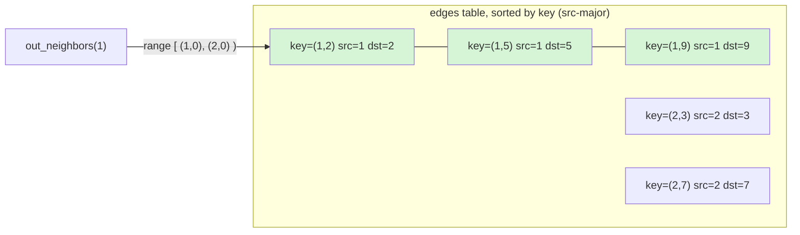
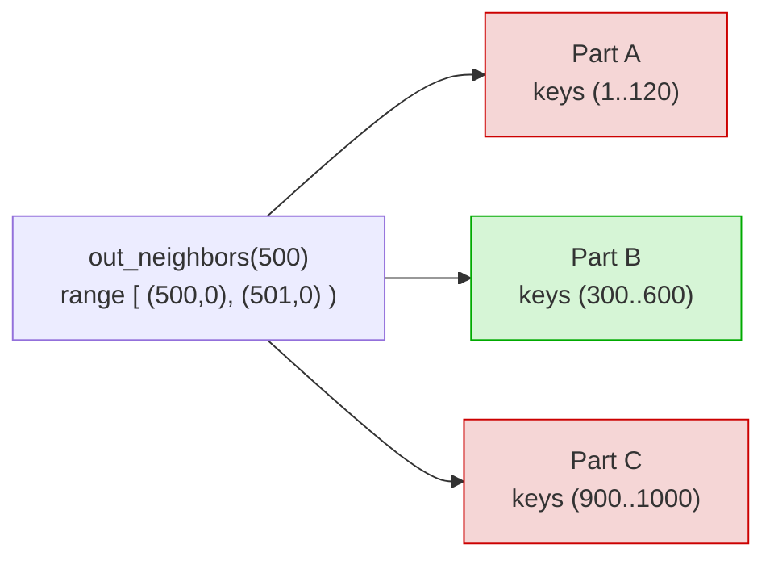

# Clustered Adjacency

The single hard constraint ChakraDB puts on a graph is also the source of its
adjacency speed. The engine has a **single-column primary key** and **no secondary
indexes**. So "find all edges with `src = X`" is fast *only if the edge table is
physically sorted by `src`.* And parts are sorted by the primary key. Therefore:

> **The edge key must sort src-major.** Encode `(src, dst)` into one sortable key,
> and a node's out-edges become a contiguous key range that part pruning answers
> cheaply.

## The key encoding

The graph layer packs a directed edge into a single integer key:

```
key(src, dst) = (src << 32) | dst
```

Because the high 32 bits are `src`, keys sort by `src` first, then `dst`. All of
node `X`'s out-edges occupy the half-open key range `[X·2³², (X+1)·2³²)`.



`out_neighbors(1)` scans the key range `[(1,0), (2,0))`, which is exactly the
green rows — contiguous, and nothing else is touched.

## Why the scan is cheap: part pruning

Sealed parts are sorted by key, so each part's keys occupy a `[min_key, max_key]`
interval. The neighbor scan skips any part whose interval cannot overlap the query
range:



Only Part B can hold `src = 500`, so only Part B is scanned. This is the same
[zonemap part pruning](../algorithms/pruning.md) that accelerates a selective SQL
`WHERE` — reused as the graph adjacency index. In the ClickBench benchmark, a
key-range scan of this shape stays effectively **O(1) as the table grows 100×**
(Part IX). For a graph, that means neighbor lookup cost tracks the node's degree,
not the graph's size.

The primitive in the engine is:

```rust
// src/table.rs — prunes parts by [min_key, max_key], scans survivors.
pub fn scan_key_range(&self, lo: &Value, hi: &Value, snap: Snapshot) -> Vec<Row>;
```

and the graph layer uses it:

```rust
pub fn out_neighbors(&self, node: NodeId) -> Result<Vec<NodeId>> {
    let lo = encode(node, 0);
    let hi = encode(node + 1, 0);        // exclusive
    // scan_key_range prunes to the parts that hold this src, over a snapshot.
}
```

## Directed, and the reverse direction

Today the layer stores **directed** out-edges in one table. Two traversal patterns
follow:

- **Forward** (out-neighbors): the range scan above.
- **Backward** (in-neighbors): the design keeps a second table keyed `(dst, src)`,
  so in-neighbors are a range scan on *that* table. (Undirected algorithms — like
  connected components and triangle counting — symmetrize the adjacency in the CSR;
  see [The CSR Snapshot](csr.md).)

## The limit, and the fix

The packed-integer encoding caps node ids at `< 2³¹` (so keys stay positive
`i64`). That is a real v1 limitation. The clean removal is a **native composite /
bytes key** — letting a table declare `PRIMARY KEY (src, dst)` or a lexicographic
`BYTES` key. That would make edges first-class, remove the encoding entirely, and
benefit non-graph multi-column keys too. It is the highest-leverage item on the
graph roadmap (see the [design exploration](../../graph-exploration.md)).
