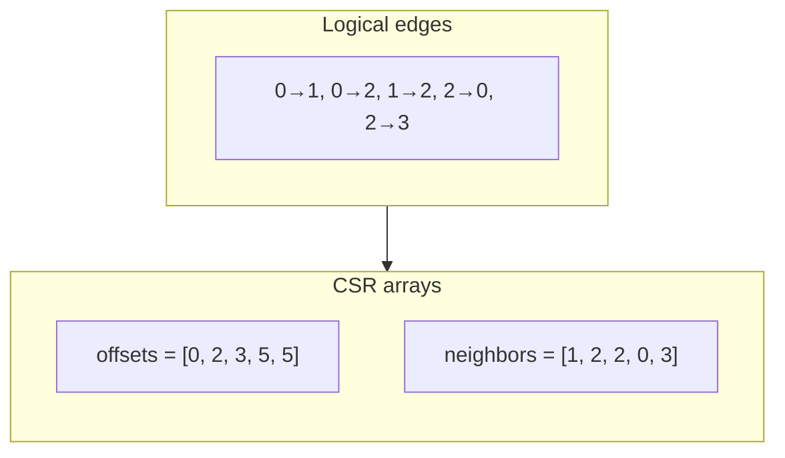
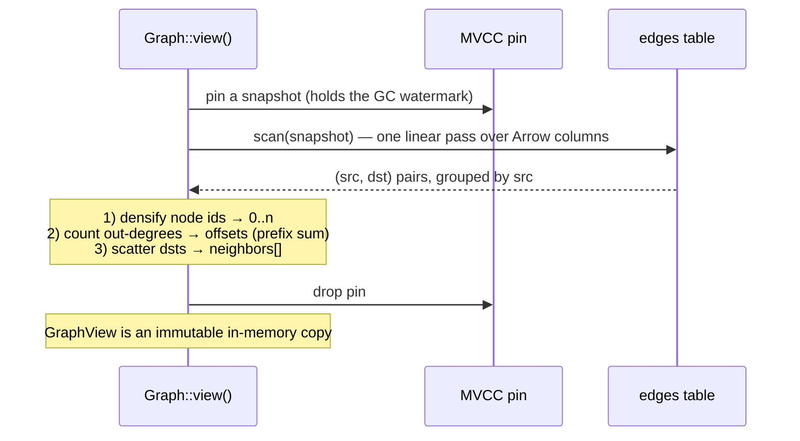

# The CSR Snapshot

```{=latex}
\epigraph{Simplicity is prerequisite for reliability.}{--- Edsger W. Dijkstra}
```

Whole-graph algorithms — BFS, PageRank, connected components — do not want to issue
a range scan per node. They want the **Compressed Sparse Row (CSR)** representation:
a flat neighbor array plus per-node offsets, giving cache-friendly `O(1)` neighbor
iteration. `Graph::view()` builds one from a single MVCC snapshot.

## What CSR is



To iterate node `u`'s out-neighbors, take `neighbors[offsets[u] .. offsets[u+1]]`.
For node 2 above: `offsets[2]=3, offsets[3]=5` → `neighbors[3..5] = [0, 3]`.

## Why building it is a linear scan

The edge table is already sorted by key = `(src, dst)` src-major. So a single scan
yields `(src, dst)` pairs *already grouped by source*. Building CSR is then a
counting pass and a fill pass — no sort, no hash join:



The actual build (`src/graph.rs`):

```rust
// Dense node numbering over every id that appears.
let mut ids: Vec<NodeId> = pairs.iter().flat_map(|&(s,d)| [s,d]).collect();
ids.sort_unstable(); ids.dedup();
let index: HashMap<NodeId,u32> = /* id -> dense idx */;

// CSR by counting sort on the source's dense index.
let mut offsets = vec![0u32; n + 1];
for &(s,_) in &pairs { offsets[index[&s] as usize + 1] += 1; }
for i in 0..n { offsets[i+1] += offsets[i]; }         // prefix sum

let mut adj = vec![0u32; pairs.len()];
let mut cursor = offsets.clone();
for &(s,d) in &pairs {
    let si = index[&s] as usize;
    adj[cursor[si] as usize] = index[&d];
    cursor[si] += 1;
}
```

Cost is `O(V + E)` plus the densify sort. The result is a compact
`{ids, index, offsets, adj}` — the `GraphView`.

## Consistency: it is a snapshot

`view()` pins an MVCC snapshot for the duration of the scan, so the CSR is built
from **one consistent instant** of the graph. Writers keep committing edges; the
`GraphView` is an immutable copy and does not change. That is what the test asserts:

```rust
let v = g.view()?;
let before = v.edge_count();
g.add_edges([(6,7,1.0),(7,8,1.0)])?;    // writes after the view was taken
assert_eq!(v.edge_count(), before);      // the snapshot view is unchanged
assert_eq!(g.view()?.edge_count(), before + 2); // a fresh view sees them
```

## Memory: the honest ceiling

The CSR lives in RAM. `offsets` is `4·(V+1)` bytes and `neighbors` is `4·E` bytes —
about **4 bytes per edge** plus the id maps. A 100-million-edge graph is ~0.4 GB of
CSR; a billion edges is a few GB. Graph algorithms are memory-bound, and this is
the same ceiling as ChakraDB's [resident index](../operations/limits.md): "fits in
a big server's RAM" is in scope, trillion-edge graphs are not. For graphs larger
than memory, restrict the view to a subgraph (a k-hop neighborhood, a component)
before running the algorithm.
