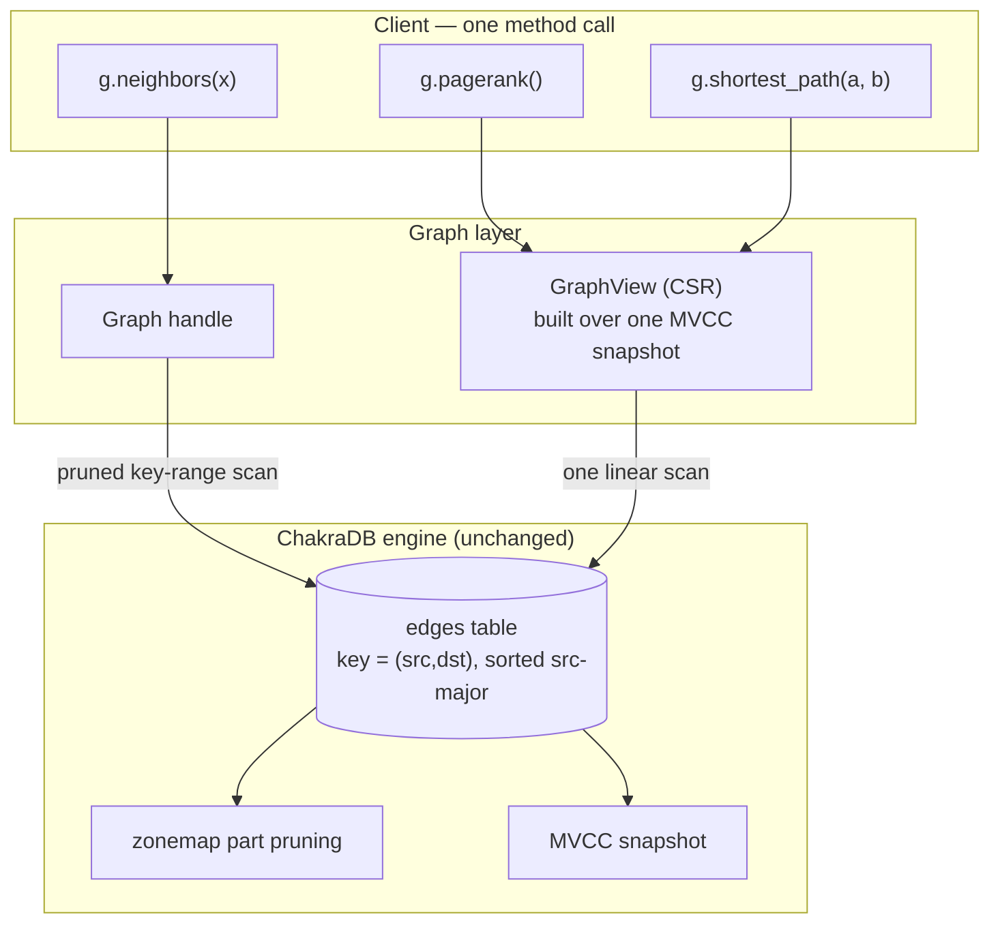
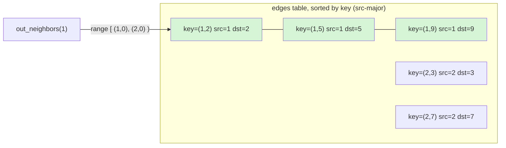
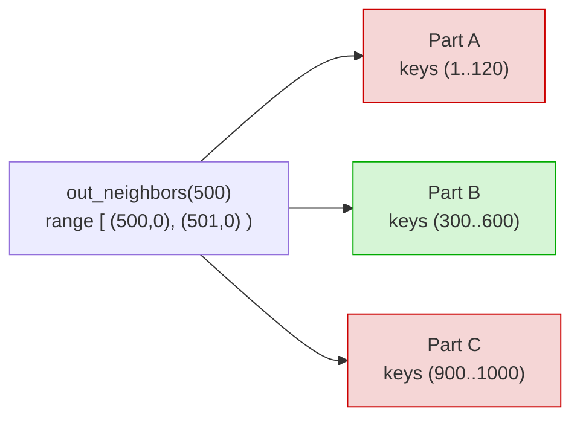

# Graphs on ChakraDB

```{=latex}
\epigraph{Only connect!}{--- E. M. Forster}
```

ChakraDB's graph layer is not a second database bolted onto a relational one. It is
a thin layer that *exposes what the engine already is*. Three properties we built
for HTAP turn out to be exactly what a graph engine wants.



## The three properties

1. **Clustered adjacency, for free.** If an edge's key encodes `(src, dst)`
   src-major, then all of a node's out-edges are one *contiguous key range*.
   "Neighbors of X" becomes a key-range scan that
   [zonemap pruning](../engine/storage.md) answers by touching only the parts
   holding `src = X`. No secondary index; the primary-key sort *is* the adjacency
   index. See Clustered Adjacency.

2. **Live graph analytics.** A whole-graph algorithm builds its working set from
   **one MVCC snapshot**. Writers keep adding edges; the algorithm sees a
   consistent graph and runs to completion. This is the [concurrency
   wedge](../engine/mvcc.md) applied to graphs — the thing pure graph
   libraries (a dead static copy) and lock-based graph databases cannot do in one
   embedded process. See [Live Graph Analytics](snapshot.md).

3. **Arrow ≈ CSR.** Edges stored sorted by `src` are already *grouped by source*,
   so building the CSR (Compressed Sparse Row) form every algorithm wants is a
   single linear, vectorized scan over Arrow columns — no sort, no hash join. See
   [The CSR Snapshot](snapshot.md).

## What the client writes

```rust
use chakradb::{Database, Graph};
use std::sync::Arc;

let g = Graph::open(Arc::new(Database::new()), "social")?;
g.add_edge(1, 2, 1.0)?;                 // src -> dst, weight
g.add_edges([(2, 3, 1.0), (1, 3, 1.0)])?;

// Live adjacency (pruned range scan):
let nbrs = g.out_neighbors(1)?;         // [2, 3]

// Whole-graph algorithms over a consistent snapshot:
let view   = g.view()?;
let ranks  = view.pagerank(20, 0.85);   // node -> score
let path   = view.shortest_path(1, 3);  // Some([1, 3])
let comps  = view.connected_components();
let tris   = view.triangle_count();
```

The client never writes a traversal by hand and never manages a lock. The engine
handles adjacency (pruned scans), consistency (snapshots), and the algorithms.

## Positioning

This is the **G** in "ChakraDB — the embedded HTAP database with built-in graph
capabilities." Transactions, analytics, and graph traversals run over the *same
live data*, on the *same non-blocking snapshots*, in *one process*. The rest of
this part builds the layer up: modeling, adjacency, CSR, and the algorithms.

> **Status.** The graph layer is real and tested (`src/graph.rs`,
> `tests/graph.rs`) — directed edges, adjacency, CSR views, and the core
> algorithm set. Node ids are currently `u32`; a native composite key (on the
> roadmap) will lift that and remove the key-encoding step. See
> Modeling a Property Graph.

## Modeling a Property Graph


A property graph is **nodes and edges**, each with a label/type and properties. On
ChakraDB it maps to ordinary tables — with one twist that makes traversal fast.

## The tables

```sql
-- Nodes: keyed by node id → fast point lookup and id-range scan.
CREATE TABLE nodes (
  id     INT PRIMARY KEY,
  label  VARCHAR(64),
  props  TEXT               -- JSON, or promote hot properties to real columns
);

-- Edges: keyed (src, dst) src-major → clustered adjacency by source.
CREATE TABLE edges (
  key    INT PRIMARY KEY,   -- encode(src, dst); see Clustered Adjacency
  src    INT,
  dst    INT,
  type   VARCHAR(32),
  weight DOUBLE
);
```

The `Graph` handle manages the edge encoding for you; the schema above is what it
creates under the hood (`{name}_edges`). A companion `nodes` table for node
properties is optional in v1 — nodes are otherwise implied by the ids that appear
in edges.

## Hot vs. cold properties

Put **hot** edge properties — the ones you filter on — in real typed columns.
They get [zonemaps](../engine/storage.md), so a query like "follow-edges created
after T" prunes:

```sql
SELECT dst FROM edges
WHERE key >= (X<<32) AND key < ((X+1)<<32)   -- neighbors of X (clustered)
  AND type = 'follows' AND weight > 0.5;      -- pruned by zonemaps
```

Put **cold / sparse** properties in a `props` blob. This is the classic
wide-vs-narrow trade: typed columns for what you query, a blob for the long tail.

## Directed vs. undirected

Edges are stored **directed**. Model an undirected edge by inserting both `(u,v)`
and `(v,u)`, or let the [CSR builder](snapshot.md) symmetrize for undirected algorithms
(connected components, triangles do this internally). For fast **backward**
traversal, keep a second table keyed `(dst, src)` — the reverse adjacency.

## Transactions keep it consistent

Adding an edge that touches multiple tables (an edge row, a reverse-edge row, a
degree counter) belongs in **one transaction**, so a reader never sees half an
edge:

```sql
BEGIN;
  INSERT INTO edges VALUES (encode(1,2), 1, 2, 'follows', 1.0);
  INSERT INTO edges_rev VALUES (encode(2,1), 1, 2);
COMMIT;
```

## What's *not* modeled

- **Composite / multi-column keys** — not yet native, hence the `(src,dst)`
  encoding (the roadmap's top item).
- **Foreign keys** — an explicit non-goal; referential integrity between nodes and
  edges is the application's responsibility.
- **Node ids beyond 2³¹** — the packed-key encoding's current ceiling.

The sections below — clustered adjacency, and then [The CSR
Snapshot](snapshot.md) — show why this simple mapping traverses fast.

## Clustered Adjacency


The single hard constraint ChakraDB puts on a graph is also the source of its
adjacency speed. The engine has a **single-column primary key** and **no secondary
indexes**. So "find all edges with `src = X`" is fast *only if the edge table is
physically sorted by `src`.* And parts are sorted by the primary key. Therefore:

> **The edge key must sort src-major.** Encode `(src, dst)` into one sortable key,
> and a node's out-edges become a contiguous key range that part pruning answers
> cheaply.

## The key encoding

The graph layer packs a directed edge into a single integer key:

```
key(src, dst) = (src << 32) | dst
```

Because the high 32 bits are `src`, keys sort by `src` first, then `dst`. All of
node `X`'s out-edges occupy the half-open key range `[X·2³², (X+1)·2³²)`.



`out_neighbors(1)` scans the key range `[(1,0), (2,0))`, which is exactly the
green rows — contiguous, and nothing else is touched.

## Why the scan is cheap: part pruning

Sealed parts are sorted by key, so each part's keys occupy a `[min_key, max_key]`
interval. The neighbor scan skips any part whose interval cannot overlap the query
range:



Only Part B can hold `src = 500`, so only Part B is scanned. This is the same
[zonemap part pruning](../engine/storage.md) that accelerates a selective SQL
`WHERE` — reused as the graph adjacency index. In the ClickBench benchmark, a
key-range scan of this shape stays effectively **O(1) as the table grows 100×**
For a graph, that means neighbor lookup cost tracks the node's degree,
not the graph's size.

The primitive in the engine is:

```rust
// src/table.rs — prunes parts by [min_key, max_key], scans survivors.
pub fn scan_key_range(&self, lo: &Value, hi: &Value, snap: Snapshot) -> Vec<Row>;
```

and the graph layer uses it:

```rust
pub fn out_neighbors(&self, node: NodeId) -> Result<Vec<NodeId>> {
    let lo = encode(node, 0);
    let hi = encode(node + 1, 0);        // exclusive
    // scan_key_range prunes to the parts that hold this src, over a snapshot.
}
```

## Directed, and the reverse direction

Today the layer stores **directed** out-edges in one table. Two traversal patterns
follow:

- **Forward** (out-neighbors): the range scan above.
- **Backward** (in-neighbors): the design keeps a second table keyed `(dst, src)`,
  so in-neighbors are a range scan on *that* table. (Undirected algorithms — like
  connected components and triangle counting — symmetrize the adjacency in the CSR;
  see [The CSR Snapshot](snapshot.md).)

## The limit, and the fix

The packed-integer encoding caps node ids at `< 2³¹` (so keys stay positive
`i64`). That is a real v1 limitation. The clean removal is a **native composite /
bytes key** — letting a table declare `PRIMARY KEY (src, dst)` or a lexicographic
`BYTES` key. That would make edges first-class, remove the encoding entirely, and
benefit non-graph multi-column keys too. It is the highest-leverage item on the
graph roadmap (see the [design exploration](../../../graph-exploration.md)).
