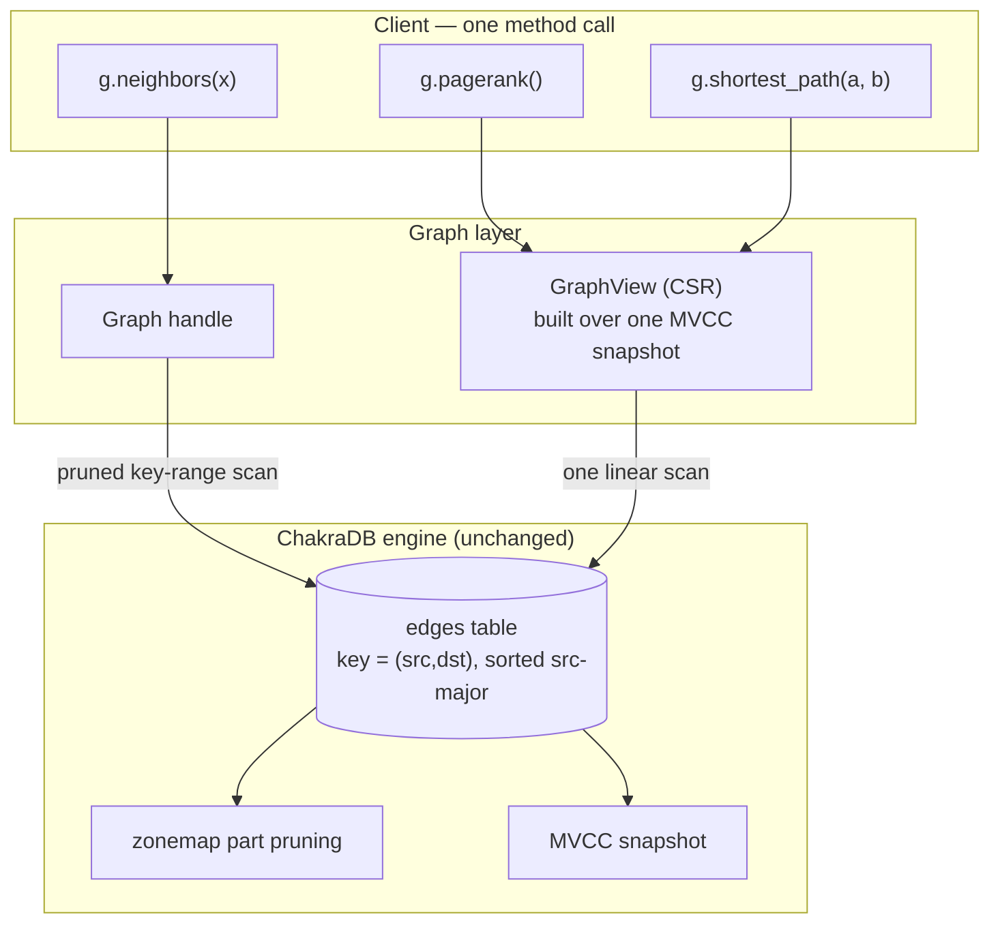

# Graphs on ChakraDB

```{=latex}
\epigraph{Only connect!}{--- E. M. Forster}
```

ChakraDB's graph layer is not a second database bolted onto a relational one. It is
a thin layer that *exposes what the engine already is*. Three properties we built
for HTAP turn out to be exactly what a graph engine wants.



## The three properties

1. **Clustered adjacency, for free.** If an edge's key encodes `(src, dst)`
   src-major, then all of a node's out-edges are one *contiguous key range*.
   "Neighbors of X" becomes a key-range scan that
   [zonemap pruning](../algorithms/pruning.md) answers by touching only the parts
   holding `src = X`. No secondary index; the primary-key sort *is* the adjacency
   index. See [Clustered Adjacency](adjacency.md).

2. **Live graph analytics.** A whole-graph algorithm builds its working set from
   **one MVCC snapshot**. Writers keep adding edges; the algorithm sees a
   consistent graph and runs to completion. This is the [concurrency
   wedge](../architecture/mvcc.md) applied to graphs — the thing pure graph
   libraries (a dead static copy) and lock-based graph databases cannot do in one
   embedded process. See [Live Graph Analytics](live-analytics.md).

3. **Arrow ≈ CSR.** Edges stored sorted by `src` are already *grouped by source*,
   so building the CSR (Compressed Sparse Row) form every algorithm wants is a
   single linear, vectorized scan over Arrow columns — no sort, no hash join. See
   [The CSR Snapshot](csr.md).

## What the client writes

```rust
use chakradb::{Database, Graph};
use std::sync::Arc;

let g = Graph::open(Arc::new(Database::new()), "social")?;
g.add_edge(1, 2, 1.0)?;                 // src -> dst, weight
g.add_edges([(2, 3, 1.0), (1, 3, 1.0)])?;

// Live adjacency (pruned range scan):
let nbrs = g.out_neighbors(1)?;         // [2, 3]

// Whole-graph algorithms over a consistent snapshot:
let view   = g.view()?;
let ranks  = view.pagerank(20, 0.85);   // node -> score
let path   = view.shortest_path(1, 3);  // Some([1, 3])
let comps  = view.connected_components();
let tris   = view.triangle_count();
```

The client never writes a traversal by hand and never manages a lock. The engine
handles adjacency (pruned scans), consistency (snapshots), and the algorithms.

## Positioning

This is the **G** in "ChakraDB — the embedded HTAP database with built-in graph
capabilities." Transactions, analytics, and graph traversals run over the *same
live data*, on the *same non-blocking snapshots*, in *one process*. The rest of
this part builds the layer up: modeling, adjacency, CSR, and the algorithms.

> **Status.** The graph layer is real and tested (`src/graph.rs`,
> `tests/graph.rs`) — directed edges, adjacency, CSR views, and the core
> algorithm set. Node ids are currently `u32`; a native composite key (on the
> roadmap) will lift that and remove the key-encoding step. See
> [Modeling a Property Graph](modeling.md).
