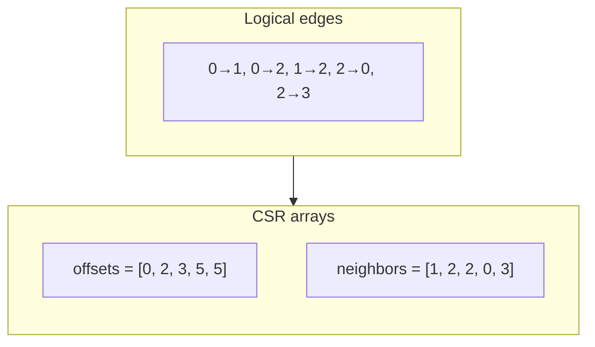
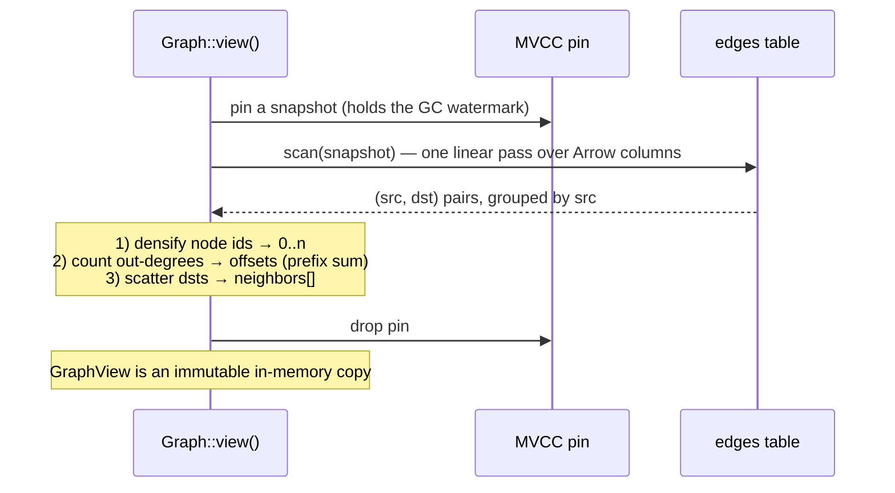

# The CSR Snapshot

```{=latex}
\epigraph{Simplicity is prerequisite for reliability.}{--- Edsger W. Dijkstra}
```

Whole-graph algorithms — BFS, PageRank, connected components — do not want to issue
a range scan per node. They want the **Compressed Sparse Row (CSR)** representation:
a flat neighbor array plus per-node offsets, giving cache-friendly `O(1)` neighbor
iteration. `Graph::view()` builds one from a single MVCC snapshot.

## What CSR is



To iterate node `u`'s out-neighbors, take `neighbors[offsets[u] .. offsets[u+1]]`.
For node 2 above: `offsets[2]=3, offsets[3]=5` → `neighbors[3..5] = [0, 3]`.

## Why building it is a linear scan

The edge table is already sorted by key = `(src, dst)` src-major. So a single scan
yields `(src, dst)` pairs *already grouped by source*. Building CSR is then a
counting pass and a fill pass — no sort, no hash join:



The actual build (`src/graph.rs`):

```rust
// Dense node numbering over every id that appears.
let mut ids: Vec<NodeId> = pairs.iter().flat_map(|&(s,d)| [s,d]).collect();
ids.sort_unstable(); ids.dedup();
let index: HashMap<NodeId,u32> = /* id -> dense idx */;

// CSR by counting sort on the source's dense index.
let mut offsets = vec![0u32; n + 1];
for &(s,_) in &pairs { offsets[index[&s] as usize + 1] += 1; }
for i in 0..n { offsets[i+1] += offsets[i]; }         // prefix sum

let mut adj = vec![0u32; pairs.len()];
let mut cursor = offsets.clone();
for &(s,d) in &pairs {
    let si = index[&s] as usize;
    adj[cursor[si] as usize] = index[&d];
    cursor[si] += 1;
}
```

Cost is `O(V + E)` plus the densify sort. The result is a compact
`{ids, index, offsets, adj}` — the `GraphView`.

## Consistency: it is a snapshot

`view()` pins an MVCC snapshot for the duration of the scan, so the CSR is built
from **one consistent instant** of the graph. Writers keep committing edges; the
`GraphView` is an immutable copy and does not change. That is what the test asserts:

```rust
let v = g.view()?;
let before = v.edge_count();
g.add_edges([(6,7,1.0),(7,8,1.0)])?;    // writes after the view was taken
assert_eq!(v.edge_count(), before);      // the snapshot view is unchanged
assert_eq!(g.view()?.edge_count(), before + 2); // a fresh view sees them
```

## Memory: the honest ceiling

The CSR lives in RAM. `offsets` is `4·(V+1)` bytes and `neighbors` is `4·E` bytes —
about **4 bytes per edge** plus the id maps. A 100-million-edge graph is ~0.4 GB of
CSR; a billion edges is a few GB. Graph algorithms are memory-bound, and this is
the same ceiling as ChakraDB's [resident index](../engine/overview.md): "fits in
a big server's RAM" is in scope, trillion-edge graphs are not. For graphs larger
than memory, restrict the view to a subgraph (a k-hop neighborhood, a component)
before running the algorithm.

## Live Graph Analytics


This is the chapter that says *why ChakraDB's graph layer is different*, not just
convenient. The difference is one word: **live.**

## The problem with the alternatives

To run a graph algorithm you need a consistent view of the graph. The usual ways to
get one all give something up:

- **Load into NetworkX / igraph.** You get a *dead static copy*. The moment you
  loaded it, it began to go stale. Re-analyzing the latest graph means reloading the
  whole thing.
- **A lock-based graph database (e.g. Neo4j).** A long analytical traversal
  contends with the writers mutating the graph; you either block ingest or read an
  inconsistent, partially-updated graph.
- **A separate OLAP copy (ETL the graph into a warehouse).** Now the analysis is
  minutes-to-hours stale, and you run two systems.

## What ChakraDB does instead

```mermaid
sequenceDiagram
    participant Writers
    participant Clock as MVCC clock
    participant Alg as Algorithm (GraphView)
    Writers->>Clock: add edge @ CSN 100
    Alg->>Clock: view() pins snapshot S = 100
    Note over Alg: builds CSR from S; runs PageRank...
    Writers->>Clock: add edge @ CSN 101  (never blocked)
    Writers->>Clock: add edge @ CSN 102
    Note over Alg: still computing over S = 100 — a consistent graph
    Alg-->>Alg: result reflects exactly the graph at S = 100
```

An algorithm builds its CSR from **one MVCC snapshot** and runs to completion over
that consistent instant. Meanwhile writers keep committing edges — **never
blocked**, because readers and writers share nothing but the append-only clock. The
[GC watermark](../engine/mvcc.md) holds the snapshot's versions alive
for the algorithm's duration even as newer data is compacted.

The result: you can run PageRank (or components, or a fraud traversal) **every
minute over the latest consistent graph, while ingest never pauses** — in one
embedded process. That is the combination the alternatives cannot offer.

## The pattern in code

```rust
// A background loop: recompute influence over the live graph, on a cadence.
loop {
    let view = graph.view()?;              // consistent snapshot; ingest continues
    let ranks = view.pagerank(20, 0.85);
    publish_top_influencers(&ranks);       // serve results
    sleep(Duration::from_secs(60));
}
```

Each `view()` is a fresh consistent snapshot. The writers feeding `graph` never
notice the analytics running.

## Why it composes with the rest of the database

Because the graph *is* tables, graph results compose with SQL and transactions over
the **same** live data:

- Score an entity with a graph traversal **and** join it to its transactional row
  in one consistent snapshot.
- Ingest an event (transactional), update the graph edge (transactional), and let
  the next analytics pass pick it up — no cross-system consistency to reason about.

This is HTAP extended to graphs: **T + A + G over one snapshot clock.** The
[fraud case study](../case-studies/fraud.md) works it end to end.

> **The honest scope.** v1 *recomputes* an algorithm over a snapshot on demand; it
> does not yet *maintain* live results incrementally as edges change. Incremental
> graph algorithms (streaming PageRank, incremental components) are a roadmap
> item — a v2 that leans even harder on this live-mutation story.
