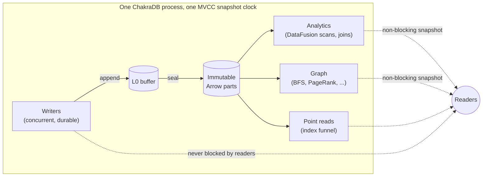

# Introduction to ChakraDB

```{=latex}
\epigraph{No man ever steps in the same river twice, for it is not the same river and he is not the same man.}{--- Heraclitus}
```

Most databases are built for data that has stopped moving. You load it, then you
query it. ChakraDB is built for the opposite premise — the one Heraclitus noticed
twenty-five centuries ago: **the data is always changing, and the interesting
question is what is true of it *now*, while it is still arriving.** Everything in
this book follows from taking that premise seriously.

## The one-sentence summary

**ChakraDB is an embedded database that serves a continuous stream of durable
writes while running analytical queries and graph traversals that never block — over
the same live data, in one process, in an open columnar format.**

Unpack that sentence and you have the whole system:

- *embedded* — a library linked into your process, like SQLite or DuckDB, not a
  server you operate.
- *continuous durable writes* — ACID, WAL-backed, and **concurrent**: many writers
  at once.
- *analytical queries and graph traversals that never block* — readers see a
  consistent snapshot and are never stopped by a writer.
- *the same live data* — no ETL, no second system, no staleness between the
  operational store and the analytical one.
- *open columnar format* — data lives on disk as Apache Arrow, readable by any Arrow
  tool.

## What makes it different

Every database chooses a shape of work to be excellent at, and pays for that choice
somewhere else. ChakraDB's choice is the *seam* between transactional and analytical
work, extended to graph — the place most systems refuse to stand.

Consider where the competition sits:

- **DuckDB** gives blazing analytics over data you loaded earlier. But it holds a
  **single-writer file lock** — a second writer is refused at the OS level
  (`IO Error: Could not set lock`). It is superb at static analytics and
  structurally unable to serve a live write stream.
- **SQLite** is a rock-solid embedded transactional store, but its analytics are
  row-at-a-time, and one writer serializes the entire database.
- **Neo4j** gives graph traversals, but it is a server, and mutation takes locks
  that contend with the reads doing the traversal.
- **NetworkX / igraph** give graph algorithms — over a *dead static copy* you loaded
  into memory, stale the instant it is built.

ChakraDB's wager is that the valuable modern workload is precisely the one that falls
*between* these: **data that is still arriving, that you want to analyze and traverse
at the same time.** That is HTAP — Hybrid Transactional/Analytical Processing — plus
graph, in an embedded library.



The differentiator is **concurrency, not raw scan speed.** ChakraDB does not aim to
out-scan DuckDB on a static file; it aims to serve a workload DuckDB *structurally
cannot* — concurrent writers with non-blocking analytical and graph reads.

### The four properties, at once

Individually, existing engines have three of the four properties below. The gap
ChakraDB targets is having all four together:

| | Embedded | ACID + MVCC | Concurrent writes + non-blocking scans | Open on-disk format |
|---|:---:|:---:|:---:|:---:|
| DuckDB | ✅ | ✅ | ❌ single writer | ⚠ via extensions |
| SQLite | ✅ | ✅ | ❌ one writer | ❌ |
| Neo4j | ❌ server | ✅ | ⚠ lock contention | ❌ |
| ArcticDB | ✅ | ❌ | ✅ | ✅ |
| **ChakraDB** | ✅ | ✅ | ✅ | ✅ Arrow IPC parts |

### …and now, graph

On top of that HTAP core, ChakraDB adds a **built-in graph layer** — not a bolted-on
second store, but a thin layer that reuses exactly the properties above. A graph edge
whose key encodes `(src, dst)` is stored *sorted by source*, so a node's neighbors
are a contiguous key range (clustered adjacency for free); a graph algorithm builds
its working set from **one MVCC snapshot**, so it runs to completion over a
consistent graph while edges keep streaming in (live graph analytics); and
sorted-by-source edges are already grouped by source, so building the CSR
representation every algorithm wants is a single linear scan (the storage format is
the algorithm's input format). The result is a client experience where BFS, shortest
path, PageRank, connected components, and triangle counting are one method call
away, over data you are still writing to.

## The problem: why another database?

The case for ChakraDB is a case against **fragmentation**. The modern data stack has
splintered a single logical need — "know what is true of my live data" — across three
or four systems: an OLTP store for the writes, a warehouse for the analytics, a graph
database for the relationships, and an ETL fabric to keep them approximately in sync.
Each hop adds latency, staleness, operational surface, and a consistency model to
reconcile.

The fragmentation exists because of a genuine technical tension — the shapes of work
want opposite physical layouts:

- **Transactional** work wants row-at-a-time mutation, point lookups, and a durable
  log. It is latency-bound and write-heavy.
- **Analytical** work wants columnar, compressed, vectorized scans over large row
  counts. It is throughput-bound and read-heavy.
- **Graph** work wants pointer-chasing adjacency and whole-graph iteration.

For decades the accepted wisdom — Stonebraker's "one size does not fit all" — was
that these needs demand separate engines. ChakraDB does not dispute that a single
*physical layout* cannot serve all three. It disputes that they need separate
*systems*. The insight is that a **log-structured, Arrow-native store with MVCC** can
present the right layout to each: a row buffer and a sorted key index for the
transactional path, immutable columnar parts for the analytical path, and
sorted-by-source edges for the graph path — all over **one snapshot clock**, so a
reader of any kind sees one consistent instant while writers proceed unblocked.

The specific thing that becomes possible, that no single embedded engine offered
before, is: **ingest continuously, and analyze and traverse the result at the same
time, with no ETL and no lock fight.** The [case studies](../case-studies/fraud.md)
show why that is not a luxury — for real-time fraud scoring, live recommendations,
and streaming dashboards, the staleness and the lock contention of the fragmented
stack are the whole problem.

## Design principles

Five commitments shape every decision in this book. They are worth stating up front
because when a trade-off arises, these are how it is resolved.

1. **Concurrency is the wedge.** ChakraDB competes on serving
   writes-plus-analytics-plus-graph on live data — a workload DuckDB structurally
   cannot — *not* on out-scanning it on a static file. When a choice trades a little
   cold-scan speed for a lot of live-concurrency, it takes that trade.

2. **Buy execution, build storage.** The vectorized analytical engine is a solved,
   multi-year problem; ChakraDB *buys* it (Apache DataFusion) and spends its own
   effort where the differentiation is — storage, MVCC, durability, the transactional
   interpreter, and the graph layer. (See [The Query
   Layer](../engine/query-router.md).)

3. **Cold data pays nothing.** The cost of concurrency is borne only by
   recently-modified data. A part that predates every live snapshot is scanned with
   no per-row version check at all — so a billion-row table with a thousand recent
   mutations pays version costs on a thousand rows, not a billion. (See
   [MVCC](../engine/mvcc.md).)

4. **Immutability over invalidation.** Sealed parts are never edited in place;
   updates and deletes are new versions and deletion-vector marks. Immutable data is
   safe to share lock-free with any number of readers, is trivially cacheable, and
   makes an open on-disk format possible.

5. **Publish the harness, not just the number.** No neutral benchmark measures the
   concurrency axis ChakraDB competes on, so every performance claim in this book
   ships with the code that produced it (Part IX). A number without a reproducible
   source is a hypothesis, not a measurement.

## The cost model

Fast writes, fast scans, and high concurrency are in genuine tension; every system
claiming all three has chosen *where to absorb the cost*. Stating ChakraDB's choice
explicitly:

| The goal | The cost it creates | Where ChakraDB pays it |
|---|---|---|
| Fast writes | data accumulates as unmerged parts → scans slow | **compaction** (a designed, back-pressured subsystem), never the read path |
| Fast scans | needs merged, sorted, columnar data → write amplification | absorbed by compaction, off the write path |
| High concurrency | needs versioning → readers may pay version cost per row | paid **only** by recently-modified data; cold parts pay `O(1)` |
| Open on-disk format | needs a committed format + manifest → commit overhead | Arrow IPC parts + a manifest; publication cadence is a tunable knob |

Three absorption points define the engine:

- **The cost of fast writes is paid by background-free, caller-driven compaction** —
  and if compaction cannot keep up, the engine applies *explicit* ingest backpressure
  rather than silently degrading scans. This is a hard commitment, not an
  aspiration.
- **The cost of concurrency is paid only by recently-modified data** — the MVCC fast
  path (principle 3).
- **The cost of the open format is paid in visibility latency, not write latency** —
  internal transactions commit fast to a local log; the durable columnar state is
  materialized on a separate cadence.

If any of these trades is unacceptable for your workload, the architecture is the
wrong fit — so they are stated here, at the front, to be challenged.

## Who uses ChakraDB

The engine fits workloads that are simultaneously *operational* and *analytical*, on
a single node, embedded in an application:

- **Real-time fraud and risk** — score transactions as they arrive, and traverse the
  entity graph they form, over one consistent view.
- **Live recommendations** — personalized PageRank / common-neighbors over a graph
  that updates continuously.
- **Streaming dashboards** — ingest events and serve aggregations without an ETL hop
  or a read/write lock fight.
- **Exact-money ledgers** — `DECIMAL` arithmetic that never rounds, with ACID
  transactions.

## The technology stack

ChakraDB is written in Rust; the core forbids `unsafe` code. Data is Apache **Arrow**
end to end — in memory, on disk (Arrow IPC), and across the DataFusion boundary
(zero-copy). Vectorized analytical execution is **bought** from Apache DataFusion;
storage, MVCC, durability, the transactional interpreter, and the graph layer are
**built**. The next part, [Architecture](../engine/overview.md), shows how
those pieces fit, and why the "buy execution, build storage" split is the whole
strategy.
