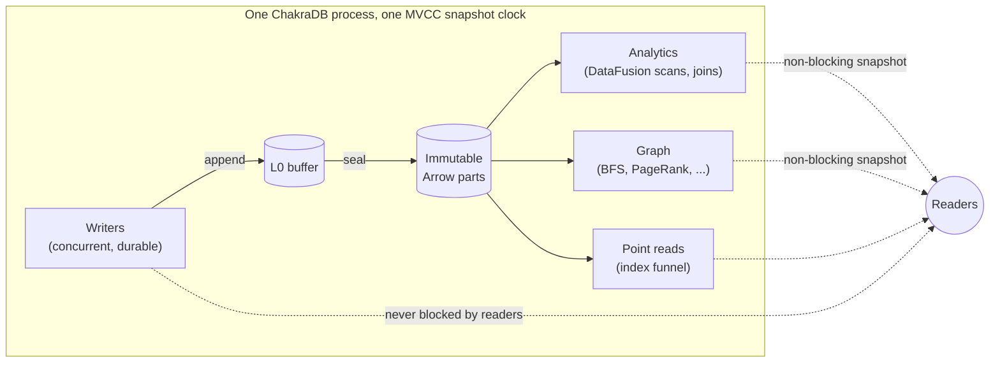

# Introduction to ChakraDB

## The one-sentence summary

**ChakraDB is an embedded database that serves a continuous stream of durable
writes while running analytical queries and graph traversals that never block —
over the same live data, in one process, in an open columnar format.**

## What makes it different

Most engines are good at one shape of work. ChakraDB is built around the seam
between them:

- **DuckDB** gives you blazing analytics over data you *loaded earlier*. It holds
  a single-writer file lock — a second writer is refused at the OS level.
- **SQLite** gives you a transactional embedded store, but analytics are
  row-at-a-time and one writer serializes the whole database.
- **Neo4j** gives you graph traversals, but it is a server, and mutation takes
  locks that contend with reads.
- **NetworkX / igraph** give you graph algorithms over a *dead static copy* you
  loaded into memory.

ChakraDB's wager is that the valuable workload is the one that sits *between*
these: **data that is still arriving, that you want to analyze and traverse at the
same time.** That is HTAP — Hybrid Transactional/Analytical Processing — plus
graph, in an embedded library.

The differentiator is **concurrency, not raw scan speed.** ChakraDB does not aim
to out-scan DuckDB on a static file; it aims to serve a workload DuckDB
*structurally cannot* — concurrent writers with non-blocking analytical and graph
reads.

## The four properties, at once

Individually, existing engines have three of the four properties below. The gap
ChakraDB targets is having all four together:

| | Embedded | ACID + MVCC | Concurrent writes + non-blocking scans | Open on-disk format |
|---|:---:|:---:|:---:|:---:|
| DuckDB | ✅ | ✅ | ❌ single writer | ⚠️ via extensions |
| SQLite | ✅ | ✅ | ❌ one writer | ❌ |
| Neo4j | ❌ server | ✅ | ⚠️ lock contention | ❌ |
| ArcticDB | ✅ | ❌ | ✅ | ✅ |
| **ChakraDB** | ✅ | ✅ | ✅ | ✅ Arrow IPC parts |

## …and now, graph

On top of that HTAP core, ChakraDB adds a **built-in graph layer**. It is not a
bolted-on second store — it reuses exactly the properties above:

- A graph edge whose key encodes `(src, dst)` is stored *sorted by source*, so a
  node's neighbors are a contiguous key range — **clustered adjacency for free.**
- A graph algorithm builds its working set from **one MVCC snapshot**, so it runs
  to completion over a consistent graph while edges keep streaming in — **live
  graph analytics.**
- Sorted-by-source edges are already grouped by source, so building the CSR
  (Compressed Sparse Row) representation every graph algorithm wants is a single
  linear scan — **the storage format is the algorithm's input format.**

That yields a client experience where the common algorithms — BFS, shortest path,
PageRank, connected components, triangle counting — are one method call away, over
data you are still writing to.

## Who uses ChakraDB

The engine fits workloads that are simultaneously *operational* and *analytical*,
in a single node, embedded in an application:

- **Real-time fraud and risk** — score transactions as they arrive, and traverse
  the entity graph they form, over one consistent view (Part VIII).
- **Live recommendations** — personalized PageRank / common-neighbors over a graph
  that updates continuously.
- **Streaming dashboards** — ingest events and serve aggregations without an ETL
  hop or a read/write lock fight.
- **Exact-money ledgers** — `DECIMAL` arithmetic that never rounds, with ACID
  transactions.

## The technology stack

ChakraDB is written in Rust (the core forbids `unsafe`), stores data in Apache
**Arrow** end to end, and *buys* its vectorized analytical execution from **Apache
DataFusion** while *building* its own storage, MVCC, durability, and the
transactional interpreter. The next chapters explain why that split is the whole
strategy.
